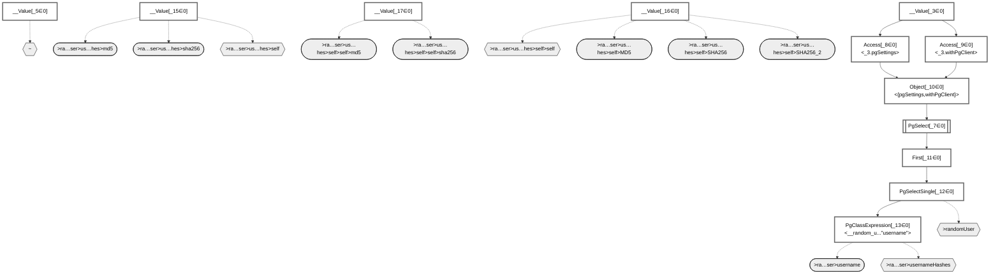

```mermaid
graph TD
    classDef path fill:#eee,stroke:#000,color:#000
    classDef plan fill:#fff,stroke-width:3px,color:#000
    classDef itemplan fill:#fff,stroke-width:6px,color:#000
    classDef sideeffectplan fill:#f00,stroke-width:6px,color:#000

    %% subgraph fields
    P1{{"~"}}:::path
    P2{{">randomUser"}}:::path
    P3([">ra…ser>username"]):::path
    %% P2 -.-> P3
    P4{{">ra…ser>usernameHashes"}}:::path
    P5([">ra…ser>us…hes>md5"]):::path
    %% P4 -.-> P5
    P6([">ra…ser>us…hes>sha256"]):::path
    %% P4 -.-> P6
    P7{{">ra…ser>us…hes>self"}}:::path
    P8{{">ra…ser>us…hes>self>self"}}:::path
    P9([">ra…ser>us…hes>self>self>md5"]):::path
    %% P8 -.-> P9
    P10([">ra…ser>us…hes>self>self>sha256"]):::path
    %% P8 -.-> P10
    %% P7 -.-> P8
    P11([">ra…ser>us…hes>self>MD5"]):::path
    %% P7 -.-> P11
    P12([">ra…ser>us…hes>self>SHA256"]):::path
    %% P7 -.-> P12
    P13([">ra…ser>us…hes>self>SHA256_2"]):::path
    %% P7 -.-> P13
    %% P4 -.-> P7
    %% P2 -.-> P4
    %% P1 -.-> P2
    %% end

    %% define plans
    __Value_3["__Value[_3∈0]<br /><context>"]:::plan
    __Value_5["__Value[_5∈0]<br /><rootValue>"]:::plan
    PgSelect_7[["PgSelect[_7∈0]<br /><random_user>"]]:::plan
    Access_8["Access[_8∈0]<br /><_3.pgSettings>"]:::plan
    Access_9["Access[_9∈0]<br /><_3.withPgClient>"]:::plan
    Object_10["Object[_10∈0]<br /><{pgSettings,withPgClient}>"]:::plan
    First_11["First[_11∈0]"]:::plan
    PgSelectSingle_12["PgSelectSingle[_12∈0]<br /><users>"]:::plan
    PgClassExpression_13["PgClassExpression[_13∈0]<br /><__random_u...#quot;username#quot;>"]:::plan
    __Value_15["__Value[_15∈0]"]:::plan
    __Value_16["__Value[_16∈0]"]:::plan
    __Value_17["__Value[_17∈0]"]:::plan

    %% plan dependencies
    Object_10 --> PgSelect_7
    __Value_3 --> Access_8
    __Value_3 --> Access_9
    Access_8 --> Object_10
    Access_9 --> Object_10
    PgSelect_7 --> First_11
    First_11 --> PgSelectSingle_12
    PgSelectSingle_12 --> PgClassExpression_13

    %% plan-to-path relationships
    __Value_5 -.-> P1
    PgSelectSingle_12 -.-> P2
    PgClassExpression_13 -.-> P3
    PgClassExpression_13 -.-> P4
    __Value_15 -.-> P5
    __Value_15 -.-> P6
    __Value_15 -.-> P7
    __Value_16 -.-> P8
    __Value_17 -.-> P9
    __Value_17 -.-> P10
    __Value_16 -.-> P11
    __Value_16 -.-> P12
    __Value_16 -.-> P13

    %% allocate buckets
    classDef bucket0 stroke:#696969
    class __Value_3,__Value_5,PgSelect_7,Access_8,Access_9,Object_10,First_11,PgSelectSingle_12,PgClassExpression_13,__Value_15,__Value_16,__Value_17 bucket0
```
