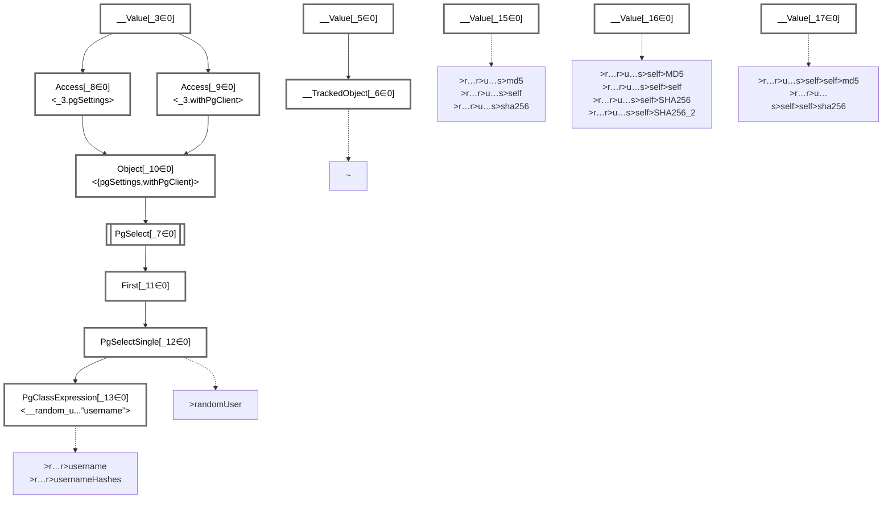

```mermaid
graph TD
    classDef path fill:#eee,stroke:#000,color:#000
    classDef plan fill:#fff,stroke-width:3px,color:#000
    classDef itemplan fill:#fff,stroke-width:6px,color:#000
    classDef sideeffectplan fill:#f00,stroke-width:6px,color:#000
    classDef bucket fill:#f6f6f6,color:#000,stroke-width:6px


    %% define plans
    __Value_3["__Value[_3∈0]<br /><context>"]:::plan
    __Value_5["__Value[_5∈0]<br /><rootValue>"]:::plan
    __TrackedObject_6["__TrackedObject[_6∈0]"]:::plan
    PgSelect_7[["PgSelect[_7∈0]<br /><random_user>"]]:::plan
    Access_8["Access[_8∈0]<br /><_3.pgSettings>"]:::plan
    Access_9["Access[_9∈0]<br /><_3.withPgClient>"]:::plan
    Object_10["Object[_10∈0]<br /><{pgSettings,withPgClient}>"]:::plan
    First_11["First[_11∈0]"]:::plan
    PgSelectSingle_12["PgSelectSingle[_12∈0]<br /><users>"]:::plan
    PgClassExpression_13["PgClassExpression[_13∈0]<br /><__random_u...”username”>"]:::plan
    __Value_15["__Value[_15∈0]"]:::plan
    __Value_16["__Value[_16∈0]"]:::plan
    __Value_17["__Value[_17∈0]"]:::plan

    %% plan dependencies
    __Value_5 --> __TrackedObject_6
    Object_10 --> PgSelect_7
    __Value_3 --> Access_8
    __Value_3 --> Access_9
    Access_8 --> Object_10
    Access_9 --> Object_10
    PgSelect_7 --> First_11
    First_11 --> PgSelectSingle_12
    PgSelectSingle_12 --> PgClassExpression_13

    %% plan-to-path relationships
    P1["~"]
    __TrackedObject_6 -.-> P1
    P2[">randomUser"]
    PgSelectSingle_12 -.-> P2
    P3[">r…r>username<br />>r…r>usernameHashes"]
    PgClassExpression_13 -.-> P3
    P4[">r…r>u…s>md5<br />>r…r>u…s>self<br />>r…r>u…s>sha256"]
    __Value_15 -.-> P4
    P5[">r…r>u…s>self>MD5<br />>r…r>u…s>self>self<br />>r…r>u…s>self>SHA256<br />>r…r>u…s>self>SHA256_2"]
    __Value_16 -.-> P5
    P6[">r…r>u…s>self>self>md5<br />>r…r>u…s>self>self>sha256"]
    __Value_17 -.-> P6

    %% allocate buckets
    classDef bucket0 stroke:#696969
    class __Value_3,__Value_5,__TrackedObject_6,PgSelect_7,Access_8,Access_9,Object_10,First_11,PgSelectSingle_12,PgClassExpression_13,__Value_15,__Value_16,__Value_17 bucket0
```
