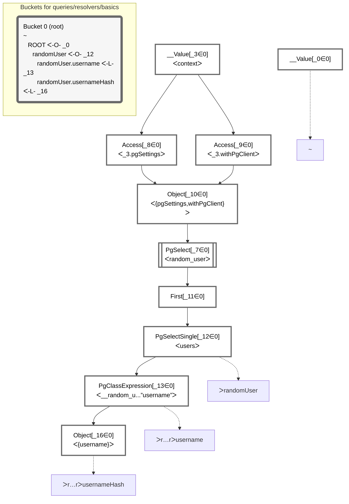

```mermaid
graph TD
    classDef path fill:#eee,stroke:#000,color:#000
    classDef plan fill:#fff,stroke-width:3px,color:#000
    classDef itemplan fill:#fff,stroke-width:6px,color:#000
    classDef sideeffectplan fill:#f00,stroke-width:6px,color:#000
    classDef bucket fill:#f6f6f6,color:#000,stroke-width:6px,text-align:left


    %% define plans
    __Value_0["__Value[_0∈0]"]:::plan
    __Value_3["__Value[_3∈0]<br />ᐸcontextᐳ"]:::plan
    PgSelect_7[["PgSelect[_7∈0]<br />ᐸrandom_userᐳ"]]:::plan
    Access_8["Access[_8∈0]<br />ᐸ_3.pgSettingsᐳ"]:::plan
    Access_9["Access[_9∈0]<br />ᐸ_3.withPgClientᐳ"]:::plan
    Object_10["Object[_10∈0]<br />ᐸ{pgSettings,withPgClient}ᐳ"]:::plan
    First_11["First[_11∈0]"]:::plan
    PgSelectSingle_12["PgSelectSingle[_12∈0]<br />ᐸusersᐳ"]:::plan
    PgClassExpression_13["PgClassExpression[_13∈0]<br />ᐸ__random_u...”username”ᐳ"]:::plan
    Object_16["Object[_16∈0]<br />ᐸ{username}ᐳ"]:::plan

    %% plan dependencies
    Object_10 --> PgSelect_7
    __Value_3 --> Access_8
    __Value_3 --> Access_9
    Access_8 & Access_9 --> Object_10
    PgSelect_7 --> First_11
    First_11 --> PgSelectSingle_12
    PgSelectSingle_12 --> PgClassExpression_13
    PgClassExpression_13 --> Object_16

    %% plan-to-path relationships
    P_0["~"]
    __Value_0 -.-> P_0
    P_12["ᐳrandomUser"]
    PgSelectSingle_12 -.-> P_12
    P_13["ᐳr…rᐳusername"]
    PgClassExpression_13 -.-> P_13
    P_16["ᐳr…rᐳusernameHash"]
    Object_16 -.-> P_16

    subgraph "Buckets for queries/resolvers/basics"
    Bucket0("Bucket 0 (root)<br />~<br />⠀ROOT ᐸ-O- _0<br />⠀⠀randomUser ᐸ-O- _12<br />⠀⠀⠀randomUser.username ᐸ-L- _13<br />⠀⠀⠀randomUser.usernameHash ᐸ-L- _16"):::bucket
    classDef bucket0 stroke:#696969
    class Bucket0,__Value_0,__Value_3,PgSelect_7,Access_8,Access_9,Object_10,First_11,PgSelectSingle_12,PgClassExpression_13,Object_16 bucket0
    end
```
