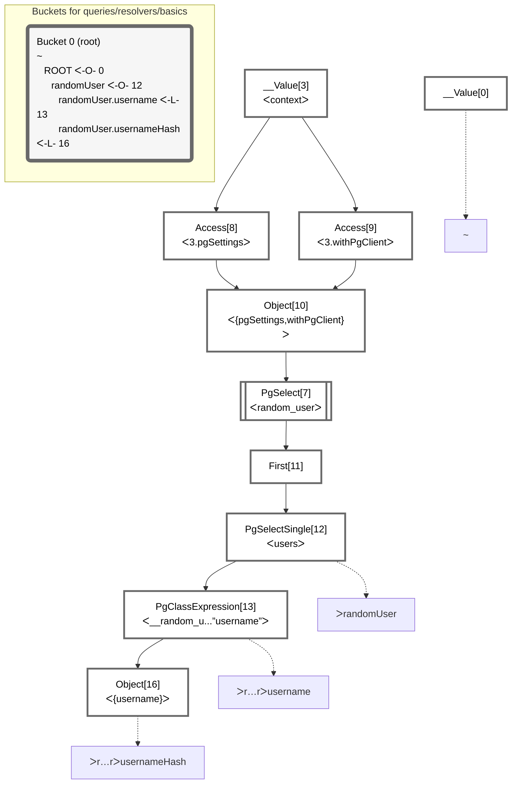

```mermaid
graph TD
    classDef path fill:#eee,stroke:#000,color:#000
    classDef plan fill:#fff,stroke-width:3px,color:#000
    classDef itemplan fill:#fff,stroke-width:6px,color:#000
    classDef sideeffectplan fill:#f00,stroke-width:6px,color:#000
    classDef bucket fill:#f6f6f6,color:#000,stroke-width:6px,text-align:left


    %% define plans
    __Value0["__Value[0]"]:::plan
    Object16["Object[16]<br />ᐸ{username}ᐳ"]:::plan
    PgClassExpression13["PgClassExpression[13]<br />ᐸ__random_u...”username”ᐳ"]:::plan
    PgSelectSingle12["PgSelectSingle[12]<br />ᐸusersᐳ"]:::plan
    First11["First[11]"]:::plan
    PgSelect7[["PgSelect[7]<br />ᐸrandom_userᐳ"]]:::plan
    Object10["Object[10]<br />ᐸ{pgSettings,withPgClient}ᐳ"]:::plan
    Access8["Access[8]<br />ᐸ3.pgSettingsᐳ"]:::plan
    Access9["Access[9]<br />ᐸ3.withPgClientᐳ"]:::plan
    __Value3["__Value[3]<br />ᐸcontextᐳ"]:::plan

    %% plan dependencies
    PgClassExpression13 --> Object16
    PgSelectSingle12 --> PgClassExpression13
    First11 --> PgSelectSingle12
    PgSelect7 --> First11
    Object10 --> PgSelect7
    Access8 & Access9 --> Object10
    __Value3 --> Access8
    __Value3 --> Access9

    %% plan-to-path relationships
    P0["~"]
    __Value0 -.-> P0
    P12["ᐳrandomUser"]
    PgSelectSingle12 -.-> P12
    P13["ᐳr…rᐳusername"]
    PgClassExpression13 -.-> P13
    P16["ᐳr…rᐳusernameHash"]
    Object16 -.-> P16

    subgraph "Buckets for queries/resolvers/basics"
    Bucket0("Bucket 0 (root)<br />~<br />⠀ROOT ᐸ-O- 0<br />⠀⠀randomUser ᐸ-O- 12<br />⠀⠀⠀randomUser.username ᐸ-L- 13<br />⠀⠀⠀randomUser.usernameHash ᐸ-L- 16"):::bucket
    classDef bucket0 stroke:#696969
    class Bucket0,__Value0,__Value3,PgSelect7,Access8,Access9,Object10,First11,PgSelectSingle12,PgClassExpression13,Object16 bucket0
    end
```
