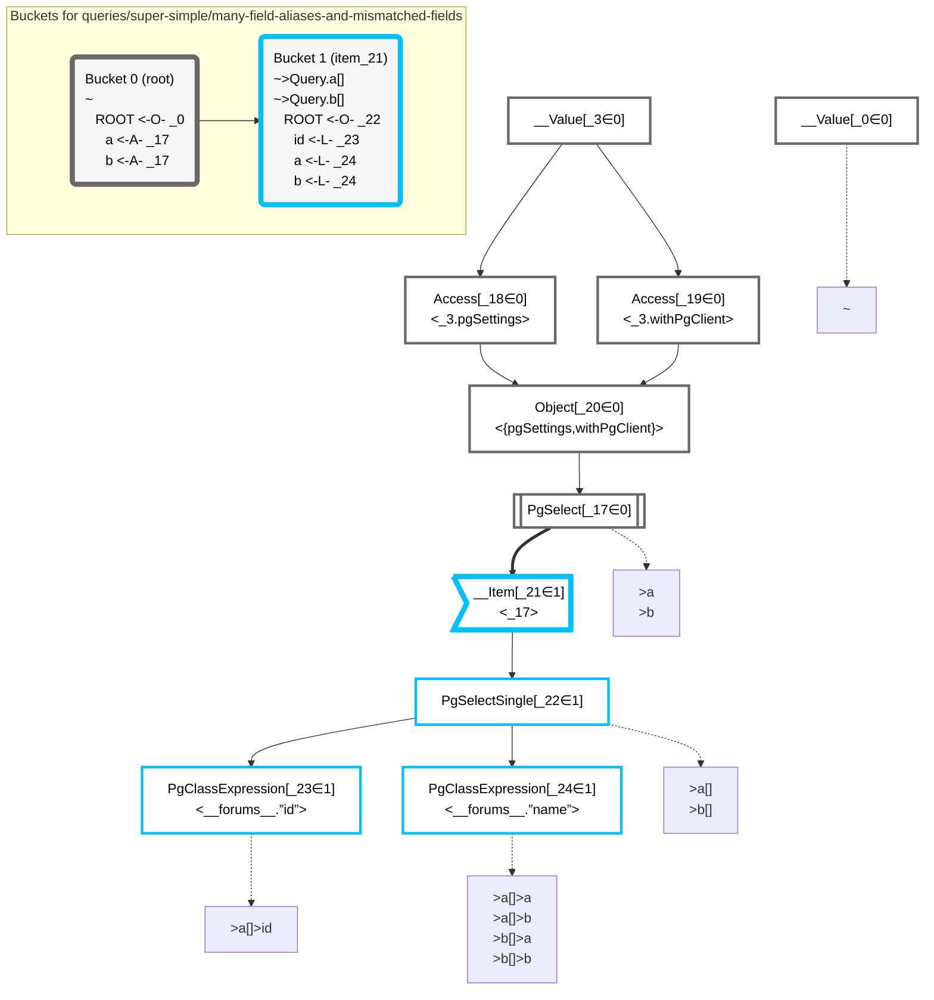

```mermaid
graph TD
    classDef path fill:#eee,stroke:#000,color:#000
    classDef plan fill:#fff,stroke-width:3px,color:#000
    classDef itemplan fill:#fff,stroke-width:6px,color:#000
    classDef sideeffectplan fill:#f00,stroke-width:6px,color:#000
    classDef bucket fill:#f6f6f6,color:#000,stroke-width:6px,text-align:left


    %% define plans
    __Value_0["__Value[_0∈0]"]:::plan
    __Value_3["__Value[_3∈0]<br /><context>"]:::plan
    PgSelect_17[["PgSelect[_17∈0]<br /><forums>"]]:::plan
    Access_18["Access[_18∈0]<br /><_3.pgSettings>"]:::plan
    Access_19["Access[_19∈0]<br /><_3.withPgClient>"]:::plan
    Object_20["Object[_20∈0]<br /><{pgSettings,withPgClient}>"]:::plan
    __Item_21>"__Item[_21∈1]<br /><_17>"]:::itemplan
    PgSelectSingle_22["PgSelectSingle[_22∈1]<br /><forums>"]:::plan
    PgClassExpression_23["PgClassExpression[_23∈1]<br /><__forums__.”id”>"]:::plan
    PgClassExpression_24["PgClassExpression[_24∈1]<br /><__forums__.”name”>"]:::plan

    %% plan dependencies
    Object_20 --> PgSelect_17
    __Value_3 --> Access_18
    __Value_3 --> Access_19
    Access_18 --> Object_20
    Access_19 --> Object_20
    PgSelect_17 ==> __Item_21
    __Item_21 --> PgSelectSingle_22
    PgSelectSingle_22 --> PgClassExpression_23
    PgSelectSingle_22 --> PgClassExpression_24

    %% plan-to-path relationships
    P_0["~"]
    __Value_0 -.-> P_0
    P_17[">a<br />>b"]
    PgSelect_17 -.-> P_17
    P_22[">a[]<br />>b[]"]
    PgSelectSingle_22 -.-> P_22
    P_23[">a[]>id"]
    PgClassExpression_23 -.-> P_23
    P_24[">a[]>a<br />>a[]>b<br />>b[]>a<br />>b[]>b"]
    PgClassExpression_24 -.-> P_24

    %% allocate buckets
    classDef bucket0 stroke:#696969
    class __Value_0,__Value_3,PgSelect_17,Access_18,Access_19,Object_20 bucket0
    classDef bucket1 stroke:#00bfff
    class __Item_21,PgSelectSingle_22,PgClassExpression_23,PgClassExpression_24 bucket1

    subgraph "Buckets for queries/super-simple/many-field-aliases-and-mismatched-fields"
    Bucket0("Bucket 0 (root)<br />~<br />⠀ROOT <-O- _0<br />⠀⠀a <-A- _17<br />⠀⠀b <-A- _17"):::bucket
    style Bucket0 stroke:#696969
    Bucket1("Bucket 1 (item_21)<br />~>Query.a[]<br />~>Query.b[]<br />⠀ROOT <-O- _22<br />⠀⠀id <-L- _23<br />⠀⠀a <-L- _24<br />⠀⠀b <-L- _24"):::bucket
    style Bucket1 stroke:#00bfff
    Bucket0 --> Bucket1
    end
```
