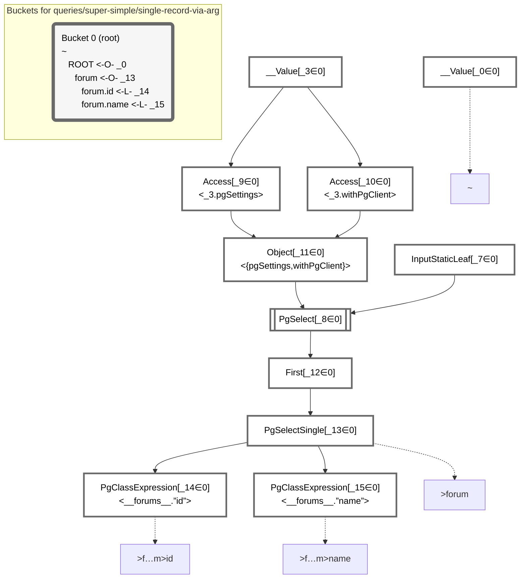

```mermaid
graph TD
    classDef path fill:#eee,stroke:#000,color:#000
    classDef plan fill:#fff,stroke-width:3px,color:#000
    classDef itemplan fill:#fff,stroke-width:6px,color:#000
    classDef sideeffectplan fill:#f00,stroke-width:6px,color:#000
    classDef bucket fill:#f6f6f6,color:#000,stroke-width:6px,text-align:left


    %% define plans
    __Value_0["__Value[_0∈0]"]:::plan
    __Value_3["__Value[_3∈0]<br /><context>"]:::plan
    InputStaticLeaf_7["InputStaticLeaf[_7∈0]"]:::plan
    PgSelect_8[["PgSelect[_8∈0]<br /><forums>"]]:::plan
    Access_9["Access[_9∈0]<br /><_3.pgSettings>"]:::plan
    Access_10["Access[_10∈0]<br /><_3.withPgClient>"]:::plan
    Object_11["Object[_11∈0]<br /><{pgSettings,withPgClient}>"]:::plan
    First_12["First[_12∈0]"]:::plan
    PgSelectSingle_13["PgSelectSingle[_13∈0]<br /><forums>"]:::plan
    PgClassExpression_14["PgClassExpression[_14∈0]<br /><__forums__.”id”>"]:::plan
    PgClassExpression_15["PgClassExpression[_15∈0]<br /><__forums__.”name”>"]:::plan

    %% plan dependencies
    Object_11 --> PgSelect_8
    InputStaticLeaf_7 --> PgSelect_8
    __Value_3 --> Access_9
    __Value_3 --> Access_10
    Access_9 --> Object_11
    Access_10 --> Object_11
    PgSelect_8 --> First_12
    First_12 --> PgSelectSingle_13
    PgSelectSingle_13 --> PgClassExpression_14
    PgSelectSingle_13 --> PgClassExpression_15

    %% plan-to-path relationships
    P_0["~"]
    __Value_0 -.-> P_0
    P_13[">forum"]
    PgSelectSingle_13 -.-> P_13
    P_14[">f…m>id"]
    PgClassExpression_14 -.-> P_14
    P_15[">f…m>name"]
    PgClassExpression_15 -.-> P_15

    %% allocate buckets
    classDef bucket0 stroke:#696969
    class __Value_0,__Value_3,InputStaticLeaf_7,PgSelect_8,Access_9,Access_10,Object_11,First_12,PgSelectSingle_13,PgClassExpression_14,PgClassExpression_15 bucket0

    subgraph "Buckets for queries/super-simple/single-record-via-arg"
    Bucket0("Bucket 0 (root)<br />~<br />⠀ROOT <-O- _0<br />⠀⠀forum <-O- _13<br />⠀⠀⠀forum.id <-L- _14<br />⠀⠀⠀forum.name <-L- _15"):::bucket
    style Bucket0 stroke:#696969
    end
```
