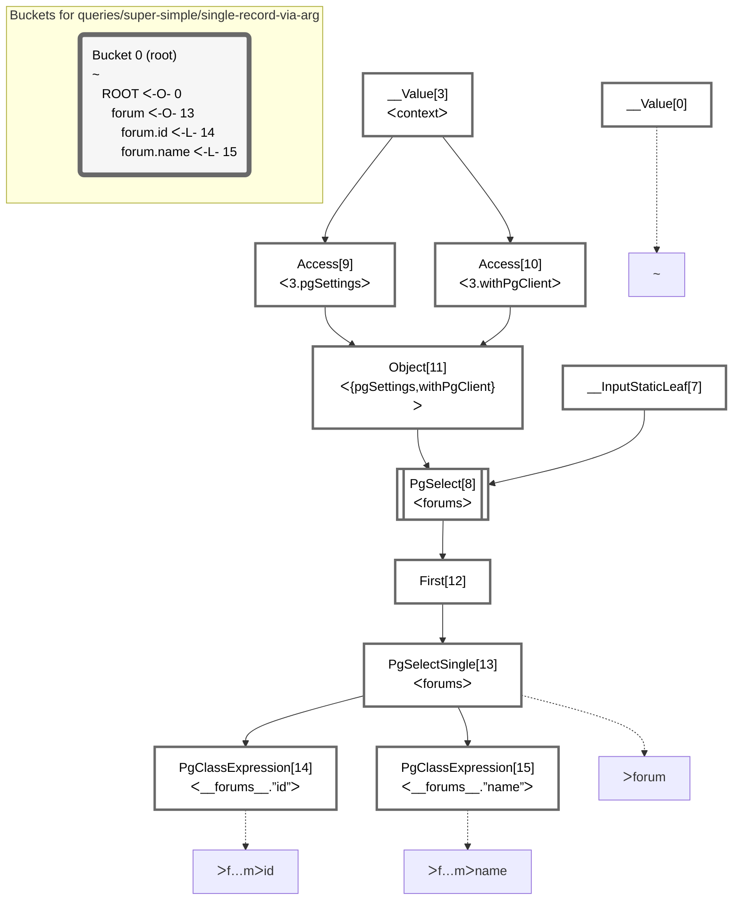

```mermaid
graph TD
    classDef path fill:#eee,stroke:#000,color:#000
    classDef plan fill:#fff,stroke-width:3px,color:#000
    classDef itemplan fill:#fff,stroke-width:6px,color:#000
    classDef sideeffectplan fill:#f00,stroke-width:6px,color:#000
    classDef bucket fill:#f6f6f6,color:#000,stroke-width:6px,text-align:left


    %% define plans
    __Value0["__Value[0]"]:::plan
    PgClassExpression14["PgClassExpression[14]<br />ᐸ__forums__.”id”ᐳ"]:::plan
    PgClassExpression15["PgClassExpression[15]<br />ᐸ__forums__.”name”ᐳ"]:::plan
    PgSelectSingle13["PgSelectSingle[13]<br />ᐸforumsᐳ"]:::plan
    First12["First[12]"]:::plan
    PgSelect8[["PgSelect[8]<br />ᐸforumsᐳ"]]:::plan
    Object11["Object[11]<br />ᐸ{pgSettings,withPgClient}ᐳ"]:::plan
    Access9["Access[9]<br />ᐸ3.pgSettingsᐳ"]:::plan
    Access10["Access[10]<br />ᐸ3.withPgClientᐳ"]:::plan
    __Value3["__Value[3]<br />ᐸcontextᐳ"]:::plan
    __InputStaticLeaf7["__InputStaticLeaf[7]"]:::plan

    %% plan dependencies
    PgSelectSingle13 --> PgClassExpression14
    PgSelectSingle13 --> PgClassExpression15
    First12 --> PgSelectSingle13
    PgSelect8 --> First12
    Object11 & __InputStaticLeaf7 --> PgSelect8
    Access9 & Access10 --> Object11
    __Value3 --> Access9
    __Value3 --> Access10

    %% plan-to-path relationships
    P0["~"]
    __Value0 -.-> P0
    P13["ᐳforum"]
    PgSelectSingle13 -.-> P13
    P14["ᐳf…mᐳid"]
    PgClassExpression14 -.-> P14
    P15["ᐳf…mᐳname"]
    PgClassExpression15 -.-> P15

    subgraph "Buckets for queries/super-simple/single-record-via-arg"
    Bucket0("Bucket 0 (root)<br />~<br />⠀ROOT ᐸ-O- 0<br />⠀⠀forum ᐸ-O- 13<br />⠀⠀⠀forum.id ᐸ-L- 14<br />⠀⠀⠀forum.name ᐸ-L- 15"):::bucket
    classDef bucket0 stroke:#696969
    class Bucket0,__Value0,__Value3,__InputStaticLeaf7,PgSelect8,Access9,Access10,Object11,First12,PgSelectSingle13,PgClassExpression14,PgClassExpression15 bucket0
    end
```
