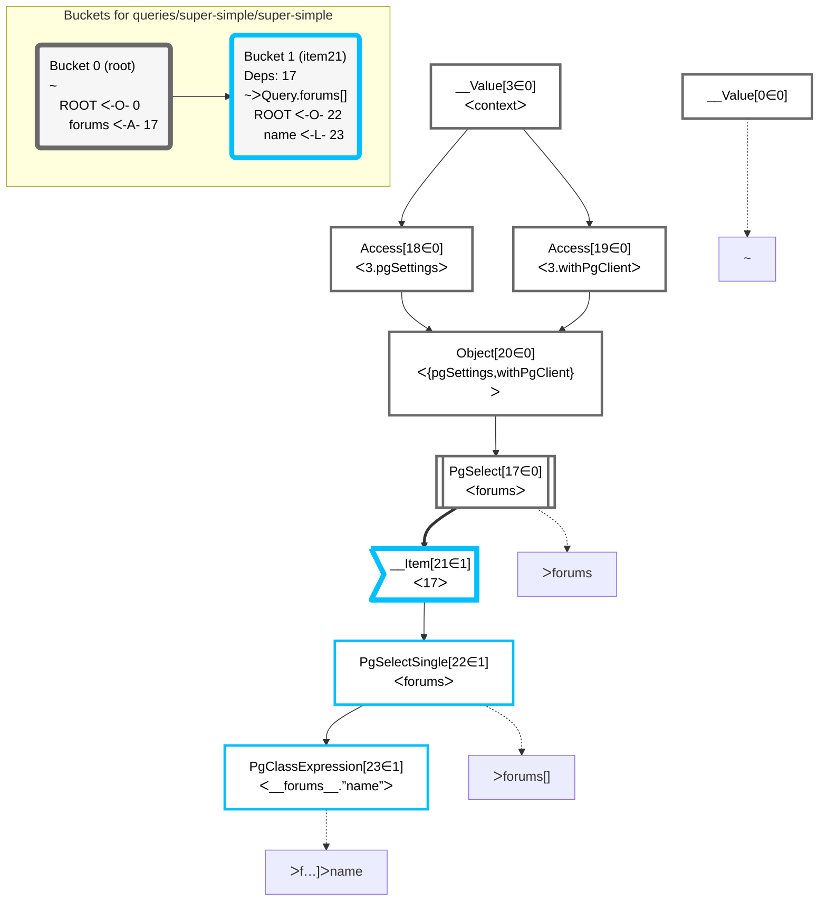

```mermaid
graph TD
    classDef path fill:#eee,stroke:#000,color:#000
    classDef plan fill:#fff,stroke-width:3px,color:#000
    classDef itemplan fill:#fff,stroke-width:6px,color:#000
    classDef sideeffectplan fill:#f00,stroke-width:6px,color:#000
    classDef bucket fill:#f6f6f6,color:#000,stroke-width:6px,text-align:left


    %% define plans
    __Value0["__Value[0∈0]"]:::plan
    __Value3["__Value[3∈0]<br />ᐸcontextᐳ"]:::plan
    Access18["Access[18∈0]<br />ᐸ3.pgSettingsᐳ"]:::plan
    Access19["Access[19∈0]<br />ᐸ3.withPgClientᐳ"]:::plan
    Object20["Object[20∈0]<br />ᐸ{pgSettings,withPgClient}ᐳ"]:::plan
    PgSelect17[["PgSelect[17∈0]<br />ᐸforumsᐳ"]]:::plan
    __Item21>"__Item[21∈1]<br />ᐸ17ᐳ"]:::itemplan
    PgSelectSingle22["PgSelectSingle[22∈1]<br />ᐸforumsᐳ"]:::plan
    PgClassExpression23["PgClassExpression[23∈1]<br />ᐸ__forums__.”name”ᐳ"]:::plan

    %% plan dependencies
    __Value3 --> Access18
    __Value3 --> Access19
    Access18 & Access19 --> Object20
    Object20 --> PgSelect17
    PgSelect17 ==> __Item21
    __Item21 --> PgSelectSingle22
    PgSelectSingle22 --> PgClassExpression23

    %% plan-to-path relationships
    P0["~"]
    __Value0 -.-> P0
    P17["ᐳforums"]
    PgSelect17 -.-> P17
    P22["ᐳforums[]"]
    PgSelectSingle22 -.-> P22
    P23["ᐳf…]ᐳname"]
    PgClassExpression23 -.-> P23

    subgraph "Buckets for queries/super-simple/super-simple"
    Bucket0("Bucket 0 (root)<br />~<br />⠀ROOT ᐸ-O- 0<br />⠀⠀forums ᐸ-A- 17"):::bucket
    classDef bucket0 stroke:#696969
    class Bucket0,__Value0,__Value3,PgSelect17,Access18,Access19,Object20 bucket0
    Bucket1("Bucket 1 (item21)<br />Deps: 17<br />~ᐳQuery.forums[]<br />⠀ROOT ᐸ-O- 22<br />⠀⠀name ᐸ-L- 23"):::bucket
    classDef bucket1 stroke:#00bfff
    class Bucket1,__Item21,PgSelectSingle22,PgClassExpression23 bucket1
    Bucket0 --> Bucket1
    end
```
