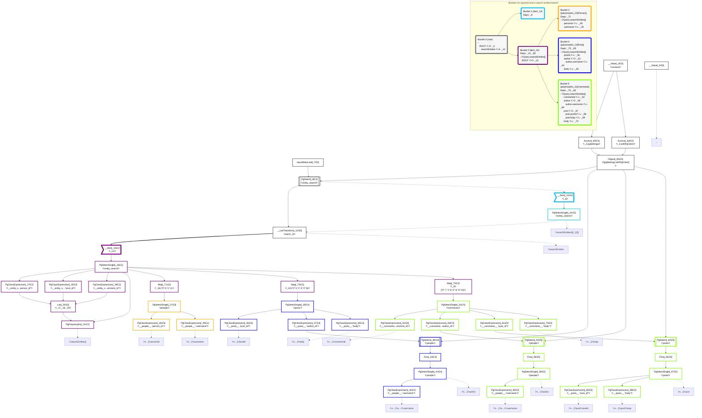

```mermaid
graph TD
    classDef path fill:#eee,stroke:#000,color:#000
    classDef plan fill:#fff,stroke-width:3px,color:#000
    classDef itemplan fill:#fff,stroke-width:6px,color:#000
    classDef sideeffectplan fill:#f00,stroke-width:6px,color:#000
    classDef bucket fill:#f6f6f6,color:#000,stroke-width:6px,text-align:left


    %% define plans
    __Value_0["__Value[_0∈0]"]:::plan
    __Value_3["__Value[_3∈0]<br />ᐸcontextᐳ"]:::plan
    InputStaticLeaf_7["InputStaticLeaf[_7∈0]"]:::plan
    PgSelect_8[["PgSelect[_8∈0]<br />ᐸentity_searchᐳ"]]:::plan
    __ListTransform_12["__ListTransform[_12∈0]<br />ᐸeach:_8ᐳ"]:::plan
    __Item_13>"__Item[_13∈1]<br />ᐸ_8ᐳ"]:::itemplan
    PgSelectSingle_14["PgSelectSingle[_14∈1]<br />ᐸentity_searchᐳ"]:::plan
    __Item_15>"__Item[_15∈2]<br />ᐸ_12ᐳ"]:::itemplan
    PgSelectSingle_16["PgSelectSingle[_16∈2]<br />ᐸentity_searchᐳ"]:::plan
    PgClassExpression_17["PgClassExpression[_17∈2]<br />ᐸ__entity_s...person_id”ᐳ"]:::plan
    PgClassExpression_18["PgClassExpression[_18∈2]<br />ᐸ__entity_s....”post_id”ᐳ"]:::plan
    PgClassExpression_19["PgClassExpression[_19∈2]<br />ᐸ__entity_s...omment_id”ᐳ"]:::plan
    List_20["List[_20∈2]<br />ᐸ_17,_18,_19ᐳ"]:::plan
    PgPolymorphic_21["PgPolymorphic[_21∈2]"]:::plan
    PgSelectSingle_27["PgSelectSingle[_27∈3]<br />ᐸpeopleᐳ"]:::plan
    PgClassExpression_28["PgClassExpression[_28∈3]<br />ᐸ__people__.”person_id”ᐳ"]:::plan
    PgClassExpression_29["PgClassExpression[_29∈3]<br />ᐸ__people__.”username”ᐳ"]:::plan
    PgSelectSingle_35["PgSelectSingle[_35∈4]<br />ᐸpostsᐳ"]:::plan
    PgClassExpression_36["PgClassExpression[_36∈4]<br />ᐸ__posts__.”post_id”ᐳ"]:::plan
    PgClassExpression_37["PgClassExpression[_37∈4]<br />ᐸ__posts__.”author_id”ᐳ"]:::plan
    PgSelect_38[["PgSelect[_38∈4]<br />ᐸpeopleᐳ"]]:::plan
    First_42["First[_42∈4]"]:::plan
    PgSelectSingle_43["PgSelectSingle[_43∈4]<br />ᐸpeopleᐳ"]:::plan
    PgClassExpression_44["PgClassExpression[_44∈4]<br />ᐸ__people__.”username”ᐳ"]:::plan
    PgClassExpression_45["PgClassExpression[_45∈4]<br />ᐸ__posts__.”body”ᐳ"]:::plan
    PgSelectSingle_51["PgSelectSingle[_51∈5]<br />ᐸcommentsᐳ"]:::plan
    PgClassExpression_52["PgClassExpression[_52∈5]<br />ᐸ__comments...omment_id”ᐳ"]:::plan
    PgClassExpression_53["PgClassExpression[_53∈5]<br />ᐸ__comments...author_id”ᐳ"]:::plan
    PgSelect_54[["PgSelect[_54∈5]<br />ᐸpeopleᐳ"]]:::plan
    First_58["First[_58∈5]"]:::plan
    PgSelectSingle_59["PgSelectSingle[_59∈5]<br />ᐸpeopleᐳ"]:::plan
    PgClassExpression_60["PgClassExpression[_60∈5]<br />ᐸ__people__.”username”ᐳ"]:::plan
    PgClassExpression_61["PgClassExpression[_61∈5]<br />ᐸ__comments__.”post_id”ᐳ"]:::plan
    PgSelect_62[["PgSelect[_62∈5]<br />ᐸpostsᐳ"]]:::plan
    Access_63["Access[_63∈0]<br />ᐸ_3.pgSettingsᐳ"]:::plan
    Access_64["Access[_64∈0]<br />ᐸ_3.withPgClientᐳ"]:::plan
    Object_65["Object[_65∈0]<br />ᐸ{pgSettings,withPgClient}ᐳ"]:::plan
    First_66["First[_66∈5]"]:::plan
    PgSelectSingle_67["PgSelectSingle[_67∈5]<br />ᐸpostsᐳ"]:::plan
    PgClassExpression_68["PgClassExpression[_68∈5]<br />ᐸ__posts__.”post_id”ᐳ"]:::plan
    PgClassExpression_69["PgClassExpression[_69∈5]<br />ᐸ__posts__.”body”ᐳ"]:::plan
    PgClassExpression_70["PgClassExpression[_70∈5]<br />ᐸ__comments__.”body”ᐳ"]:::plan
    Map_71["Map[_71∈2]<br />ᐸ_16:{”0”:0,”1”:1}ᐳ"]:::plan
    Map_73["Map[_73∈2]<br />ᐸ_16:{”0”:3,”1”:4,”2”:5}ᐳ"]:::plan
    Map_75["Map[_75∈2]<br />ᐸ_16:{”0”:7,”1”:8,”2”:9,”3”:10}ᐳ"]:::plan

    %% plan dependencies
    Object_65 & InputStaticLeaf_7 --> PgSelect_8
    PgSelect_8 --> __ListTransform_12
    PgSelectSingle_14 -.-> __ListTransform_12
    PgSelect_8 -.-> __Item_13
    __Item_13 --> PgSelectSingle_14
    __ListTransform_12 ==> __Item_15
    __Item_15 --> PgSelectSingle_16
    PgSelectSingle_16 --> PgClassExpression_17
    PgSelectSingle_16 --> PgClassExpression_18
    PgSelectSingle_16 --> PgClassExpression_19
    PgClassExpression_17 & PgClassExpression_18 & PgClassExpression_19 --> List_20
    PgSelectSingle_16 & List_20 --> PgPolymorphic_21
    Map_71 --> PgSelectSingle_27
    PgSelectSingle_27 --> PgClassExpression_28
    PgSelectSingle_27 --> PgClassExpression_29
    Map_73 --> PgSelectSingle_35
    PgSelectSingle_35 --> PgClassExpression_36
    PgSelectSingle_35 --> PgClassExpression_37
    Object_65 & PgClassExpression_37 --> PgSelect_38
    PgSelect_38 --> First_42
    First_42 --> PgSelectSingle_43
    PgSelectSingle_43 --> PgClassExpression_44
    PgSelectSingle_35 --> PgClassExpression_45
    Map_75 --> PgSelectSingle_51
    PgSelectSingle_51 --> PgClassExpression_52
    PgSelectSingle_51 --> PgClassExpression_53
    Object_65 & PgClassExpression_53 --> PgSelect_54
    PgSelect_54 --> First_58
    First_58 --> PgSelectSingle_59
    PgSelectSingle_59 --> PgClassExpression_60
    PgSelectSingle_51 --> PgClassExpression_61
    Object_65 & PgClassExpression_61 --> PgSelect_62
    __Value_3 --> Access_63
    __Value_3 --> Access_64
    Access_63 & Access_64 --> Object_65
    PgSelect_62 --> First_66
    First_66 --> PgSelectSingle_67
    PgSelectSingle_67 --> PgClassExpression_68
    PgSelectSingle_67 --> PgClassExpression_69
    PgSelectSingle_51 --> PgClassExpression_70
    PgSelectSingle_16 --> Map_71
    PgSelectSingle_16 --> Map_73
    PgSelectSingle_16 --> Map_75

    %% plan-to-path relationships
    P_0["~"]
    __Value_0 -.-> P_0
    P_12["ᐳsearchEntities"]
    __ListTransform_12 -.-> P_12
    P_14["ᐳsearchEntities@_12[]"]
    PgSelectSingle_14 -.-> P_14
    P_21["ᐳsearchEntities[]"]
    PgPolymorphic_21 -.-> P_21
    P_28["ᐳs…]ᐳpersonId"]
    PgClassExpression_28 -.-> P_28
    P_29["ᐳs…]ᐳusername"]
    PgClassExpression_29 -.-> P_29
    P_36["ᐳs…]ᐳpostId"]
    PgClassExpression_36 -.-> P_36
    P_43["ᐳs…]ᐳauthor"]
    PgSelectSingle_43 -.-> P_43
    P_44["ᐳs…]ᐳa…rᐳusername"]
    PgClassExpression_44 -.-> P_44
    P_45["ᐳs…]ᐳbody"]
    PgClassExpression_45 -.-> P_45
    P_52["ᐳs…]ᐳcommentId"]
    PgClassExpression_52 -.-> P_52
    P_59["ᐳs…]ᐳauthor"]
    PgSelectSingle_59 -.-> P_59
    P_60["ᐳs…]ᐳa…rᐳusername"]
    PgClassExpression_60 -.-> P_60
    P_67["ᐳs…]ᐳpost"]
    PgSelectSingle_67 -.-> P_67
    P_68["ᐳs…]ᐳpostᐳpostId"]
    PgClassExpression_68 -.-> P_68
    P_69["ᐳs…]ᐳpostᐳbody"]
    PgClassExpression_69 -.-> P_69
    P_70["ᐳs…]ᐳbody"]
    PgClassExpression_70 -.-> P_70

    %% allocate buckets
    classDef bucket0 stroke:#696969
    class __Value_0,__Value_3,InputStaticLeaf_7,PgSelect_8,__ListTransform_12,Access_63,Access_64,Object_65 bucket0
    classDef bucket1 stroke:#00bfff
    class __Item_13,PgSelectSingle_14 bucket1
    classDef bucket2 stroke:#7f007f
    class __Item_15,PgSelectSingle_16,PgClassExpression_17,PgClassExpression_18,PgClassExpression_19,List_20,PgPolymorphic_21,Map_71,Map_73,Map_75 bucket2
    classDef bucket3 stroke:#ffa500
    class PgSelectSingle_27,PgClassExpression_28,PgClassExpression_29 bucket3
    classDef bucket4 stroke:#0000ff
    class PgSelectSingle_35,PgClassExpression_36,PgClassExpression_37,PgSelect_38,First_42,PgSelectSingle_43,PgClassExpression_44,PgClassExpression_45 bucket4
    classDef bucket5 stroke:#7fff00
    class PgSelectSingle_51,PgClassExpression_52,PgClassExpression_53,PgSelect_54,First_58,PgSelectSingle_59,PgClassExpression_60,PgClassExpression_61,PgSelect_62,First_66,PgSelectSingle_67,PgClassExpression_68,PgClassExpression_69,PgClassExpression_70 bucket5

    subgraph "Buckets for queries/unions-search-entities/search"
    Bucket0("Bucket 0 (root)<br />~<br />⠀ROOT ᐸ-O- _0<br />⠀⠀searchEntities ᐸ-A- _12"):::bucket
    style Bucket0 stroke:#696969
    Bucket1("Bucket 1 (item_13)<br />Deps: _8"):::bucket
    style Bucket1 stroke:#00bfff
    Bucket2("Bucket 2 (item_15)<br />Deps: _12, _65<br />~ᐳQuery.searchEntities[]<br />⠀ROOT ᐸ-O- _21"):::bucket
    style Bucket2 stroke:#7f007f
    Bucket3("Bucket 3 (polymorphic_21[Person])<br />Deps: _71<br />~ᐳQuery.searchEntities[]<br />⠀⠀personId ᐸ-L- _28<br />⠀⠀username ᐸ-L- _29"):::bucket
    style Bucket3 stroke:#ffa500
    Bucket4("Bucket 4 (polymorphic_21[Post])<br />Deps: _73, _65<br />~ᐳQuery.searchEntities[]<br />⠀⠀postId ᐸ-L- _36<br />⠀⠀author ᐸ-O- _43<br />⠀⠀⠀author.username ᐸ-L- _44<br />⠀⠀body ᐸ-L- _45"):::bucket
    style Bucket4 stroke:#0000ff
    Bucket5("Bucket 5 (polymorphic_21[Comment])<br />Deps: _75, _65<br />~ᐳQuery.searchEntities[]<br />⠀⠀commentId ᐸ-L- _52<br />⠀⠀author ᐸ-O- _59<br />⠀⠀⠀author.username ᐸ-L- _60<br />⠀⠀post ᐸ-O- _67<br />⠀⠀⠀post.postId ᐸ-L- _68<br />⠀⠀⠀post.body ᐸ-L- _69<br />⠀⠀body ᐸ-L- _70"):::bucket
    style Bucket5 stroke:#7fff00
    Bucket0 --> Bucket1 & Bucket2
    Bucket2 --> Bucket3 & Bucket4 & Bucket5
    end
```
