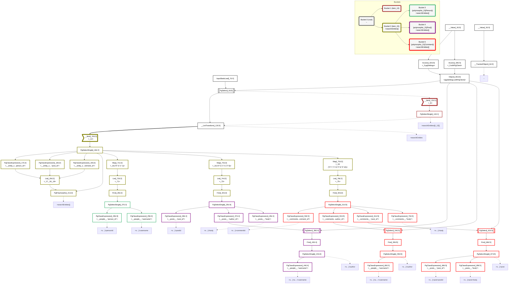

```mermaid
graph TD
    classDef path fill:#eee,stroke:#000,color:#000
    classDef plan fill:#fff,stroke-width:3px,color:#000
    classDef itemplan fill:#fff,stroke-width:6px,color:#000
    classDef sideeffectplan fill:#f00,stroke-width:6px,color:#000
    classDef bucket fill:#f6f6f6,color:#000,stroke-width:6px


    %% define plans
    __Value_3["__Value[_3∈0]<br /><context>"]:::plan
    __Value_5["__Value[_5∈0]<br /><rootValue>"]:::plan
    __TrackedObject_6["__TrackedObject[_6∈0]"]:::plan
    InputStaticLeaf_7["InputStaticLeaf[_7∈0]"]:::plan
    PgSelect_8[["PgSelect[_8∈0]<br /><entity_search>"]]:::plan
    __ListTransform_12["__ListTransform[_12∈0]<br /><each:_8>"]:::plan
    __Item_13>"__Item[_13∈1]<br /><_8>"]:::itemplan
    PgSelectSingle_14["PgSelectSingle[_14∈1]<br /><entity_search>"]:::plan
    __Item_15>"__Item[_15∈2]<br /><_12>"]:::itemplan
    PgSelectSingle_16["PgSelectSingle[_16∈2]<br /><entity_search>"]:::plan
    PgClassExpression_17["PgClassExpression[_17∈2]<br /><__entity_s...person_id”>"]:::plan
    PgClassExpression_18["PgClassExpression[_18∈2]<br /><__entity_s....”post_id”>"]:::plan
    PgClassExpression_19["PgClassExpression[_19∈2]<br /><__entity_s...omment_id”>"]:::plan
    List_20["List[_20∈2]<br /><_17,_18,_19>"]:::plan
    PgPolymorphic_21["PgPolymorphic[_21∈2]"]:::plan
    First_26["First[_26∈2]"]:::plan
    PgSelectSingle_27["PgSelectSingle[_27∈3]<br /><people>"]:::plan
    PgClassExpression_28["PgClassExpression[_28∈3]<br /><__people__.”person_id”>"]:::plan
    PgClassExpression_29["PgClassExpression[_29∈3]<br /><__people__.”username”>"]:::plan
    First_34["First[_34∈2]"]:::plan
    PgSelectSingle_35["PgSelectSingle[_35∈4]<br /><posts>"]:::plan
    PgClassExpression_36["PgClassExpression[_36∈4]<br /><__posts__.”post_id”>"]:::plan
    PgClassExpression_37["PgClassExpression[_37∈4]<br /><__posts__.”author_id”>"]:::plan
    PgSelect_38[["PgSelect[_38∈4]<br /><people>"]]:::plan
    First_42["First[_42∈4]"]:::plan
    PgSelectSingle_43["PgSelectSingle[_43∈4]<br /><people>"]:::plan
    PgClassExpression_44["PgClassExpression[_44∈4]<br /><__people__.”username”>"]:::plan
    PgClassExpression_45["PgClassExpression[_45∈4]<br /><__posts__.”body”>"]:::plan
    First_50["First[_50∈2]"]:::plan
    PgSelectSingle_51["PgSelectSingle[_51∈5]<br /><comments>"]:::plan
    PgClassExpression_52["PgClassExpression[_52∈5]<br /><__comments...omment_id”>"]:::plan
    PgClassExpression_53["PgClassExpression[_53∈5]<br /><__comments...author_id”>"]:::plan
    PgSelect_54[["PgSelect[_54∈5]<br /><people>"]]:::plan
    First_58["First[_58∈5]"]:::plan
    PgSelectSingle_59["PgSelectSingle[_59∈5]<br /><people>"]:::plan
    PgClassExpression_60["PgClassExpression[_60∈5]<br /><__people__.”username”>"]:::plan
    PgClassExpression_61["PgClassExpression[_61∈5]<br /><__comments__.”post_id”>"]:::plan
    PgSelect_62[["PgSelect[_62∈5]<br /><posts>"]]:::plan
    Access_63["Access[_63∈0]<br /><_3.pgSettings>"]:::plan
    Access_64["Access[_64∈0]<br /><_3.withPgClient>"]:::plan
    Object_65["Object[_65∈0]<br /><{pgSettings,withPgClient}>"]:::plan
    First_66["First[_66∈5]"]:::plan
    PgSelectSingle_67["PgSelectSingle[_67∈5]<br /><posts>"]:::plan
    PgClassExpression_68["PgClassExpression[_68∈5]<br /><__posts__.”post_id”>"]:::plan
    PgClassExpression_69["PgClassExpression[_69∈5]<br /><__posts__.”body”>"]:::plan
    PgClassExpression_70["PgClassExpression[_70∈5]<br /><__comments__.”body”>"]:::plan
    Map_71["Map[_71∈2]<br /><_16:{”0”:0,”1”:1}>"]:::plan
    List_72["List[_72∈2]<br /><_71>"]:::plan
    Map_73["Map[_73∈2]<br /><_16:{”0”:3,”1”:4,”2”:5}>"]:::plan
    List_74["List[_74∈2]<br /><_73>"]:::plan
    Map_75["Map[_75∈2]<br /><_16:{”0”:7,”1”:8,”2”:9,”3”:10}>"]:::plan
    List_76["List[_76∈2]<br /><_75>"]:::plan

    %% plan dependencies
    __Value_5 --> __TrackedObject_6
    Object_65 --> PgSelect_8
    InputStaticLeaf_7 --> PgSelect_8
    PgSelect_8 --> __ListTransform_12
    PgSelectSingle_14 -.-> __ListTransform_12
    PgSelect_8 -.-> __Item_13
    __Item_13 --> PgSelectSingle_14
    __ListTransform_12 ==> __Item_15
    __Item_15 --> PgSelectSingle_16
    PgSelectSingle_16 --> PgClassExpression_17
    PgSelectSingle_16 --> PgClassExpression_18
    PgSelectSingle_16 --> PgClassExpression_19
    PgClassExpression_17 --> List_20
    PgClassExpression_18 --> List_20
    PgClassExpression_19 --> List_20
    PgSelectSingle_16 --> PgPolymorphic_21
    List_20 --> PgPolymorphic_21
    List_72 --> First_26
    First_26 --> PgSelectSingle_27
    PgSelectSingle_27 --> PgClassExpression_28
    PgSelectSingle_27 --> PgClassExpression_29
    List_74 --> First_34
    First_34 --> PgSelectSingle_35
    PgSelectSingle_35 --> PgClassExpression_36
    PgSelectSingle_35 --> PgClassExpression_37
    Object_65 --> PgSelect_38
    PgClassExpression_37 --> PgSelect_38
    PgSelect_38 --> First_42
    First_42 --> PgSelectSingle_43
    PgSelectSingle_43 --> PgClassExpression_44
    PgSelectSingle_35 --> PgClassExpression_45
    List_76 --> First_50
    First_50 --> PgSelectSingle_51
    PgSelectSingle_51 --> PgClassExpression_52
    PgSelectSingle_51 --> PgClassExpression_53
    Object_65 --> PgSelect_54
    PgClassExpression_53 --> PgSelect_54
    PgSelect_54 --> First_58
    First_58 --> PgSelectSingle_59
    PgSelectSingle_59 --> PgClassExpression_60
    PgSelectSingle_51 --> PgClassExpression_61
    Object_65 --> PgSelect_62
    PgClassExpression_61 --> PgSelect_62
    __Value_3 --> Access_63
    __Value_3 --> Access_64
    Access_63 --> Object_65
    Access_64 --> Object_65
    PgSelect_62 --> First_66
    First_66 --> PgSelectSingle_67
    PgSelectSingle_67 --> PgClassExpression_68
    PgSelectSingle_67 --> PgClassExpression_69
    PgSelectSingle_51 --> PgClassExpression_70
    PgSelectSingle_16 --> Map_71
    Map_71 --> List_72
    PgSelectSingle_16 --> Map_73
    Map_73 --> List_74
    PgSelectSingle_16 --> Map_75
    Map_75 --> List_76

    %% plan-to-path relationships
    P1["~"]
    __TrackedObject_6 -.-> P1
    P2[">searchEntities@_12[]"]
    PgSelectSingle_14 -.-> P2
    P3[">searchEntities"]
    __ListTransform_12 -.-> P3
    P4[">searchEntities[]"]
    PgPolymorphic_21 -.-> P4
    P5[">s…]>personId"]
    PgClassExpression_28 -.-> P5
    P6[">s…]>username"]
    PgClassExpression_29 -.-> P6
    P7[">s…]>postId"]
    PgClassExpression_36 -.-> P7
    P8[">s…]>author"]
    PgSelectSingle_43 -.-> P8
    P9[">s…]>a…r>username"]
    PgClassExpression_44 -.-> P9
    P10[">s…]>body"]
    PgClassExpression_45 -.-> P10
    P11[">s…]>commentId"]
    PgClassExpression_52 -.-> P11
    P12[">s…]>author"]
    PgSelectSingle_59 -.-> P12
    P13[">s…]>a…r>username"]
    PgClassExpression_60 -.-> P13
    P14[">s…]>post"]
    PgSelectSingle_67 -.-> P14
    P15[">s…]>post>postId"]
    PgClassExpression_68 -.-> P15
    P16[">s…]>post>body"]
    PgClassExpression_69 -.-> P16
    P17[">s…]>body"]
    PgClassExpression_70 -.-> P17

    %% allocate buckets
    classDef bucket0 stroke:#696969
    class __Value_3,__Value_5,__TrackedObject_6,InputStaticLeaf_7,PgSelect_8,__ListTransform_12,Access_63,Access_64,Object_65 bucket0
    classDef bucket1 stroke:#a52a2a
    class __Item_13,PgSelectSingle_14 bucket1
    classDef bucket2 stroke:#808000
    class __Item_15,PgSelectSingle_16,PgClassExpression_17,PgClassExpression_18,PgClassExpression_19,List_20,PgPolymorphic_21,First_26,First_34,First_50,Map_71,List_72,Map_73,List_74,Map_75,List_76 bucket2
    classDef bucket3 stroke:#3cb371
    class PgSelectSingle_27,PgClassExpression_28,PgClassExpression_29 bucket3
    classDef bucket4 stroke:#7f007f
    class PgSelectSingle_35,PgClassExpression_36,PgClassExpression_37,PgSelect_38,First_42,PgSelectSingle_43,PgClassExpression_44,PgClassExpression_45 bucket4
    classDef bucket5 stroke:#ff0000
    class PgSelectSingle_51,PgClassExpression_52,PgClassExpression_53,PgSelect_54,First_58,PgSelectSingle_59,PgClassExpression_60,PgClassExpression_61,PgSelect_62,First_66,PgSelectSingle_67,PgClassExpression_68,PgClassExpression_69,PgClassExpression_70 bucket5

    subgraph Buckets
    Bucket0("Bucket 0 (root)<br />~"):::bucket
    style Bucket0 stroke:#696969
    Bucket1("Bucket 1 (item_13)"):::bucket
    style Bucket1 stroke:#a52a2a
    Bucket0 --> Bucket1
    Bucket2("Bucket 2 (item_15)<br />>searchEntities[]"):::bucket
    style Bucket2 stroke:#808000
    Bucket0 --> Bucket2
    Bucket3("Bucket 3 (polymorphic_21[Person])<br />>searchEntities[]"):::bucket
    style Bucket3 stroke:#3cb371
    Bucket2 --> Bucket3
    Bucket4("Bucket 4 (polymorphic_21[Post])<br />>searchEntities[]"):::bucket
    style Bucket4 stroke:#7f007f
    Bucket2 --> Bucket4
    Bucket5("Bucket 5 (polymorphic_21[Comment])<br />>searchEntities[]"):::bucket
    style Bucket5 stroke:#ff0000
    Bucket2 --> Bucket5
    end
```
