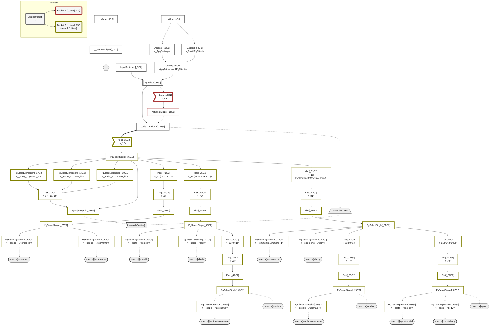

```mermaid
graph TD
    classDef path fill:#eee,stroke:#000,color:#000
    classDef plan fill:#fff,stroke-width:3px,color:#000
    classDef itemplan fill:#fff,stroke-width:6px,color:#000
    classDef sideeffectplan fill:#f00,stroke-width:6px,color:#000
    classDef bucket fill:#f6f6f6,color:#000,stroke-width:6px

    %% subgraph fields
    P1{{"~"}}:::path
    P2[/">searchEntities"\]:::path
    P3>">searchEntities[]"]:::path
    P2 -.- P3
    P4([">se…s[]>personId"]):::path
    %% P3 -.-> P4
    P5([">se…s[]>username"]):::path
    %% P3 -.-> P5
    P6([">se…s[]>postId"]):::path
    %% P3 -.-> P6
    P7{{">se…s[]>author"}}:::path
    P8([">se…s[]>author>username"]):::path
    %% P7 -.-> P8
    %% P3 -.-> P7
    P9([">se…s[]>body"]):::path
    %% P3 -.-> P9
    P10([">se…s[]>commentId"]):::path
    %% P3 -.-> P10
    P11{{">se…s[]>author"}}:::path
    P12([">se…s[]>author>username"]):::path
    %% P11 -.-> P12
    %% P3 -.-> P11
    P13{{">se…s[]>post"}}:::path
    P14([">se…s[]>post>postId"]):::path
    %% P13 -.-> P14
    P15([">se…s[]>post>body"]):::path
    %% P13 -.-> P15
    %% P3 -.-> P13
    P16([">se…s[]>body"]):::path
    %% P3 -.-> P16
    %% P1 -.-> P2
    %% end

    %% define plans
    __Value_3["__Value[_3∈0]<br /><context>"]:::plan
    __Value_5["__Value[_5∈0]<br /><rootValue>"]:::plan
    __TrackedObject_6["__TrackedObject[_6∈0]"]:::plan
    InputStaticLeaf_7["InputStaticLeaf[_7∈0]"]:::plan
    PgSelect_8[["PgSelect[_8∈0]<br /><entity_search>"]]:::plan
    __ListTransform_12["__ListTransform[_12∈0]<br /><each:_8>"]:::plan
    __Item_13>"__Item[_13∈1]<br /><_8>"]:::itemplan
    PgSelectSingle_14["PgSelectSingle[_14∈1]<br /><entity_search>"]:::plan
    __Item_15>"__Item[_15∈2]<br /><_12>"]:::itemplan
    PgSelectSingle_16["PgSelectSingle[_16∈2]<br /><entity_search>"]:::plan
    PgClassExpression_17["PgClassExpression[_17∈2]<br /><__entity_s...person_id#quot;>"]:::plan
    PgClassExpression_18["PgClassExpression[_18∈2]<br /><__entity_s....#quot;post_id#quot;>"]:::plan
    PgClassExpression_19["PgClassExpression[_19∈2]<br /><__entity_s...omment_id#quot;>"]:::plan
    List_20["List[_20∈2]<br /><_17,_18,_19>"]:::plan
    PgPolymorphic_21["PgPolymorphic[_21∈2]"]:::plan
    First_26["First[_26∈2]"]:::plan
    PgSelectSingle_27["PgSelectSingle[_27∈2]<br /><people>"]:::plan
    PgClassExpression_28["PgClassExpression[_28∈2]<br /><__people__.#quot;person_id#quot;>"]:::plan
    PgClassExpression_29["PgClassExpression[_29∈2]<br /><__people__.#quot;username#quot;>"]:::plan
    First_34["First[_34∈2]"]:::plan
    PgSelectSingle_35["PgSelectSingle[_35∈2]<br /><posts>"]:::plan
    PgClassExpression_36["PgClassExpression[_36∈2]<br /><__posts__.#quot;post_id#quot;>"]:::plan
    First_42["First[_42∈2]"]:::plan
    PgSelectSingle_43["PgSelectSingle[_43∈2]<br /><people>"]:::plan
    PgClassExpression_44["PgClassExpression[_44∈2]<br /><__people__.#quot;username#quot;>"]:::plan
    PgClassExpression_45["PgClassExpression[_45∈2]<br /><__posts__.#quot;body#quot;>"]:::plan
    First_50["First[_50∈2]"]:::plan
    PgSelectSingle_51["PgSelectSingle[_51∈2]<br /><comments>"]:::plan
    PgClassExpression_52["PgClassExpression[_52∈2]<br /><__comments...omment_id#quot;>"]:::plan
    First_58["First[_58∈2]"]:::plan
    PgSelectSingle_59["PgSelectSingle[_59∈2]<br /><people>"]:::plan
    PgClassExpression_60["PgClassExpression[_60∈2]<br /><__people__.#quot;username#quot;>"]:::plan
    Access_63["Access[_63∈0]<br /><_3.pgSettings>"]:::plan
    Access_64["Access[_64∈0]<br /><_3.withPgClient>"]:::plan
    Object_65["Object[_65∈0]<br /><{pgSettings,withPgClient}>"]:::plan
    First_66["First[_66∈2]"]:::plan
    PgSelectSingle_67["PgSelectSingle[_67∈2]<br /><posts>"]:::plan
    PgClassExpression_68["PgClassExpression[_68∈2]<br /><__posts__.#quot;post_id#quot;>"]:::plan
    PgClassExpression_69["PgClassExpression[_69∈2]<br /><__posts__.#quot;body#quot;>"]:::plan
    PgClassExpression_70["PgClassExpression[_70∈2]<br /><__comments__.#quot;body#quot;>"]:::plan
    Map_71["Map[_71∈2]<br /><_16:{#quot;0#quot;:0,#quot;1#quot;:1}>"]:::plan
    List_72["List[_72∈2]<br /><_71>"]:::plan
    Map_73["Map[_73∈2]<br /><_35:{#quot;0#quot;:1}>"]:::plan
    List_74["List[_74∈2]<br /><_73>"]:::plan
    Map_75["Map[_75∈2]<br /><_16:{#quot;0#quot;:3,#quot;1#quot;:4,#quot;2#quot;:5}>"]:::plan
    List_76["List[_76∈2]<br /><_75>"]:::plan
    Map_77["Map[_77∈2]<br /><_51:{#quot;0#quot;:1}>"]:::plan
    List_78["List[_78∈2]<br /><_77>"]:::plan
    Map_79["Map[_79∈2]<br /><_51:{#quot;0#quot;:2,#quot;1#quot;:3}>"]:::plan
    List_80["List[_80∈2]<br /><_79>"]:::plan
    Map_81["Map[_81∈2]<br /><_16:{#quot;0#quot;:7,#quot;1#quot;:8,#quot;2#quot;:9,#quot;3#quot;:10,#quot;4#quot;:11}>"]:::plan
    List_82["List[_82∈2]<br /><_81>"]:::plan

    %% plan dependencies
    __Value_5 --> __TrackedObject_6
    Object_65 --> PgSelect_8
    InputStaticLeaf_7 --> PgSelect_8
    PgSelect_8 --> __ListTransform_12
    PgSelectSingle_14 -.-> __ListTransform_12
    PgSelect_8 -.-> __Item_13
    __Item_13 --> PgSelectSingle_14
    __ListTransform_12 ==> __Item_15
    __Item_15 --> PgSelectSingle_16
    PgSelectSingle_16 --> PgClassExpression_17
    PgSelectSingle_16 --> PgClassExpression_18
    PgSelectSingle_16 --> PgClassExpression_19
    PgClassExpression_17 --> List_20
    PgClassExpression_18 --> List_20
    PgClassExpression_19 --> List_20
    PgSelectSingle_16 --> PgPolymorphic_21
    List_20 --> PgPolymorphic_21
    List_72 --> First_26
    First_26 --> PgSelectSingle_27
    PgSelectSingle_27 --> PgClassExpression_28
    PgSelectSingle_27 --> PgClassExpression_29
    List_76 --> First_34
    First_34 --> PgSelectSingle_35
    PgSelectSingle_35 --> PgClassExpression_36
    List_74 --> First_42
    First_42 --> PgSelectSingle_43
    PgSelectSingle_43 --> PgClassExpression_44
    PgSelectSingle_35 --> PgClassExpression_45
    List_82 --> First_50
    First_50 --> PgSelectSingle_51
    PgSelectSingle_51 --> PgClassExpression_52
    List_78 --> First_58
    First_58 --> PgSelectSingle_59
    PgSelectSingle_59 --> PgClassExpression_60
    __Value_3 --> Access_63
    __Value_3 --> Access_64
    Access_63 --> Object_65
    Access_64 --> Object_65
    List_80 --> First_66
    First_66 --> PgSelectSingle_67
    PgSelectSingle_67 --> PgClassExpression_68
    PgSelectSingle_67 --> PgClassExpression_69
    PgSelectSingle_51 --> PgClassExpression_70
    PgSelectSingle_16 --> Map_71
    Map_71 --> List_72
    PgSelectSingle_35 --> Map_73
    Map_73 --> List_74
    PgSelectSingle_16 --> Map_75
    Map_75 --> List_76
    PgSelectSingle_51 --> Map_77
    Map_77 --> List_78
    PgSelectSingle_51 --> Map_79
    Map_79 --> List_80
    PgSelectSingle_16 --> Map_81
    Map_81 --> List_82

    %% plan-to-path relationships
    __TrackedObject_6 -.-> P1
    __ListTransform_12 -.-> P2
    PgPolymorphic_21 -.-> P3
    PgClassExpression_28 -.-> P4
    PgClassExpression_29 -.-> P5
    PgClassExpression_36 -.-> P6
    PgSelectSingle_43 -.-> P7
    PgClassExpression_44 -.-> P8
    PgClassExpression_45 -.-> P9
    PgClassExpression_52 -.-> P10
    PgSelectSingle_59 -.-> P11
    PgClassExpression_60 -.-> P12
    PgSelectSingle_67 -.-> P13
    PgClassExpression_68 -.-> P14
    PgClassExpression_69 -.-> P15
    PgClassExpression_70 -.-> P16

    %% allocate buckets
    classDef bucket0 stroke:#696969
    class __Value_3,__Value_5,__TrackedObject_6,InputStaticLeaf_7,PgSelect_8,__ListTransform_12,Access_63,Access_64,Object_65 bucket0
    classDef bucket1 stroke:#a52a2a
    class __Item_13,PgSelectSingle_14 bucket1
    classDef bucket2 stroke:#808000
    class __Item_15,PgSelectSingle_16,PgClassExpression_17,PgClassExpression_18,PgClassExpression_19,List_20,PgPolymorphic_21,First_26,PgSelectSingle_27,PgClassExpression_28,PgClassExpression_29,First_34,PgSelectSingle_35,PgClassExpression_36,First_42,PgSelectSingle_43,PgClassExpression_44,PgClassExpression_45,First_50,PgSelectSingle_51,PgClassExpression_52,First_58,PgSelectSingle_59,PgClassExpression_60,First_66,PgSelectSingle_67,PgClassExpression_68,PgClassExpression_69,PgClassExpression_70,Map_71,List_72,Map_73,List_74,Map_75,List_76,Map_77,List_78,Map_79,List_80,Map_81,List_82 bucket2

    subgraph Buckets
    Bucket0("Bucket 0 (root)<br />~"):::bucket
    style Bucket0 stroke:#696969
    Bucket1("Bucket 1 (__Item[_13])"):::bucket
    style Bucket1 stroke:#a52a2a
    Bucket0 --> Bucket1
    Bucket2("Bucket 2 (__Item[_15])<br />>searchEntities[]"):::bucket
    style Bucket2 stroke:#808000
    Bucket0 --> Bucket2
    end
```
