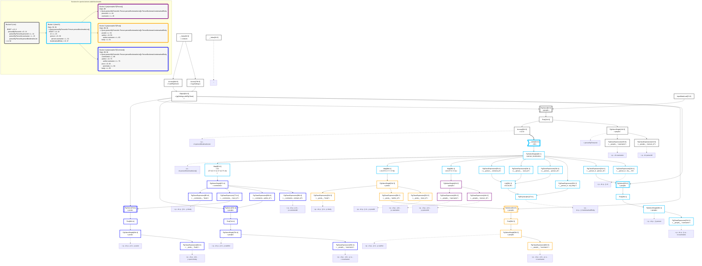

```mermaid
graph TD
    classDef path fill:#eee,stroke:#000,color:#000
    classDef plan fill:#fff,stroke-width:3px,color:#000
    classDef itemplan fill:#fff,stroke-width:6px,color:#000
    classDef sideeffectplan fill:#f00,stroke-width:6px,color:#000
    classDef bucket fill:#f6f6f6,color:#000,stroke-width:6px,text-align:left


    %% define plans
    __Value0["__Value[0∈0]"]:::plan
    PgClassExpression14["PgClassExpression[14∈0]<br />ᐸ__people__.”person_id”ᐳ"]:::plan
    PgClassExpression15["PgClassExpression[15∈0]<br />ᐸ__people__.”username”ᐳ"]:::plan
    PgSelectSingle13["PgSelectSingle[13∈0]<br />ᐸpeopleᐳ"]:::plan
    PgClassExpression23["PgClassExpression[23∈1]<br />ᐸ__person_b...rks__.”id”ᐳ"]:::plan
    PgClassExpression31["PgClassExpression[31∈1]<br />ᐸ__people__.”username”ᐳ"]:::plan
    PgSelectSingle30["PgSelectSingle[30∈1]<br />ᐸpeopleᐳ"]:::plan
    First29["First[29∈1]"]:::plan
    PgSelect25[["PgSelect[25∈1]<br />ᐸpeopleᐳ"]]:::plan
    PgClassExpression24["PgClassExpression[24∈1]<br />ᐸ__person_b...person_id”ᐳ"]:::plan
    PgPolymorphic37["PgPolymorphic[37∈1]"]:::plan
    PgClassExpression32["PgClassExpression[32∈1]<br />ᐸ__person_b...ed_entity”ᐳ"]:::plan
    List36["List[36∈1]<br />ᐸ33,34,35ᐳ"]:::plan
    PgClassExpression33["PgClassExpression[33∈1]<br />ᐸ(__person_...person_id”ᐳ"]:::plan
    PgClassExpression34["PgClassExpression[34∈1]<br />ᐸ(__person_....”post_id”ᐳ"]:::plan
    PgClassExpression35["PgClassExpression[35∈1]<br />ᐸ(__person_...omment_id”ᐳ"]:::plan
    PgClassExpression44["PgClassExpression[44∈2]<br />ᐸ__people__.”person_id”ᐳ"]:::plan
    PgClassExpression45["PgClassExpression[45∈2]<br />ᐸ__people__.”username”ᐳ"]:::plan
    PgSelectSingle43["PgSelectSingle[43∈2]<br />ᐸpeopleᐳ"]:::plan
    Map86["Map[86∈1]<br />ᐸ22:{”0”:3,”1”:4}ᐳ"]:::plan
    PgClassExpression52["PgClassExpression[52∈3]<br />ᐸ__posts__.”post_id”ᐳ"]:::plan
    PgClassExpression60["PgClassExpression[60∈3]<br />ᐸ__people__.”username”ᐳ"]:::plan
    PgSelectSingle59["PgSelectSingle[59∈3]<br />ᐸpeopleᐳ"]:::plan
    First58["First[58∈3]"]:::plan
    PgSelect54[["PgSelect[54∈3]<br />ᐸpeopleᐳ"]]:::plan
    PgClassExpression53["PgClassExpression[53∈3]<br />ᐸ__posts__.”author_id”ᐳ"]:::plan
    PgClassExpression61["PgClassExpression[61∈3]<br />ᐸ__posts__.”body”ᐳ"]:::plan
    PgSelectSingle51["PgSelectSingle[51∈3]<br />ᐸpostsᐳ"]:::plan
    Map88["Map[88∈1]<br />ᐸ22:{”0”:6,”1”:7,”2”:8}ᐳ"]:::plan
    PgClassExpression68["PgClassExpression[68∈4]<br />ᐸ__comments...omment_id”ᐳ"]:::plan
    PgClassExpression76["PgClassExpression[76∈4]<br />ᐸ__people__.”username”ᐳ"]:::plan
    PgSelectSingle75["PgSelectSingle[75∈4]<br />ᐸpeopleᐳ"]:::plan
    First74["First[74∈4]"]:::plan
    PgSelect70[["PgSelect[70∈4]<br />ᐸpeopleᐳ"]]:::plan
    PgClassExpression69["PgClassExpression[69∈4]<br />ᐸ__comments...author_id”ᐳ"]:::plan
    PgClassExpression84["PgClassExpression[84∈4]<br />ᐸ__posts__.”body”ᐳ"]:::plan
    PgSelectSingle83["PgSelectSingle[83∈4]<br />ᐸpostsᐳ"]:::plan
    First82["First[82∈4]"]:::plan
    PgSelect78[["PgSelect[78∈4]<br />ᐸpostsᐳ"]]:::plan
    PgClassExpression77["PgClassExpression[77∈4]<br />ᐸ__comments__.”post_id”ᐳ"]:::plan
    PgClassExpression85["PgClassExpression[85∈4]<br />ᐸ__comments__.”body”ᐳ"]:::plan
    PgSelectSingle67["PgSelectSingle[67∈4]<br />ᐸcommentsᐳ"]:::plan
    Map90["Map[90∈1]<br />ᐸ22:{”0”:10,”1”:11,”2”:12,”3”:13}ᐳ"]:::plan
    PgSelectSingle22["PgSelectSingle[22∈1]<br />ᐸperson_bookmarksᐳ"]:::plan
    __Item21>"__Item[21∈1]<br />ᐸ92ᐳ"]:::itemplan
    Access92["Access[92∈0]<br />ᐸ12.0ᐳ"]:::plan
    First12["First[12∈0]"]:::plan
    PgSelect8[["PgSelect[8∈0]<br />ᐸpeopleᐳ"]]:::plan
    Object81["Object[81∈0]<br />ᐸ{pgSettings,withPgClient}ᐳ"]:::plan
    Access79["Access[79∈0]<br />ᐸ3.pgSettingsᐳ"]:::plan
    Access80["Access[80∈0]<br />ᐸ3.withPgClientᐳ"]:::plan
    __Value3["__Value[3∈0]<br />ᐸcontextᐳ"]:::plan
    InputStaticLeaf7["InputStaticLeaf[7∈0]"]:::plan

    %% plan dependencies
    PgSelectSingle13 --> PgClassExpression14
    PgSelectSingle13 --> PgClassExpression15
    First12 --> PgSelectSingle13
    PgSelectSingle22 --> PgClassExpression23
    PgSelectSingle30 --> PgClassExpression31
    First29 --> PgSelectSingle30
    PgSelect25 --> First29
    Object81 & PgClassExpression24 --> PgSelect25
    PgSelectSingle22 --> PgClassExpression24
    PgClassExpression32 & List36 --> PgPolymorphic37
    PgSelectSingle22 --> PgClassExpression32
    PgClassExpression33 & PgClassExpression34 & PgClassExpression35 --> List36
    PgSelectSingle22 --> PgClassExpression33
    PgSelectSingle22 --> PgClassExpression34
    PgSelectSingle22 --> PgClassExpression35
    PgSelectSingle43 --> PgClassExpression44
    PgSelectSingle43 --> PgClassExpression45
    Map86 --> PgSelectSingle43
    PgSelectSingle22 --> Map86
    PgSelectSingle51 --> PgClassExpression52
    PgSelectSingle59 --> PgClassExpression60
    First58 --> PgSelectSingle59
    PgSelect54 --> First58
    Object81 & PgClassExpression53 --> PgSelect54
    PgSelectSingle51 --> PgClassExpression53
    PgSelectSingle51 --> PgClassExpression61
    Map88 --> PgSelectSingle51
    PgSelectSingle22 --> Map88
    PgSelectSingle67 --> PgClassExpression68
    PgSelectSingle75 --> PgClassExpression76
    First74 --> PgSelectSingle75
    PgSelect70 --> First74
    Object81 & PgClassExpression69 --> PgSelect70
    PgSelectSingle67 --> PgClassExpression69
    PgSelectSingle83 --> PgClassExpression84
    First82 --> PgSelectSingle83
    PgSelect78 --> First82
    Object81 & PgClassExpression77 --> PgSelect78
    PgSelectSingle67 --> PgClassExpression77
    PgSelectSingle67 --> PgClassExpression85
    Map90 --> PgSelectSingle67
    PgSelectSingle22 --> Map90
    __Item21 --> PgSelectSingle22
    Access92 ==> __Item21
    First12 --> Access92
    PgSelect8 --> First12
    Object81 & InputStaticLeaf7 --> PgSelect8
    Access79 & Access80 --> Object81
    __Value3 --> Access79
    __Value3 --> Access80

    %% plan-to-path relationships
    P0["~"]
    __Value0 -.-> P0
    P13["ᐳpersonByPersonId"]
    PgSelectSingle13 -.-> P13
    P14["ᐳp…dᐳpersonId"]
    PgClassExpression14 -.-> P14
    P15["ᐳp…dᐳusername"]
    PgClassExpression15 -.-> P15
    P22["ᐳp…dᐳpersonBookmarksList[]"]
    PgSelectSingle22 -.-> P22
    P23["ᐳp…dᐳp…]ᐳid"]
    PgClassExpression23 -.-> P23
    P30["ᐳp…dᐳp…]ᐳperson"]
    PgSelectSingle30 -.-> P30
    P31["ᐳp…dᐳp…]ᐳp…nᐳusername"]
    PgClassExpression31 -.-> P31
    P37["ᐳp…dᐳp…]ᐳbookmarkedEntity"]
    PgPolymorphic37 -.-> P37
    P44["ᐳp…dᐳp…]ᐳb…yᐳpersonId"]
    PgClassExpression44 -.-> P44
    P45["ᐳp…dᐳp…]ᐳb…yᐳusername"]
    PgClassExpression45 -.-> P45
    P52["ᐳp…dᐳp…]ᐳb…yᐳpostId"]
    PgClassExpression52 -.-> P52
    P59["ᐳp…dᐳp…]ᐳb…yᐳauthor"]
    PgSelectSingle59 -.-> P59
    P60["ᐳp…dᐳp…]ᐳb…yᐳa…rᐳusername"]
    PgClassExpression60 -.-> P60
    P61["ᐳp…dᐳp…]ᐳb…yᐳbody"]
    PgClassExpression61 -.-> P61
    P68["ᐳp…dᐳp…]ᐳb…yᐳcommentId"]
    PgClassExpression68 -.-> P68
    P75["ᐳp…dᐳp…]ᐳb…yᐳauthor"]
    PgSelectSingle75 -.-> P75
    P76["ᐳp…dᐳp…]ᐳb…yᐳa…rᐳusername"]
    PgClassExpression76 -.-> P76
    P83["ᐳp…dᐳp…]ᐳb…yᐳpost"]
    PgSelectSingle83 -.-> P83
    P84["ᐳp…dᐳp…]ᐳb…yᐳpostᐳbody"]
    PgClassExpression84 -.-> P84
    P85["ᐳp…dᐳp…]ᐳb…yᐳbody"]
    PgClassExpression85 -.-> P85
    P92["ᐳp…dᐳpersonBookmarksList"]
    Access92 -.-> P92

    subgraph "Buckets for queries/unions-table/bookmarks"
    Bucket0("Bucket 0 (root)<br />~<br />⠀ROOT ᐸ-O- 0<br />⠀⠀personByPersonId ᐸ-O- 13<br />⠀⠀⠀personByPersonId.personId ᐸ-L- 14<br />⠀⠀⠀personByPersonId.username ᐸ-L- 15<br />⠀⠀⠀personByPersonId.personBookmarksList ᐸ-A- 92"):::bucket
    classDef bucket0 stroke:#696969
    class Bucket0,__Value0,__Value3,InputStaticLeaf7,PgSelect8,First12,PgSelectSingle13,PgClassExpression14,PgClassExpression15,Access79,Access80,Object81,Access92 bucket0
    Bucket1("Bucket 1 (item21)<br />Deps: 92, 81<br />~ᐳQuery.personByPersonIdᐳPerson.personBookmarksList[]<br />⠀ROOT ᐸ-O- 22<br />⠀⠀id ᐸ-L- 23<br />⠀⠀person ᐸ-O- 30<br />⠀⠀⠀person.username ᐸ-L- 31<br />⠀⠀bookmarkedEntity ᐸ-O- 37"):::bucket
    classDef bucket1 stroke:#00bfff
    class Bucket1,__Item21,PgSelectSingle22,PgClassExpression23,PgClassExpression24,PgSelect25,First29,PgSelectSingle30,PgClassExpression31,PgClassExpression32,PgClassExpression33,PgClassExpression34,PgClassExpression35,List36,PgPolymorphic37,Map86,Map88,Map90 bucket1
    Bucket2("Bucket 2 (polymorphic37[Person])<br />Deps: 86<br />~ᐳQuery.personByPersonIdᐳPerson.personBookmarksList[]ᐳPersonBookmark.bookmarkedEntity<br />⠀⠀personId ᐸ-L- 44<br />⠀⠀username ᐸ-L- 45"):::bucket
    classDef bucket2 stroke:#7f007f
    class Bucket2,PgSelectSingle43,PgClassExpression44,PgClassExpression45 bucket2
    Bucket3("Bucket 3 (polymorphic37[Post])<br />Deps: 88, 81<br />~ᐳQuery.personByPersonIdᐳPerson.personBookmarksList[]ᐳPersonBookmark.bookmarkedEntity<br />⠀⠀postId ᐸ-L- 52<br />⠀⠀author ᐸ-O- 59<br />⠀⠀⠀author.username ᐸ-L- 60<br />⠀⠀body ᐸ-L- 61"):::bucket
    classDef bucket3 stroke:#ffa500
    class Bucket3,PgSelectSingle51,PgClassExpression52,PgClassExpression53,PgSelect54,First58,PgSelectSingle59,PgClassExpression60,PgClassExpression61 bucket3
    Bucket4("Bucket 4 (polymorphic37[Comment])<br />Deps: 90, 81<br />~ᐳQuery.personByPersonIdᐳPerson.personBookmarksList[]ᐳPersonBookmark.bookmarkedEntity<br />⠀⠀commentId ᐸ-L- 68<br />⠀⠀author ᐸ-O- 75<br />⠀⠀⠀author.username ᐸ-L- 76<br />⠀⠀post ᐸ-O- 83<br />⠀⠀⠀post.body ᐸ-L- 84<br />⠀⠀body ᐸ-L- 85"):::bucket
    classDef bucket4 stroke:#0000ff
    class Bucket4,PgSelectSingle67,PgClassExpression68,PgClassExpression69,PgSelect70,First74,PgSelectSingle75,PgClassExpression76,PgClassExpression77,PgSelect78,First82,PgSelectSingle83,PgClassExpression84,PgClassExpression85 bucket4
    Bucket0 --> Bucket1
    Bucket1 --> Bucket2 & Bucket3 & Bucket4
    end
```
