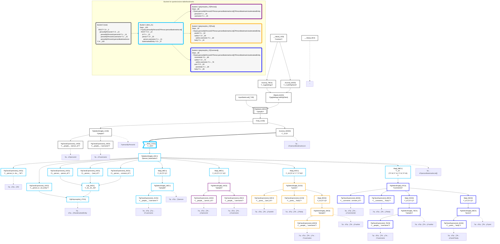

```mermaid
graph TD
    classDef path fill:#eee,stroke:#000,color:#000
    classDef plan fill:#fff,stroke-width:3px,color:#000
    classDef itemplan fill:#fff,stroke-width:6px,color:#000
    classDef sideeffectplan fill:#f00,stroke-width:6px,color:#000
    classDef bucket fill:#f6f6f6,color:#000,stroke-width:6px,text-align:left


    %% define plans
    __Value_0["__Value[_0∈0]"]:::plan
    __Value_3["__Value[_3∈0]<br />ᐸcontextᐳ"]:::plan
    InputStaticLeaf_7["InputStaticLeaf[_7∈0]"]:::plan
    PgSelect_8[["PgSelect[_8∈0]<br />ᐸpeopleᐳ"]]:::plan
    First_12["First[_12∈0]"]:::plan
    PgSelectSingle_13["PgSelectSingle[_13∈0]<br />ᐸpeopleᐳ"]:::plan
    PgClassExpression_14["PgClassExpression[_14∈0]<br />ᐸ__people__.”person_id”ᐳ"]:::plan
    PgClassExpression_15["PgClassExpression[_15∈0]<br />ᐸ__people__.”username”ᐳ"]:::plan
    __Item_21>"__Item[_21∈1]<br />ᐸ_100ᐳ"]:::itemplan
    PgSelectSingle_22["PgSelectSingle[_22∈1]<br />ᐸperson_bookmarksᐳ"]:::plan
    PgClassExpression_23["PgClassExpression[_23∈1]<br />ᐸ__person_b...rks__.”id”ᐳ"]:::plan
    PgSelectSingle_30["PgSelectSingle[_30∈1]<br />ᐸpeopleᐳ"]:::plan
    PgClassExpression_31["PgClassExpression[_31∈1]<br />ᐸ__people__.”username”ᐳ"]:::plan
    PgClassExpression_32["PgClassExpression[_32∈1]<br />ᐸ__person_b...ed_entity”ᐳ"]:::plan
    PgClassExpression_33["PgClassExpression[_33∈1]<br />ᐸ(__person_...person_id”ᐳ"]:::plan
    PgClassExpression_34["PgClassExpression[_34∈1]<br />ᐸ(__person_....”post_id”ᐳ"]:::plan
    PgClassExpression_35["PgClassExpression[_35∈1]<br />ᐸ(__person_...omment_id”ᐳ"]:::plan
    List_36["List[_36∈1]<br />ᐸ_33,_34,_35ᐳ"]:::plan
    PgPolymorphic_37["PgPolymorphic[_37∈1]"]:::plan
    PgSelectSingle_43["PgSelectSingle[_43∈2]<br />ᐸpeopleᐳ"]:::plan
    PgClassExpression_44["PgClassExpression[_44∈2]<br />ᐸ__people__.”person_id”ᐳ"]:::plan
    PgClassExpression_45["PgClassExpression[_45∈2]<br />ᐸ__people__.”username”ᐳ"]:::plan
    PgSelectSingle_51["PgSelectSingle[_51∈3]<br />ᐸpostsᐳ"]:::plan
    PgClassExpression_52["PgClassExpression[_52∈3]<br />ᐸ__posts__.”post_id”ᐳ"]:::plan
    PgSelectSingle_59["PgSelectSingle[_59∈3]<br />ᐸpeopleᐳ"]:::plan
    PgClassExpression_60["PgClassExpression[_60∈3]<br />ᐸ__people__.”username”ᐳ"]:::plan
    PgClassExpression_61["PgClassExpression[_61∈3]<br />ᐸ__posts__.”body”ᐳ"]:::plan
    PgSelectSingle_67["PgSelectSingle[_67∈4]<br />ᐸcommentsᐳ"]:::plan
    PgClassExpression_68["PgClassExpression[_68∈4]<br />ᐸ__comments...omment_id”ᐳ"]:::plan
    PgSelectSingle_75["PgSelectSingle[_75∈4]<br />ᐸpeopleᐳ"]:::plan
    PgClassExpression_76["PgClassExpression[_76∈4]<br />ᐸ__people__.”username”ᐳ"]:::plan
    Access_79["Access[_79∈0]<br />ᐸ_3.pgSettingsᐳ"]:::plan
    Access_80["Access[_80∈0]<br />ᐸ_3.withPgClientᐳ"]:::plan
    Object_81["Object[_81∈0]<br />ᐸ{pgSettings,withPgClient}ᐳ"]:::plan
    PgSelectSingle_83["PgSelectSingle[_83∈4]<br />ᐸpostsᐳ"]:::plan
    PgClassExpression_84["PgClassExpression[_84∈4]<br />ᐸ__posts__.”body”ᐳ"]:::plan
    PgClassExpression_85["PgClassExpression[_85∈4]<br />ᐸ__comments__.”body”ᐳ"]:::plan
    Map_86["Map[_86∈1]<br />ᐸ_22:{”0”:1}ᐳ"]:::plan
    Map_88["Map[_88∈1]<br />ᐸ_22:{”0”:3,”1”:4}ᐳ"]:::plan
    Map_90["Map[_90∈3]<br />ᐸ_51:{”0”:1}ᐳ"]:::plan
    Map_92["Map[_92∈1]<br />ᐸ_22:{”0”:6,”1”:7,”2”:8}ᐳ"]:::plan
    Map_94["Map[_94∈4]<br />ᐸ_67:{”0”:1}ᐳ"]:::plan
    Map_96["Map[_96∈4]<br />ᐸ_67:{”0”:2}ᐳ"]:::plan
    Map_98["Map[_98∈1]<br />ᐸ_22:{”0”:10,”1”:11,”2”:12,”3”:13}ᐳ"]:::plan
    Access_100["Access[_100∈0]<br />ᐸ_12.0ᐳ"]:::plan

    %% plan dependencies
    Object_81 & InputStaticLeaf_7 --> PgSelect_8
    PgSelect_8 --> First_12
    First_12 --> PgSelectSingle_13
    PgSelectSingle_13 --> PgClassExpression_14
    PgSelectSingle_13 --> PgClassExpression_15
    Access_100 ==> __Item_21
    __Item_21 --> PgSelectSingle_22
    PgSelectSingle_22 --> PgClassExpression_23
    Map_86 --> PgSelectSingle_30
    PgSelectSingle_30 --> PgClassExpression_31
    PgSelectSingle_22 --> PgClassExpression_32
    PgSelectSingle_22 --> PgClassExpression_33
    PgSelectSingle_22 --> PgClassExpression_34
    PgSelectSingle_22 --> PgClassExpression_35
    PgClassExpression_33 & PgClassExpression_34 & PgClassExpression_35 --> List_36
    PgClassExpression_32 & List_36 --> PgPolymorphic_37
    Map_88 --> PgSelectSingle_43
    PgSelectSingle_43 --> PgClassExpression_44
    PgSelectSingle_43 --> PgClassExpression_45
    Map_92 --> PgSelectSingle_51
    PgSelectSingle_51 --> PgClassExpression_52
    Map_90 --> PgSelectSingle_59
    PgSelectSingle_59 --> PgClassExpression_60
    PgSelectSingle_51 --> PgClassExpression_61
    Map_98 --> PgSelectSingle_67
    PgSelectSingle_67 --> PgClassExpression_68
    Map_94 --> PgSelectSingle_75
    PgSelectSingle_75 --> PgClassExpression_76
    __Value_3 --> Access_79
    __Value_3 --> Access_80
    Access_79 & Access_80 --> Object_81
    Map_96 --> PgSelectSingle_83
    PgSelectSingle_83 --> PgClassExpression_84
    PgSelectSingle_67 --> PgClassExpression_85
    PgSelectSingle_22 --> Map_86
    PgSelectSingle_22 --> Map_88
    PgSelectSingle_51 --> Map_90
    PgSelectSingle_22 --> Map_92
    PgSelectSingle_67 --> Map_94
    PgSelectSingle_67 --> Map_96
    PgSelectSingle_22 --> Map_98
    First_12 --> Access_100

    %% plan-to-path relationships
    P_0["~"]
    __Value_0 -.-> P_0
    P_13["ᐳpersonByPersonId"]
    PgSelectSingle_13 -.-> P_13
    P_14["ᐳp…dᐳpersonId"]
    PgClassExpression_14 -.-> P_14
    P_15["ᐳp…dᐳusername"]
    PgClassExpression_15 -.-> P_15
    P_22["ᐳp…dᐳpersonBookmarksList[]"]
    PgSelectSingle_22 -.-> P_22
    P_23["ᐳp…dᐳp…]ᐳid"]
    PgClassExpression_23 -.-> P_23
    P_30["ᐳp…dᐳp…]ᐳperson"]
    PgSelectSingle_30 -.-> P_30
    P_31["ᐳp…dᐳp…]ᐳp…nᐳusername"]
    PgClassExpression_31 -.-> P_31
    P_37["ᐳp…dᐳp…]ᐳbookmarkedEntity"]
    PgPolymorphic_37 -.-> P_37
    P_44["ᐳp…dᐳp…]ᐳb…yᐳpersonId"]
    PgClassExpression_44 -.-> P_44
    P_45["ᐳp…dᐳp…]ᐳb…yᐳusername"]
    PgClassExpression_45 -.-> P_45
    P_52["ᐳp…dᐳp…]ᐳb…yᐳpostId"]
    PgClassExpression_52 -.-> P_52
    P_59["ᐳp…dᐳp…]ᐳb…yᐳauthor"]
    PgSelectSingle_59 -.-> P_59
    P_60["ᐳp…dᐳp…]ᐳb…yᐳa…rᐳusername"]
    PgClassExpression_60 -.-> P_60
    P_61["ᐳp…dᐳp…]ᐳb…yᐳbody"]
    PgClassExpression_61 -.-> P_61
    P_68["ᐳp…dᐳp…]ᐳb…yᐳcommentId"]
    PgClassExpression_68 -.-> P_68
    P_75["ᐳp…dᐳp…]ᐳb…yᐳauthor"]
    PgSelectSingle_75 -.-> P_75
    P_76["ᐳp…dᐳp…]ᐳb…yᐳa…rᐳusername"]
    PgClassExpression_76 -.-> P_76
    P_83["ᐳp…dᐳp…]ᐳb…yᐳpost"]
    PgSelectSingle_83 -.-> P_83
    P_84["ᐳp…dᐳp…]ᐳb…yᐳpostᐳbody"]
    PgClassExpression_84 -.-> P_84
    P_85["ᐳp…dᐳp…]ᐳb…yᐳbody"]
    PgClassExpression_85 -.-> P_85
    P_100["ᐳp…dᐳpersonBookmarksList"]
    Access_100 -.-> P_100

    subgraph "Buckets for queries/unions-table/bookmarks"
    Bucket0("Bucket 0 (root)<br />~<br />⠀ROOT ᐸ-O- _0<br />⠀⠀personByPersonId ᐸ-O- _13<br />⠀⠀⠀personByPersonId.personId ᐸ-L- _14<br />⠀⠀⠀personByPersonId.username ᐸ-L- _15<br />⠀⠀⠀personByPersonId.personBookmarksList ᐸ-A- _100"):::bucket
    classDef bucket0 stroke:#696969
    class Bucket0,__Value_0,__Value_3,InputStaticLeaf_7,PgSelect_8,First_12,PgSelectSingle_13,PgClassExpression_14,PgClassExpression_15,Access_79,Access_80,Object_81,Access_100 bucket0
    Bucket1("Bucket 1 (item_21)<br />Deps: _100<br />~ᐳQuery.personByPersonIdᐳPerson.personBookmarksList[]<br />⠀ROOT ᐸ-O- _22<br />⠀⠀id ᐸ-L- _23<br />⠀⠀person ᐸ-O- _30<br />⠀⠀⠀person.username ᐸ-L- _31<br />⠀⠀bookmarkedEntity ᐸ-O- _37"):::bucket
    classDef bucket1 stroke:#00bfff
    class Bucket1,__Item_21,PgSelectSingle_22,PgClassExpression_23,PgSelectSingle_30,PgClassExpression_31,PgClassExpression_32,PgClassExpression_33,PgClassExpression_34,PgClassExpression_35,List_36,PgPolymorphic_37,Map_86,Map_88,Map_92,Map_98 bucket1
    Bucket2("Bucket 2 (polymorphic_37[Person])<br />Deps: _88<br />~ᐳQuery.personByPersonIdᐳPerson.personBookmarksList[]ᐳPersonBookmark.bookmarkedEntity<br />⠀⠀personId ᐸ-L- _44<br />⠀⠀username ᐸ-L- _45"):::bucket
    classDef bucket2 stroke:#7f007f
    class Bucket2,PgSelectSingle_43,PgClassExpression_44,PgClassExpression_45 bucket2
    Bucket3("Bucket 3 (polymorphic_37[Post])<br />Deps: _92<br />~ᐳQuery.personByPersonIdᐳPerson.personBookmarksList[]ᐳPersonBookmark.bookmarkedEntity<br />⠀⠀postId ᐸ-L- _52<br />⠀⠀author ᐸ-O- _59<br />⠀⠀⠀author.username ᐸ-L- _60<br />⠀⠀body ᐸ-L- _61"):::bucket
    classDef bucket3 stroke:#ffa500
    class Bucket3,PgSelectSingle_51,PgClassExpression_52,PgSelectSingle_59,PgClassExpression_60,PgClassExpression_61,Map_90 bucket3
    Bucket4("Bucket 4 (polymorphic_37[Comment])<br />Deps: _98<br />~ᐳQuery.personByPersonIdᐳPerson.personBookmarksList[]ᐳPersonBookmark.bookmarkedEntity<br />⠀⠀commentId ᐸ-L- _68<br />⠀⠀author ᐸ-O- _75<br />⠀⠀⠀author.username ᐸ-L- _76<br />⠀⠀post ᐸ-O- _83<br />⠀⠀⠀post.body ᐸ-L- _84<br />⠀⠀body ᐸ-L- _85"):::bucket
    classDef bucket4 stroke:#0000ff
    class Bucket4,PgSelectSingle_67,PgClassExpression_68,PgSelectSingle_75,PgClassExpression_76,PgSelectSingle_83,PgClassExpression_84,PgClassExpression_85,Map_94,Map_96 bucket4
    Bucket0 --> Bucket1
    Bucket1 --> Bucket2 & Bucket3 & Bucket4
    end
```
