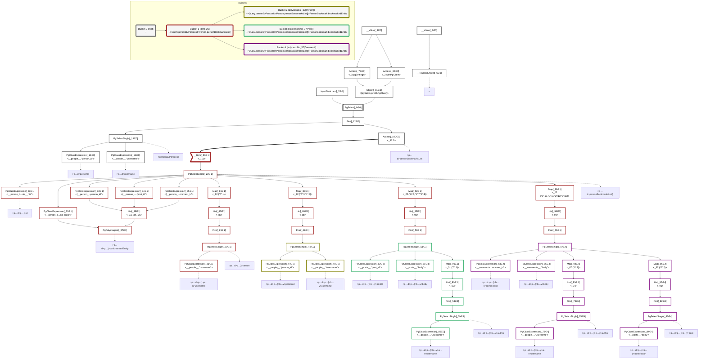

```mermaid
graph TD
    classDef path fill:#eee,stroke:#000,color:#000
    classDef plan fill:#fff,stroke-width:3px,color:#000
    classDef itemplan fill:#fff,stroke-width:6px,color:#000
    classDef sideeffectplan fill:#f00,stroke-width:6px,color:#000
    classDef bucket fill:#f6f6f6,color:#000,stroke-width:6px


    %% define plans
    __Value_3["__Value[_3∈0]<br /><context>"]:::plan
    __Value_5["__Value[_5∈0]<br /><rootValue>"]:::plan
    __TrackedObject_6["__TrackedObject[_6∈0]"]:::plan
    InputStaticLeaf_7["InputStaticLeaf[_7∈0]"]:::plan
    PgSelect_8[["PgSelect[_8∈0]<br /><people>"]]:::plan
    First_12["First[_12∈0]"]:::plan
    PgSelectSingle_13["PgSelectSingle[_13∈0]<br /><people>"]:::plan
    PgClassExpression_14["PgClassExpression[_14∈0]<br /><__people__.”person_id”>"]:::plan
    PgClassExpression_15["PgClassExpression[_15∈0]<br /><__people__.”username”>"]:::plan
    __Item_21>"__Item[_21∈1]<br /><_100>"]:::itemplan
    PgSelectSingle_22["PgSelectSingle[_22∈1]<br /><person_bookmarks>"]:::plan
    PgClassExpression_23["PgClassExpression[_23∈1]<br /><__person_b...rks__.”id”>"]:::plan
    First_29["First[_29∈1]"]:::plan
    PgSelectSingle_30["PgSelectSingle[_30∈1]<br /><people>"]:::plan
    PgClassExpression_31["PgClassExpression[_31∈1]<br /><__people__.”username”>"]:::plan
    PgClassExpression_32["PgClassExpression[_32∈1]<br /><__person_b...ed_entity”>"]:::plan
    PgClassExpression_33["PgClassExpression[_33∈1]<br /><(__person_...person_id”>"]:::plan
    PgClassExpression_34["PgClassExpression[_34∈1]<br /><(__person_....”post_id”>"]:::plan
    PgClassExpression_35["PgClassExpression[_35∈1]<br /><(__person_...omment_id”>"]:::plan
    List_36["List[_36∈1]<br /><_33,_34,_35>"]:::plan
    PgPolymorphic_37["PgPolymorphic[_37∈1]"]:::plan
    First_42["First[_42∈1]"]:::plan
    PgSelectSingle_43["PgSelectSingle[_43∈2]<br /><people>"]:::plan
    PgClassExpression_44["PgClassExpression[_44∈2]<br /><__people__.”person_id”>"]:::plan
    PgClassExpression_45["PgClassExpression[_45∈2]<br /><__people__.”username”>"]:::plan
    First_50["First[_50∈1]"]:::plan
    PgSelectSingle_51["PgSelectSingle[_51∈3]<br /><posts>"]:::plan
    PgClassExpression_52["PgClassExpression[_52∈3]<br /><__posts__.”post_id”>"]:::plan
    First_58["First[_58∈3]"]:::plan
    PgSelectSingle_59["PgSelectSingle[_59∈3]<br /><people>"]:::plan
    PgClassExpression_60["PgClassExpression[_60∈3]<br /><__people__.”username”>"]:::plan
    PgClassExpression_61["PgClassExpression[_61∈3]<br /><__posts__.”body”>"]:::plan
    First_66["First[_66∈1]"]:::plan
    PgSelectSingle_67["PgSelectSingle[_67∈4]<br /><comments>"]:::plan
    PgClassExpression_68["PgClassExpression[_68∈4]<br /><__comments...omment_id”>"]:::plan
    First_74["First[_74∈4]"]:::plan
    PgSelectSingle_75["PgSelectSingle[_75∈4]<br /><people>"]:::plan
    PgClassExpression_76["PgClassExpression[_76∈4]<br /><__people__.”username”>"]:::plan
    Access_79["Access[_79∈0]<br /><_3.pgSettings>"]:::plan
    Access_80["Access[_80∈0]<br /><_3.withPgClient>"]:::plan
    Object_81["Object[_81∈0]<br /><{pgSettings,withPgClient}>"]:::plan
    First_82["First[_82∈4]"]:::plan
    PgSelectSingle_83["PgSelectSingle[_83∈4]<br /><posts>"]:::plan
    PgClassExpression_84["PgClassExpression[_84∈4]<br /><__posts__.”body”>"]:::plan
    PgClassExpression_85["PgClassExpression[_85∈4]<br /><__comments__.”body”>"]:::plan
    Map_86["Map[_86∈1]<br /><_22:{”0”:1}>"]:::plan
    List_87["List[_87∈1]<br /><_86>"]:::plan
    Map_88["Map[_88∈1]<br /><_22:{”0”:3,”1”:4}>"]:::plan
    List_89["List[_89∈1]<br /><_88>"]:::plan
    Map_90["Map[_90∈3]<br /><_51:{”0”:1}>"]:::plan
    List_91["List[_91∈3]<br /><_90>"]:::plan
    Map_92["Map[_92∈1]<br /><_22:{”0”:6,”1”:7,”2”:8}>"]:::plan
    List_93["List[_93∈1]<br /><_92>"]:::plan
    Map_94["Map[_94∈4]<br /><_67:{”0”:1}>"]:::plan
    List_95["List[_95∈4]<br /><_94>"]:::plan
    Map_96["Map[_96∈4]<br /><_67:{”0”:2}>"]:::plan
    List_97["List[_97∈4]<br /><_96>"]:::plan
    Map_98["Map[_98∈1]<br /><_22:{”0”:10,”1”:11,”2”:12,”3”:13}>"]:::plan
    List_99["List[_99∈1]<br /><_98>"]:::plan
    Access_100["Access[_100∈0]<br /><_12.0>"]:::plan

    %% plan dependencies
    __Value_5 --> __TrackedObject_6
    Object_81 --> PgSelect_8
    InputStaticLeaf_7 --> PgSelect_8
    PgSelect_8 --> First_12
    First_12 --> PgSelectSingle_13
    PgSelectSingle_13 --> PgClassExpression_14
    PgSelectSingle_13 --> PgClassExpression_15
    Access_100 ==> __Item_21
    __Item_21 --> PgSelectSingle_22
    PgSelectSingle_22 --> PgClassExpression_23
    List_87 --> First_29
    First_29 --> PgSelectSingle_30
    PgSelectSingle_30 --> PgClassExpression_31
    PgSelectSingle_22 --> PgClassExpression_32
    PgSelectSingle_22 --> PgClassExpression_33
    PgSelectSingle_22 --> PgClassExpression_34
    PgSelectSingle_22 --> PgClassExpression_35
    PgClassExpression_33 --> List_36
    PgClassExpression_34 --> List_36
    PgClassExpression_35 --> List_36
    PgClassExpression_32 --> PgPolymorphic_37
    List_36 --> PgPolymorphic_37
    List_89 --> First_42
    First_42 --> PgSelectSingle_43
    PgSelectSingle_43 --> PgClassExpression_44
    PgSelectSingle_43 --> PgClassExpression_45
    List_93 --> First_50
    First_50 --> PgSelectSingle_51
    PgSelectSingle_51 --> PgClassExpression_52
    List_91 --> First_58
    First_58 --> PgSelectSingle_59
    PgSelectSingle_59 --> PgClassExpression_60
    PgSelectSingle_51 --> PgClassExpression_61
    List_99 --> First_66
    First_66 --> PgSelectSingle_67
    PgSelectSingle_67 --> PgClassExpression_68
    List_95 --> First_74
    First_74 --> PgSelectSingle_75
    PgSelectSingle_75 --> PgClassExpression_76
    __Value_3 --> Access_79
    __Value_3 --> Access_80
    Access_79 --> Object_81
    Access_80 --> Object_81
    List_97 --> First_82
    First_82 --> PgSelectSingle_83
    PgSelectSingle_83 --> PgClassExpression_84
    PgSelectSingle_67 --> PgClassExpression_85
    PgSelectSingle_22 --> Map_86
    Map_86 --> List_87
    PgSelectSingle_22 --> Map_88
    Map_88 --> List_89
    PgSelectSingle_51 --> Map_90
    Map_90 --> List_91
    PgSelectSingle_22 --> Map_92
    Map_92 --> List_93
    PgSelectSingle_67 --> Map_94
    Map_94 --> List_95
    PgSelectSingle_67 --> Map_96
    Map_96 --> List_97
    PgSelectSingle_22 --> Map_98
    Map_98 --> List_99
    First_12 --> Access_100

    %% plan-to-path relationships
    P_6["~"]
    __TrackedObject_6 -.-> P_6
    P_13[">personByPersonId"]
    PgSelectSingle_13 -.-> P_13
    P_14[">p…d>personId"]
    PgClassExpression_14 -.-> P_14
    P_15[">p…d>username"]
    PgClassExpression_15 -.-> P_15
    P_100[">p…d>personBookmarksList"]
    Access_100 -.-> P_100
    P_22[">p…d>personBookmarksList[]"]
    PgSelectSingle_22 -.-> P_22
    P_23[">p…d>p…]>id"]
    PgClassExpression_23 -.-> P_23
    P_30[">p…d>p…]>person"]
    PgSelectSingle_30 -.-> P_30
    P_31[">p…d>p…]>p…n>username"]
    PgClassExpression_31 -.-> P_31
    P_37[">p…d>p…]>bookmarkedEntity"]
    PgPolymorphic_37 -.-> P_37
    P_44[">p…d>p…]>b…y>personId"]
    PgClassExpression_44 -.-> P_44
    P_45[">p…d>p…]>b…y>username"]
    PgClassExpression_45 -.-> P_45
    P_52[">p…d>p…]>b…y>postId"]
    PgClassExpression_52 -.-> P_52
    P_59[">p…d>p…]>b…y>author"]
    PgSelectSingle_59 -.-> P_59
    P_60[">p…d>p…]>b…y>a…r>username"]
    PgClassExpression_60 -.-> P_60
    P_61[">p…d>p…]>b…y>body"]
    PgClassExpression_61 -.-> P_61
    P_68[">p…d>p…]>b…y>commentId"]
    PgClassExpression_68 -.-> P_68
    P_75[">p…d>p…]>b…y>author"]
    PgSelectSingle_75 -.-> P_75
    P_76[">p…d>p…]>b…y>a…r>username"]
    PgClassExpression_76 -.-> P_76
    P_83[">p…d>p…]>b…y>post"]
    PgSelectSingle_83 -.-> P_83
    P_84[">p…d>p…]>b…y>post>body"]
    PgClassExpression_84 -.-> P_84
    P_85[">p…d>p…]>b…y>body"]
    PgClassExpression_85 -.-> P_85

    %% allocate buckets
    classDef bucket0 stroke:#696969
    class __Value_3,__Value_5,__TrackedObject_6,InputStaticLeaf_7,PgSelect_8,First_12,PgSelectSingle_13,PgClassExpression_14,PgClassExpression_15,Access_79,Access_80,Object_81,Access_100 bucket0
    classDef bucket1 stroke:#a52a2a
    class __Item_21,PgSelectSingle_22,PgClassExpression_23,First_29,PgSelectSingle_30,PgClassExpression_31,PgClassExpression_32,PgClassExpression_33,PgClassExpression_34,PgClassExpression_35,List_36,PgPolymorphic_37,First_42,First_50,First_66,Map_86,List_87,Map_88,List_89,Map_92,List_93,Map_98,List_99 bucket1
    classDef bucket2 stroke:#808000
    class PgSelectSingle_43,PgClassExpression_44,PgClassExpression_45 bucket2
    classDef bucket3 stroke:#3cb371
    class PgSelectSingle_51,PgClassExpression_52,First_58,PgSelectSingle_59,PgClassExpression_60,PgClassExpression_61,Map_90,List_91 bucket3
    classDef bucket4 stroke:#7f007f
    class PgSelectSingle_67,PgClassExpression_68,First_74,PgSelectSingle_75,PgClassExpression_76,First_82,PgSelectSingle_83,PgClassExpression_84,PgClassExpression_85,Map_94,List_95,Map_96,List_97 bucket4

    subgraph Buckets
    Bucket0("Bucket 0 (root)<br />~"):::bucket
    style Bucket0 stroke:#696969
    Bucket1("Bucket 1 (item_21)<br />~>Query.personByPersonId>Person.personBookmarksList[]"):::bucket
    style Bucket1 stroke:#a52a2a
    Bucket0 --> Bucket1
    Bucket2("Bucket 2 (polymorphic_37[Person])<br />~>Query.personByPersonId>Person.personBookmarksList[]>PersonBookmark.bookmarkedEntity"):::bucket
    style Bucket2 stroke:#808000
    Bucket1 --> Bucket2
    Bucket3("Bucket 3 (polymorphic_37[Post])<br />~>Query.personByPersonId>Person.personBookmarksList[]>PersonBookmark.bookmarkedEntity"):::bucket
    style Bucket3 stroke:#3cb371
    Bucket1 --> Bucket3
    Bucket4("Bucket 4 (polymorphic_37[Comment])<br />~>Query.personByPersonId>Person.personBookmarksList[]>PersonBookmark.bookmarkedEntity"):::bucket
    style Bucket4 stroke:#7f007f
    Bucket1 --> Bucket4
    end
```
