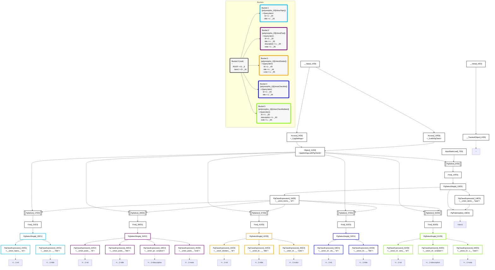

```mermaid
graph TD
    classDef path fill:#eee,stroke:#000,color:#000
    classDef plan fill:#fff,stroke-width:3px,color:#000
    classDef itemplan fill:#fff,stroke-width:6px,color:#000
    classDef sideeffectplan fill:#f00,stroke-width:6px,color:#000
    classDef bucket fill:#f6f6f6,color:#000,stroke-width:6px,text-align:left


    %% define plans
    __Value_3["__Value[_3∈0]<br /><context>"]:::plan
    __Value_5["__Value[_5∈0]<br /><rootValue>"]:::plan
    __TrackedObject_6["__TrackedObject[_6∈0]"]:::plan
    InputStaticLeaf_7["InputStaticLeaf[_7∈0]"]:::plan
    PgSelect_8[["PgSelect[_8∈0]<br /><union_items>"]]:::plan
    Access_9["Access[_9∈0]<br /><_3.pgSettings>"]:::plan
    Access_10["Access[_10∈0]<br /><_3.withPgClient>"]:::plan
    Object_11["Object[_11∈0]<br /><{pgSettings,withPgClient}>"]:::plan
    First_12["First[_12∈0]"]:::plan
    PgSelectSingle_13["PgSelectSingle[_13∈0]<br /><union_items>"]:::plan
    PgClassExpression_14["PgClassExpression[_14∈0]<br /><__union_items__.”type”>"]:::plan
    PgPolymorphic_15["PgPolymorphic[_15∈0]"]:::plan
    PgClassExpression_16["PgClassExpression[_16∈0]<br /><__union_items__.”id”>"]:::plan
    PgSelect_17[["PgSelect[_17∈0]<br /><union_topics>"]]:::plan
    First_21["First[_21∈0]"]:::plan
    PgSelectSingle_22["PgSelectSingle[_22∈1]<br /><union_topics>"]:::plan
    PgClassExpression_23["PgClassExpression[_23∈1]<br /><__union_topics__.”id”>"]:::plan
    PgClassExpression_24["PgClassExpression[_24∈1]<br /><__union_to...__.”title”>"]:::plan
    PgSelect_26[["PgSelect[_26∈0]<br /><union_posts>"]]:::plan
    First_30["First[_30∈0]"]:::plan
    PgSelectSingle_31["PgSelectSingle[_31∈2]<br /><union_posts>"]:::plan
    PgClassExpression_32["PgClassExpression[_32∈2]<br /><__union_posts__.”id”>"]:::plan
    PgClassExpression_33["PgClassExpression[_33∈2]<br /><__union_posts__.”title”>"]:::plan
    PgClassExpression_34["PgClassExpression[_34∈2]<br /><__union_po...scription”>"]:::plan
    PgClassExpression_35["PgClassExpression[_35∈2]<br /><__union_posts__.”note”>"]:::plan
    PgSelect_37[["PgSelect[_37∈0]<br /><union_dividers>"]]:::plan
    First_41["First[_41∈0]"]:::plan
    PgSelectSingle_42["PgSelectSingle[_42∈3]<br /><union_dividers>"]:::plan
    PgClassExpression_43["PgClassExpression[_43∈3]<br /><__union_dividers__.”id”>"]:::plan
    PgClassExpression_44["PgClassExpression[_44∈3]<br /><__union_di...__.”title”>"]:::plan
    PgClassExpression_45["PgClassExpression[_45∈3]<br /><__union_di...__.”color”>"]:::plan
    PgSelect_47[["PgSelect[_47∈0]<br /><union_checklists>"]]:::plan
    First_51["First[_51∈0]"]:::plan
    PgSelectSingle_52["PgSelectSingle[_52∈4]<br /><union_checklists>"]:::plan
    PgClassExpression_53["PgClassExpression[_53∈4]<br /><__union_ch...sts__.”id”>"]:::plan
    PgClassExpression_54["PgClassExpression[_54∈4]<br /><__union_ch...__.”title”>"]:::plan
    PgSelect_56[["PgSelect[_56∈0]<br /><union_checklist_items>"]]:::plan
    First_60["First[_60∈0]"]:::plan
    PgSelectSingle_61["PgSelectSingle[_61∈5]<br /><union_checklist_items>"]:::plan
    PgClassExpression_62["PgClassExpression[_62∈5]<br /><__union_ch...ems__.”id”>"]:::plan
    PgClassExpression_63["PgClassExpression[_63∈5]<br /><__union_ch...scription”>"]:::plan
    PgClassExpression_64["PgClassExpression[_64∈5]<br /><__union_ch...s__.”note”>"]:::plan

    %% plan dependencies
    __Value_5 --> __TrackedObject_6
    Object_11 --> PgSelect_8
    InputStaticLeaf_7 --> PgSelect_8
    __Value_3 --> Access_9
    __Value_3 --> Access_10
    Access_9 --> Object_11
    Access_10 --> Object_11
    PgSelect_8 --> First_12
    First_12 --> PgSelectSingle_13
    PgSelectSingle_13 --> PgClassExpression_14
    PgSelectSingle_13 --> PgPolymorphic_15
    PgClassExpression_14 --> PgPolymorphic_15
    PgSelectSingle_13 --> PgClassExpression_16
    Object_11 --> PgSelect_17
    PgClassExpression_16 --> PgSelect_17
    PgSelect_17 --> First_21
    First_21 --> PgSelectSingle_22
    PgSelectSingle_22 --> PgClassExpression_23
    PgSelectSingle_22 --> PgClassExpression_24
    Object_11 --> PgSelect_26
    PgClassExpression_16 --> PgSelect_26
    PgSelect_26 --> First_30
    First_30 --> PgSelectSingle_31
    PgSelectSingle_31 --> PgClassExpression_32
    PgSelectSingle_31 --> PgClassExpression_33
    PgSelectSingle_31 --> PgClassExpression_34
    PgSelectSingle_31 --> PgClassExpression_35
    Object_11 --> PgSelect_37
    PgClassExpression_16 --> PgSelect_37
    PgSelect_37 --> First_41
    First_41 --> PgSelectSingle_42
    PgSelectSingle_42 --> PgClassExpression_43
    PgSelectSingle_42 --> PgClassExpression_44
    PgSelectSingle_42 --> PgClassExpression_45
    Object_11 --> PgSelect_47
    PgClassExpression_16 --> PgSelect_47
    PgSelect_47 --> First_51
    First_51 --> PgSelectSingle_52
    PgSelectSingle_52 --> PgClassExpression_53
    PgSelectSingle_52 --> PgClassExpression_54
    Object_11 --> PgSelect_56
    PgClassExpression_16 --> PgSelect_56
    PgSelect_56 --> First_60
    First_60 --> PgSelectSingle_61
    PgSelectSingle_61 --> PgClassExpression_62
    PgSelectSingle_61 --> PgClassExpression_63
    PgSelectSingle_61 --> PgClassExpression_64

    %% plan-to-path relationships
    P_6["~"]
    __TrackedObject_6 -.-> P_6
    P_15[">item1"]
    PgPolymorphic_15 -.-> P_15
    P_23[">i…1>id"]
    PgClassExpression_23 -.-> P_23
    P_24[">i…1>title"]
    PgClassExpression_24 -.-> P_24
    P_32[">i…1>id"]
    PgClassExpression_32 -.-> P_32
    P_33[">i…1>title"]
    PgClassExpression_33 -.-> P_33
    P_34[">i…1>description"]
    PgClassExpression_34 -.-> P_34
    P_35[">i…1>note"]
    PgClassExpression_35 -.-> P_35
    P_43[">i…1>id"]
    PgClassExpression_43 -.-> P_43
    P_44[">i…1>title"]
    PgClassExpression_44 -.-> P_44
    P_45[">i…1>color"]
    PgClassExpression_45 -.-> P_45
    P_53[">i…1>id"]
    PgClassExpression_53 -.-> P_53
    P_54[">i…1>title"]
    PgClassExpression_54 -.-> P_54
    P_62[">i…1>id"]
    PgClassExpression_62 -.-> P_62
    P_63[">i…1>description"]
    PgClassExpression_63 -.-> P_63
    P_64[">i…1>note"]
    PgClassExpression_64 -.-> P_64

    %% allocate buckets
    classDef bucket0 stroke:#696969
    class __Value_3,__Value_5,__TrackedObject_6,InputStaticLeaf_7,PgSelect_8,Access_9,Access_10,Object_11,First_12,PgSelectSingle_13,PgClassExpression_14,PgPolymorphic_15,PgClassExpression_16,PgSelect_17,First_21,PgSelect_26,First_30,PgSelect_37,First_41,PgSelect_47,First_51,PgSelect_56,First_60 bucket0
    classDef bucket1 stroke:#00bfff
    class PgSelectSingle_22,PgClassExpression_23,PgClassExpression_24 bucket1
    classDef bucket2 stroke:#7f007f
    class PgSelectSingle_31,PgClassExpression_32,PgClassExpression_33,PgClassExpression_34,PgClassExpression_35 bucket2
    classDef bucket3 stroke:#ffa500
    class PgSelectSingle_42,PgClassExpression_43,PgClassExpression_44,PgClassExpression_45 bucket3
    classDef bucket4 stroke:#0000ff
    class PgSelectSingle_52,PgClassExpression_53,PgClassExpression_54 bucket4
    classDef bucket5 stroke:#7fff00
    class PgSelectSingle_61,PgClassExpression_62,PgClassExpression_63,PgClassExpression_64 bucket5

    subgraph Buckets
    Bucket0("Bucket 0 (root)<br />~<br />⠀ROOT <-O- _6<br />⠀⠀item1 <-O- _15"):::bucket
    style Bucket0 stroke:#696969
    Bucket1("Bucket 1 (polymorphic_15[UnionTopic])<br />~>Query.item1<br />⠀⠀id <-L- _23<br />⠀⠀title <-L- _24"):::bucket
    style Bucket1 stroke:#00bfff
    Bucket0 --> Bucket1
    Bucket2("Bucket 2 (polymorphic_15[UnionPost])<br />~>Query.item1<br />⠀⠀id <-L- _32<br />⠀⠀title <-L- _33<br />⠀⠀description <-L- _34<br />⠀⠀note <-L- _35"):::bucket
    style Bucket2 stroke:#7f007f
    Bucket0 --> Bucket2
    Bucket3("Bucket 3 (polymorphic_15[UnionDivider])<br />~>Query.item1<br />⠀⠀id <-L- _43<br />⠀⠀title <-L- _44<br />⠀⠀color <-L- _45"):::bucket
    style Bucket3 stroke:#ffa500
    Bucket0 --> Bucket3
    Bucket4("Bucket 4 (polymorphic_15[UnionChecklist])<br />~>Query.item1<br />⠀⠀id <-L- _53<br />⠀⠀title <-L- _54"):::bucket
    style Bucket4 stroke:#0000ff
    Bucket0 --> Bucket4
    Bucket5("Bucket 5 (polymorphic_15[UnionChecklistItem])<br />~>Query.item1<br />⠀⠀id <-L- _62<br />⠀⠀description <-L- _63<br />⠀⠀note <-L- _64"):::bucket
    style Bucket5 stroke:#7fff00
    Bucket0 --> Bucket5
    end
```
