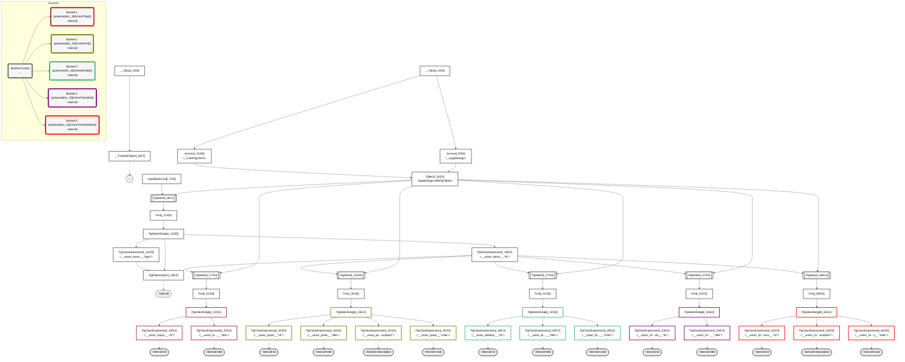

```mermaid
graph TD
    classDef path fill:#eee,stroke:#000,color:#000
    classDef plan fill:#fff,stroke-width:3px,color:#000
    classDef itemplan fill:#fff,stroke-width:6px,color:#000
    classDef sideeffectplan fill:#f00,stroke-width:6px,color:#000
    classDef bucket fill:#f6f6f6,color:#000,stroke-width:6px

    %% subgraph fields
    P1{{"~"}}:::path
    P2{{">item18"}}:::path
    P3([">item18>id"]):::path
    %% P2 -.-> P3
    P4([">item18>title"]):::path
    %% P2 -.-> P4
    P5([">item18>id"]):::path
    %% P2 -.-> P5
    P6([">item18>title"]):::path
    %% P2 -.-> P6
    P7([">item18>description"]):::path
    %% P2 -.-> P7
    P8([">item18>note"]):::path
    %% P2 -.-> P8
    P9([">item18>id"]):::path
    %% P2 -.-> P9
    P10([">item18>title"]):::path
    %% P2 -.-> P10
    P11([">item18>color"]):::path
    %% P2 -.-> P11
    P12([">item18>id"]):::path
    %% P2 -.-> P12
    P13([">item18>title"]):::path
    %% P2 -.-> P13
    P14([">item18>id"]):::path
    %% P2 -.-> P14
    P15([">item18>description"]):::path
    %% P2 -.-> P15
    P16([">item18>note"]):::path
    %% P2 -.-> P16
    %% P1 -.-> P2
    %% end

    %% define plans
    __Value_3["__Value[_3∈0]<br /><context>"]:::plan
    __Value_5["__Value[_5∈0]<br /><rootValue>"]:::plan
    __TrackedObject_6["__TrackedObject[_6∈0]"]:::plan
    InputStaticLeaf_7["InputStaticLeaf[_7∈0]"]:::plan
    PgSelect_8[["PgSelect[_8∈0]<br /><union_items>"]]:::plan
    Access_9["Access[_9∈0]<br /><_3.pgSettings>"]:::plan
    Access_10["Access[_10∈0]<br /><_3.withPgClient>"]:::plan
    Object_11["Object[_11∈0]<br /><{pgSettings,withPgClient}>"]:::plan
    First_12["First[_12∈0]"]:::plan
    PgSelectSingle_13["PgSelectSingle[_13∈0]<br /><union_items>"]:::plan
    PgClassExpression_14["PgClassExpression[_14∈0]<br /><__union_items__.#quot;type#quot;>"]:::plan
    PgPolymorphic_15["PgPolymorphic[_15∈0]"]:::plan
    PgClassExpression_16["PgClassExpression[_16∈0]<br /><__union_items__.#quot;id#quot;>"]:::plan
    PgSelect_17[["PgSelect[_17∈0]<br /><union_topics>"]]:::plan
    First_21["First[_21∈0]"]:::plan
    PgSelectSingle_22["PgSelectSingle[_22∈1]<br /><union_topics>"]:::plan
    PgClassExpression_23["PgClassExpression[_23∈1]<br /><__union_topics__.#quot;id#quot;>"]:::plan
    PgClassExpression_24["PgClassExpression[_24∈1]<br /><__union_to...__.#quot;title#quot;>"]:::plan
    PgSelect_26[["PgSelect[_26∈0]<br /><union_posts>"]]:::plan
    First_30["First[_30∈0]"]:::plan
    PgSelectSingle_31["PgSelectSingle[_31∈2]<br /><union_posts>"]:::plan
    PgClassExpression_32["PgClassExpression[_32∈2]<br /><__union_posts__.#quot;id#quot;>"]:::plan
    PgClassExpression_33["PgClassExpression[_33∈2]<br /><__union_posts__.#quot;title#quot;>"]:::plan
    PgClassExpression_34["PgClassExpression[_34∈2]<br /><__union_po...scription#quot;>"]:::plan
    PgClassExpression_35["PgClassExpression[_35∈2]<br /><__union_posts__.#quot;note#quot;>"]:::plan
    PgSelect_37[["PgSelect[_37∈0]<br /><union_dividers>"]]:::plan
    First_41["First[_41∈0]"]:::plan
    PgSelectSingle_42["PgSelectSingle[_42∈3]<br /><union_dividers>"]:::plan
    PgClassExpression_43["PgClassExpression[_43∈3]<br /><__union_dividers__.#quot;id#quot;>"]:::plan
    PgClassExpression_44["PgClassExpression[_44∈3]<br /><__union_di...__.#quot;title#quot;>"]:::plan
    PgClassExpression_45["PgClassExpression[_45∈3]<br /><__union_di...__.#quot;color#quot;>"]:::plan
    PgSelect_47[["PgSelect[_47∈0]<br /><union_checklists>"]]:::plan
    First_51["First[_51∈0]"]:::plan
    PgSelectSingle_52["PgSelectSingle[_52∈4]<br /><union_checklists>"]:::plan
    PgClassExpression_53["PgClassExpression[_53∈4]<br /><__union_ch...sts__.#quot;id#quot;>"]:::plan
    PgClassExpression_54["PgClassExpression[_54∈4]<br /><__union_ch...__.#quot;title#quot;>"]:::plan
    PgSelect_56[["PgSelect[_56∈0]<br /><union_checklist_items>"]]:::plan
    First_60["First[_60∈0]"]:::plan
    PgSelectSingle_61["PgSelectSingle[_61∈5]<br /><union_checklist_items>"]:::plan
    PgClassExpression_62["PgClassExpression[_62∈5]<br /><__union_ch...ems__.#quot;id#quot;>"]:::plan
    PgClassExpression_63["PgClassExpression[_63∈5]<br /><__union_ch...scription#quot;>"]:::plan
    PgClassExpression_64["PgClassExpression[_64∈5]<br /><__union_ch...s__.#quot;note#quot;>"]:::plan

    %% plan dependencies
    __Value_5 --> __TrackedObject_6
    Object_11 --> PgSelect_8
    InputStaticLeaf_7 --> PgSelect_8
    __Value_3 --> Access_9
    __Value_3 --> Access_10
    Access_9 --> Object_11
    Access_10 --> Object_11
    PgSelect_8 --> First_12
    First_12 --> PgSelectSingle_13
    PgSelectSingle_13 --> PgClassExpression_14
    PgSelectSingle_13 --> PgPolymorphic_15
    PgClassExpression_14 --> PgPolymorphic_15
    PgSelectSingle_13 --> PgClassExpression_16
    Object_11 --> PgSelect_17
    PgClassExpression_16 --> PgSelect_17
    PgSelect_17 --> First_21
    First_21 --> PgSelectSingle_22
    PgSelectSingle_22 --> PgClassExpression_23
    PgSelectSingle_22 --> PgClassExpression_24
    Object_11 --> PgSelect_26
    PgClassExpression_16 --> PgSelect_26
    PgSelect_26 --> First_30
    First_30 --> PgSelectSingle_31
    PgSelectSingle_31 --> PgClassExpression_32
    PgSelectSingle_31 --> PgClassExpression_33
    PgSelectSingle_31 --> PgClassExpression_34
    PgSelectSingle_31 --> PgClassExpression_35
    Object_11 --> PgSelect_37
    PgClassExpression_16 --> PgSelect_37
    PgSelect_37 --> First_41
    First_41 --> PgSelectSingle_42
    PgSelectSingle_42 --> PgClassExpression_43
    PgSelectSingle_42 --> PgClassExpression_44
    PgSelectSingle_42 --> PgClassExpression_45
    Object_11 --> PgSelect_47
    PgClassExpression_16 --> PgSelect_47
    PgSelect_47 --> First_51
    First_51 --> PgSelectSingle_52
    PgSelectSingle_52 --> PgClassExpression_53
    PgSelectSingle_52 --> PgClassExpression_54
    Object_11 --> PgSelect_56
    PgClassExpression_16 --> PgSelect_56
    PgSelect_56 --> First_60
    First_60 --> PgSelectSingle_61
    PgSelectSingle_61 --> PgClassExpression_62
    PgSelectSingle_61 --> PgClassExpression_63
    PgSelectSingle_61 --> PgClassExpression_64

    %% plan-to-path relationships
    __TrackedObject_6 -.-> P1
    PgPolymorphic_15 -.-> P2
    PgClassExpression_23 -.-> P3
    PgClassExpression_24 -.-> P4
    PgClassExpression_32 -.-> P5
    PgClassExpression_33 -.-> P6
    PgClassExpression_34 -.-> P7
    PgClassExpression_35 -.-> P8
    PgClassExpression_43 -.-> P9
    PgClassExpression_44 -.-> P10
    PgClassExpression_45 -.-> P11
    PgClassExpression_53 -.-> P12
    PgClassExpression_54 -.-> P13
    PgClassExpression_62 -.-> P14
    PgClassExpression_63 -.-> P15
    PgClassExpression_64 -.-> P16

    %% allocate buckets
    classDef bucket0 stroke:#696969
    class __Value_3,__Value_5,__TrackedObject_6,InputStaticLeaf_7,PgSelect_8,Access_9,Access_10,Object_11,First_12,PgSelectSingle_13,PgClassExpression_14,PgPolymorphic_15,PgClassExpression_16,PgSelect_17,First_21,PgSelect_26,First_30,PgSelect_37,First_41,PgSelect_47,First_51,PgSelect_56,First_60 bucket0
    classDef bucket1 stroke:#a52a2a
    class PgSelectSingle_22,PgClassExpression_23,PgClassExpression_24 bucket1
    classDef bucket2 stroke:#808000
    class PgSelectSingle_31,PgClassExpression_32,PgClassExpression_33,PgClassExpression_34,PgClassExpression_35 bucket2
    classDef bucket3 stroke:#3cb371
    class PgSelectSingle_42,PgClassExpression_43,PgClassExpression_44,PgClassExpression_45 bucket3
    classDef bucket4 stroke:#7f007f
    class PgSelectSingle_52,PgClassExpression_53,PgClassExpression_54 bucket4
    classDef bucket5 stroke:#ff0000
    class PgSelectSingle_61,PgClassExpression_62,PgClassExpression_63,PgClassExpression_64 bucket5

    subgraph Buckets
    Bucket0("Bucket 0 (root)<br />~"):::bucket
    style Bucket0 stroke:#696969
    Bucket1("Bucket 1 (polymorphic_15[UnionTopic])<br />>item18"):::bucket
    style Bucket1 stroke:#a52a2a
    Bucket0 --> Bucket1
    Bucket2("Bucket 2 (polymorphic_15[UnionPost])<br />>item18"):::bucket
    style Bucket2 stroke:#808000
    Bucket0 --> Bucket2
    Bucket3("Bucket 3 (polymorphic_15[UnionDivider])<br />>item18"):::bucket
    style Bucket3 stroke:#3cb371
    Bucket0 --> Bucket3
    Bucket4("Bucket 4 (polymorphic_15[UnionChecklist])<br />>item18"):::bucket
    style Bucket4 stroke:#7f007f
    Bucket0 --> Bucket4
    Bucket5("Bucket 5 (polymorphic_15[UnionChecklistItem])<br />>item18"):::bucket
    style Bucket5 stroke:#ff0000
    Bucket0 --> Bucket5
    end
```
