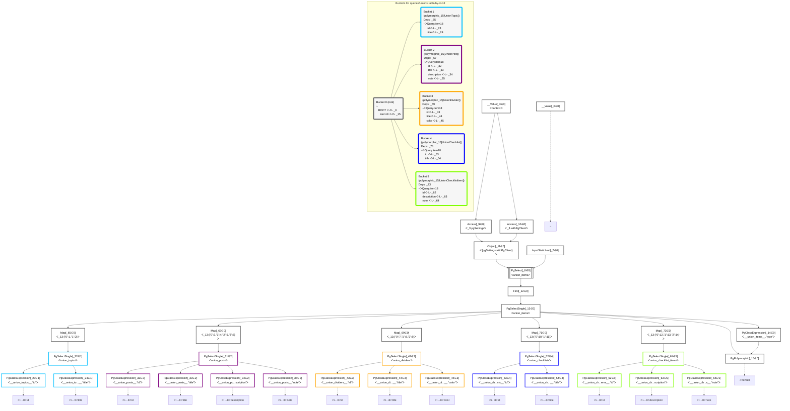

```mermaid
graph TD
    classDef path fill:#eee,stroke:#000,color:#000
    classDef plan fill:#fff,stroke-width:3px,color:#000
    classDef itemplan fill:#fff,stroke-width:6px,color:#000
    classDef sideeffectplan fill:#f00,stroke-width:6px,color:#000
    classDef bucket fill:#f6f6f6,color:#000,stroke-width:6px,text-align:left


    %% define plans
    __Value_0["__Value[_0∈0]"]:::plan
    __Value_3["__Value[_3∈0]<br />ᐸcontextᐳ"]:::plan
    InputStaticLeaf_7["InputStaticLeaf[_7∈0]"]:::plan
    PgSelect_8[["PgSelect[_8∈0]<br />ᐸunion_itemsᐳ"]]:::plan
    Access_9["Access[_9∈0]<br />ᐸ_3.pgSettingsᐳ"]:::plan
    Access_10["Access[_10∈0]<br />ᐸ_3.withPgClientᐳ"]:::plan
    Object_11["Object[_11∈0]<br />ᐸ{pgSettings,withPgClient}ᐳ"]:::plan
    First_12["First[_12∈0]"]:::plan
    PgSelectSingle_13["PgSelectSingle[_13∈0]<br />ᐸunion_itemsᐳ"]:::plan
    PgClassExpression_14["PgClassExpression[_14∈0]<br />ᐸ__union_items__.”type”ᐳ"]:::plan
    PgPolymorphic_15["PgPolymorphic[_15∈0]"]:::plan
    PgSelectSingle_22["PgSelectSingle[_22∈1]<br />ᐸunion_topicsᐳ"]:::plan
    PgClassExpression_23["PgClassExpression[_23∈1]<br />ᐸ__union_topics__.”id”ᐳ"]:::plan
    PgClassExpression_24["PgClassExpression[_24∈1]<br />ᐸ__union_to...__.”title”ᐳ"]:::plan
    PgSelectSingle_31["PgSelectSingle[_31∈2]<br />ᐸunion_postsᐳ"]:::plan
    PgClassExpression_32["PgClassExpression[_32∈2]<br />ᐸ__union_posts__.”id”ᐳ"]:::plan
    PgClassExpression_33["PgClassExpression[_33∈2]<br />ᐸ__union_posts__.”title”ᐳ"]:::plan
    PgClassExpression_34["PgClassExpression[_34∈2]<br />ᐸ__union_po...scription”ᐳ"]:::plan
    PgClassExpression_35["PgClassExpression[_35∈2]<br />ᐸ__union_posts__.”note”ᐳ"]:::plan
    PgSelectSingle_42["PgSelectSingle[_42∈3]<br />ᐸunion_dividersᐳ"]:::plan
    PgClassExpression_43["PgClassExpression[_43∈3]<br />ᐸ__union_dividers__.”id”ᐳ"]:::plan
    PgClassExpression_44["PgClassExpression[_44∈3]<br />ᐸ__union_di...__.”title”ᐳ"]:::plan
    PgClassExpression_45["PgClassExpression[_45∈3]<br />ᐸ__union_di...__.”color”ᐳ"]:::plan
    PgSelectSingle_52["PgSelectSingle[_52∈4]<br />ᐸunion_checklistsᐳ"]:::plan
    PgClassExpression_53["PgClassExpression[_53∈4]<br />ᐸ__union_ch...sts__.”id”ᐳ"]:::plan
    PgClassExpression_54["PgClassExpression[_54∈4]<br />ᐸ__union_ch...__.”title”ᐳ"]:::plan
    PgSelectSingle_61["PgSelectSingle[_61∈5]<br />ᐸunion_checklist_itemsᐳ"]:::plan
    PgClassExpression_62["PgClassExpression[_62∈5]<br />ᐸ__union_ch...ems__.”id”ᐳ"]:::plan
    PgClassExpression_63["PgClassExpression[_63∈5]<br />ᐸ__union_ch...scription”ᐳ"]:::plan
    PgClassExpression_64["PgClassExpression[_64∈5]<br />ᐸ__union_ch...s__.”note”ᐳ"]:::plan
    Map_65["Map[_65∈0]<br />ᐸ_13:{”0”:1,”1”:2}ᐳ"]:::plan
    Map_67["Map[_67∈0]<br />ᐸ_13:{”0”:3,”1”:4,”2”:5,”3”:6}ᐳ"]:::plan
    Map_69["Map[_69∈0]<br />ᐸ_13:{”0”:7,”1”:8,”2”:9}ᐳ"]:::plan
    Map_71["Map[_71∈0]<br />ᐸ_13:{”0”:10,”1”:11}ᐳ"]:::plan
    Map_73["Map[_73∈0]<br />ᐸ_13:{”0”:12,”1”:13,”2”:14}ᐳ"]:::plan

    %% plan dependencies
    Object_11 & InputStaticLeaf_7 --> PgSelect_8
    __Value_3 --> Access_9
    __Value_3 --> Access_10
    Access_9 & Access_10 --> Object_11
    PgSelect_8 --> First_12
    First_12 --> PgSelectSingle_13
    PgSelectSingle_13 --> PgClassExpression_14
    PgSelectSingle_13 & PgClassExpression_14 --> PgPolymorphic_15
    Map_65 --> PgSelectSingle_22
    PgSelectSingle_22 --> PgClassExpression_23
    PgSelectSingle_22 --> PgClassExpression_24
    Map_67 --> PgSelectSingle_31
    PgSelectSingle_31 --> PgClassExpression_32
    PgSelectSingle_31 --> PgClassExpression_33
    PgSelectSingle_31 --> PgClassExpression_34
    PgSelectSingle_31 --> PgClassExpression_35
    Map_69 --> PgSelectSingle_42
    PgSelectSingle_42 --> PgClassExpression_43
    PgSelectSingle_42 --> PgClassExpression_44
    PgSelectSingle_42 --> PgClassExpression_45
    Map_71 --> PgSelectSingle_52
    PgSelectSingle_52 --> PgClassExpression_53
    PgSelectSingle_52 --> PgClassExpression_54
    Map_73 --> PgSelectSingle_61
    PgSelectSingle_61 --> PgClassExpression_62
    PgSelectSingle_61 --> PgClassExpression_63
    PgSelectSingle_61 --> PgClassExpression_64
    PgSelectSingle_13 --> Map_65
    PgSelectSingle_13 --> Map_67
    PgSelectSingle_13 --> Map_69
    PgSelectSingle_13 --> Map_71
    PgSelectSingle_13 --> Map_73

    %% plan-to-path relationships
    P_0["~"]
    __Value_0 -.-> P_0
    P_15["ᐳitem18"]
    PgPolymorphic_15 -.-> P_15
    P_23["ᐳi…8ᐳid"]
    PgClassExpression_23 -.-> P_23
    P_24["ᐳi…8ᐳtitle"]
    PgClassExpression_24 -.-> P_24
    P_32["ᐳi…8ᐳid"]
    PgClassExpression_32 -.-> P_32
    P_33["ᐳi…8ᐳtitle"]
    PgClassExpression_33 -.-> P_33
    P_34["ᐳi…8ᐳdescription"]
    PgClassExpression_34 -.-> P_34
    P_35["ᐳi…8ᐳnote"]
    PgClassExpression_35 -.-> P_35
    P_43["ᐳi…8ᐳid"]
    PgClassExpression_43 -.-> P_43
    P_44["ᐳi…8ᐳtitle"]
    PgClassExpression_44 -.-> P_44
    P_45["ᐳi…8ᐳcolor"]
    PgClassExpression_45 -.-> P_45
    P_53["ᐳi…8ᐳid"]
    PgClassExpression_53 -.-> P_53
    P_54["ᐳi…8ᐳtitle"]
    PgClassExpression_54 -.-> P_54
    P_62["ᐳi…8ᐳid"]
    PgClassExpression_62 -.-> P_62
    P_63["ᐳi…8ᐳdescription"]
    PgClassExpression_63 -.-> P_63
    P_64["ᐳi…8ᐳnote"]
    PgClassExpression_64 -.-> P_64

    %% allocate buckets
    classDef bucket0 stroke:#696969
    class __Value_0,__Value_3,InputStaticLeaf_7,PgSelect_8,Access_9,Access_10,Object_11,First_12,PgSelectSingle_13,PgClassExpression_14,PgPolymorphic_15,Map_65,Map_67,Map_69,Map_71,Map_73 bucket0
    classDef bucket1 stroke:#00bfff
    class PgSelectSingle_22,PgClassExpression_23,PgClassExpression_24 bucket1
    classDef bucket2 stroke:#7f007f
    class PgSelectSingle_31,PgClassExpression_32,PgClassExpression_33,PgClassExpression_34,PgClassExpression_35 bucket2
    classDef bucket3 stroke:#ffa500
    class PgSelectSingle_42,PgClassExpression_43,PgClassExpression_44,PgClassExpression_45 bucket3
    classDef bucket4 stroke:#0000ff
    class PgSelectSingle_52,PgClassExpression_53,PgClassExpression_54 bucket4
    classDef bucket5 stroke:#7fff00
    class PgSelectSingle_61,PgClassExpression_62,PgClassExpression_63,PgClassExpression_64 bucket5

    subgraph "Buckets for queries/unions-table/by-id-18"
    Bucket0("Bucket 0 (root)<br />~<br />⠀ROOT ᐸ-O- _0<br />⠀⠀item18 ᐸ-O- _15"):::bucket
    style Bucket0 stroke:#696969
    Bucket1("Bucket 1 (polymorphic_15[UnionTopic])<br />Deps: _65<br />~ᐳQuery.item18<br />⠀⠀id ᐸ-L- _23<br />⠀⠀title ᐸ-L- _24"):::bucket
    style Bucket1 stroke:#00bfff
    Bucket2("Bucket 2 (polymorphic_15[UnionPost])<br />Deps: _67<br />~ᐳQuery.item18<br />⠀⠀id ᐸ-L- _32<br />⠀⠀title ᐸ-L- _33<br />⠀⠀description ᐸ-L- _34<br />⠀⠀note ᐸ-L- _35"):::bucket
    style Bucket2 stroke:#7f007f
    Bucket3("Bucket 3 (polymorphic_15[UnionDivider])<br />Deps: _69<br />~ᐳQuery.item18<br />⠀⠀id ᐸ-L- _43<br />⠀⠀title ᐸ-L- _44<br />⠀⠀color ᐸ-L- _45"):::bucket
    style Bucket3 stroke:#ffa500
    Bucket4("Bucket 4 (polymorphic_15[UnionChecklist])<br />Deps: _71<br />~ᐳQuery.item18<br />⠀⠀id ᐸ-L- _53<br />⠀⠀title ᐸ-L- _54"):::bucket
    style Bucket4 stroke:#0000ff
    Bucket5("Bucket 5 (polymorphic_15[UnionChecklistItem])<br />Deps: _73<br />~ᐳQuery.item18<br />⠀⠀id ᐸ-L- _62<br />⠀⠀description ᐸ-L- _63<br />⠀⠀note ᐸ-L- _64"):::bucket
    style Bucket5 stroke:#7fff00
    Bucket0 --> Bucket1 & Bucket2 & Bucket3 & Bucket4 & Bucket5
    end
```
