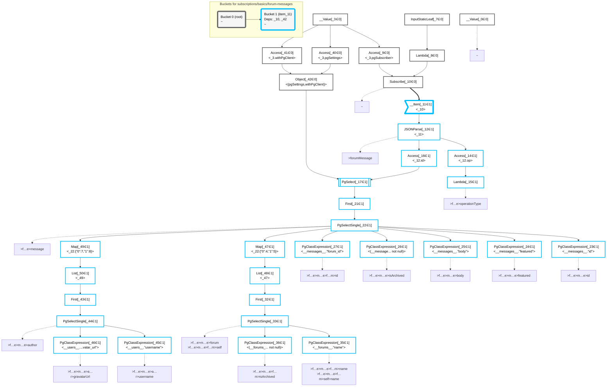

```mermaid
graph TD
    classDef path fill:#eee,stroke:#000,color:#000
    classDef plan fill:#fff,stroke-width:3px,color:#000
    classDef itemplan fill:#fff,stroke-width:6px,color:#000
    classDef sideeffectplan fill:#f00,stroke-width:6px,color:#000
    classDef bucket fill:#f6f6f6,color:#000,stroke-width:6px,text-align:left


    %% define plans
    __Value_0["__Value[_0∈0]"]:::plan
    __Value_3["__Value[_3∈0]<br /><context>"]:::plan
    InputStaticLeaf_7["InputStaticLeaf[_7∈0]"]:::plan
    Lambda_8["Lambda[_8∈0]"]:::plan
    Access_9["Access[_9∈0]<br /><_3.pgSubscriber>"]:::plan
    Subscribe_10["Subscribe[_10∈0]"]:::plan
    __Item_11>"__Item[_11∈1]<br /><_10>"]:::itemplan
    JSONParse_12["JSONParse[_12∈1]<br /><_11>"]:::plan
    Access_14["Access[_14∈1]<br /><_12.op>"]:::plan
    Lambda_15["Lambda[_15∈1]"]:::plan
    Access_16["Access[_16∈1]<br /><_12.id>"]:::plan
    PgSelect_17[["PgSelect[_17∈1]<br /><messages>"]]:::plan
    First_21["First[_21∈1]"]:::plan
    PgSelectSingle_22["PgSelectSingle[_22∈1]<br /><messages>"]:::plan
    PgClassExpression_23["PgClassExpression[_23∈1]<br /><__messages__.”id”>"]:::plan
    PgClassExpression_24["PgClassExpression[_24∈1]<br /><__messages__.”featured”>"]:::plan
    PgClassExpression_25["PgClassExpression[_25∈1]<br /><__messages__.”body”>"]:::plan
    PgClassExpression_26["PgClassExpression[_26∈1]<br /><(__message... not null)>"]:::plan
    PgClassExpression_27["PgClassExpression[_27∈1]<br /><__messages__.”forum_id”>"]:::plan
    First_32["First[_32∈1]"]:::plan
    PgSelectSingle_33["PgSelectSingle[_33∈1]<br /><forums>"]:::plan
    PgClassExpression_35["PgClassExpression[_35∈1]<br /><__forums__.”name”>"]:::plan
    PgClassExpression_36["PgClassExpression[_36∈1]<br /><(__forums_... not null)>"]:::plan
    Access_40["Access[_40∈0]<br /><_3.pgSettings>"]:::plan
    Access_41["Access[_41∈0]<br /><_3.withPgClient>"]:::plan
    Object_42["Object[_42∈0]<br /><{pgSettings,withPgClient}>"]:::plan
    First_43["First[_43∈1]"]:::plan
    PgSelectSingle_44["PgSelectSingle[_44∈1]<br /><users>"]:::plan
    PgClassExpression_45["PgClassExpression[_45∈1]<br /><__users__.”username”>"]:::plan
    PgClassExpression_46["PgClassExpression[_46∈1]<br /><__users__....vatar_url”>"]:::plan
    Map_47["Map[_47∈1]<br /><_22:{”0”:4,”1”:5}>"]:::plan
    List_48["List[_48∈1]<br /><_47>"]:::plan
    Map_49["Map[_49∈1]<br /><_22:{”0”:7,”1”:8}>"]:::plan
    List_50["List[_50∈1]<br /><_49>"]:::plan

    %% plan dependencies
    InputStaticLeaf_7 --> Lambda_8
    __Value_3 --> Access_9
    Access_9 --> Subscribe_10
    Lambda_8 --> Subscribe_10
    Subscribe_10 ==> __Item_11
    __Item_11 --> JSONParse_12
    JSONParse_12 --> Access_14
    Access_14 --> Lambda_15
    JSONParse_12 --> Access_16
    Object_42 --> PgSelect_17
    Access_16 --> PgSelect_17
    PgSelect_17 --> First_21
    First_21 --> PgSelectSingle_22
    PgSelectSingle_22 --> PgClassExpression_23
    PgSelectSingle_22 --> PgClassExpression_24
    PgSelectSingle_22 --> PgClassExpression_25
    PgSelectSingle_22 --> PgClassExpression_26
    PgSelectSingle_22 --> PgClassExpression_27
    List_48 --> First_32
    First_32 --> PgSelectSingle_33
    PgSelectSingle_33 --> PgClassExpression_35
    PgSelectSingle_33 --> PgClassExpression_36
    __Value_3 --> Access_40
    __Value_3 --> Access_41
    Access_40 --> Object_42
    Access_41 --> Object_42
    List_50 --> First_43
    First_43 --> PgSelectSingle_44
    PgSelectSingle_44 --> PgClassExpression_45
    PgSelectSingle_44 --> PgClassExpression_46
    PgSelectSingle_22 --> Map_47
    Map_47 --> List_48
    PgSelectSingle_22 --> Map_49
    Map_49 --> List_50

    %% plan-to-path relationships
    P_0["~"]
    __Value_0 -.-> P_0
    P_10["~"]
    Subscribe_10 -.-> P_10
    P_12[">forumMessage"]
    JSONParse_12 -.-> P_12
    P_15[">f…e>operationType"]
    Lambda_15 -.-> P_15
    P_22[">f…e>message"]
    PgSelectSingle_22 -.-> P_22
    P_23[">f…e>m…e>id"]
    PgClassExpression_23 -.-> P_23
    P_24[">f…e>m…e>featured"]
    PgClassExpression_24 -.-> P_24
    P_25[">f…e>m…e>body"]
    PgClassExpression_25 -.-> P_25
    P_26[">f…e>m…e>isArchived"]
    PgClassExpression_26 -.-> P_26
    P_27[">f…e>m…e>f…m>id"]
    PgClassExpression_27 -.-> P_27
    P_33[">f…e>m…e>forum<br />>f…e>m…e>f…m>self"]
    PgSelectSingle_33 -.-> P_33
    P_35[">f…e>m…e>f…m>name<br />>f…e>m…e>f…m>self>name"]
    PgClassExpression_35 -.-> P_35
    P_36[">f…e>m…e>f…m>isArchived"]
    PgClassExpression_36 -.-> P_36
    P_44[">f…e>m…e>author"]
    PgSelectSingle_44 -.-> P_44
    P_45[">f…e>m…e>a…r>username"]
    PgClassExpression_45 -.-> P_45
    P_46[">f…e>m…e>a…r>gravatarUrl"]
    PgClassExpression_46 -.-> P_46

    %% allocate buckets
    classDef bucket0 stroke:#696969
    class __Value_0,__Value_3,InputStaticLeaf_7,Lambda_8,Access_9,Subscribe_10,Access_40,Access_41,Object_42 bucket0
    classDef bucket1 stroke:#00bfff
    class __Item_11,JSONParse_12,Access_14,Lambda_15,Access_16,PgSelect_17,First_21,PgSelectSingle_22,PgClassExpression_23,PgClassExpression_24,PgClassExpression_25,PgClassExpression_26,PgClassExpression_27,First_32,PgSelectSingle_33,PgClassExpression_35,PgClassExpression_36,First_43,PgSelectSingle_44,PgClassExpression_45,PgClassExpression_46,Map_47,List_48,Map_49,List_50 bucket1

    subgraph "Buckets for subscriptions/basics/forum-messages"
    Bucket0("Bucket 0 (root)<br />~"):::bucket
    style Bucket0 stroke:#696969
    Bucket1("Bucket 1 (item_11)<br />Deps: _10, _42<br />~"):::bucket
    style Bucket1 stroke:#00bfff
    Bucket0 --> Bucket1
    end
```
