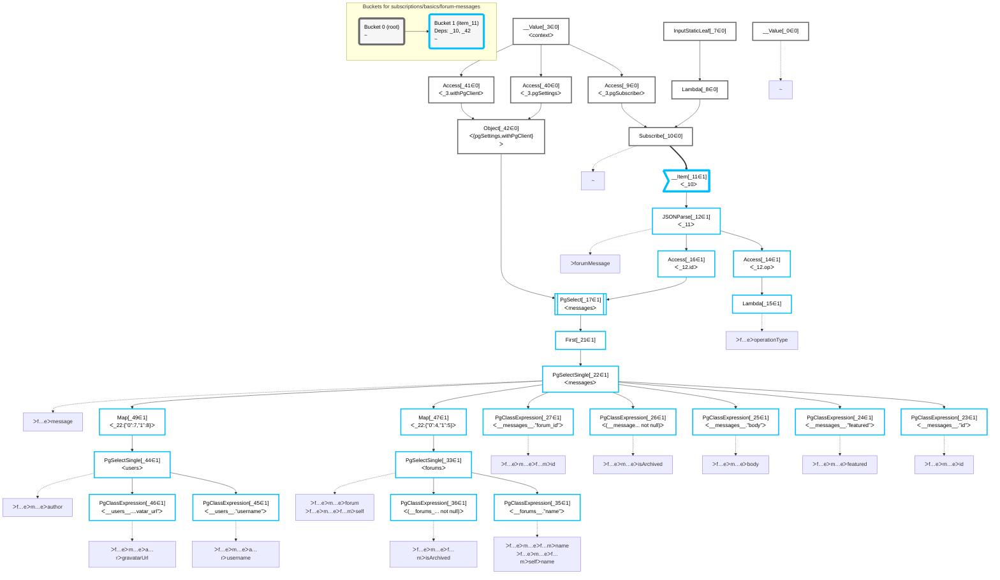

```mermaid
graph TD
    classDef path fill:#eee,stroke:#000,color:#000
    classDef plan fill:#fff,stroke-width:3px,color:#000
    classDef itemplan fill:#fff,stroke-width:6px,color:#000
    classDef sideeffectplan fill:#f00,stroke-width:6px,color:#000
    classDef bucket fill:#f6f6f6,color:#000,stroke-width:6px,text-align:left


    %% define plans
    __Value_0["__Value[_0∈0]"]:::plan
    Lambda_15["Lambda[_15∈1]"]:::plan
    Access_14["Access[_14∈1]<br />ᐸ_12.opᐳ"]:::plan
    PgClassExpression_23["PgClassExpression[_23∈1]<br />ᐸ__messages__.”id”ᐳ"]:::plan
    PgClassExpression_24["PgClassExpression[_24∈1]<br />ᐸ__messages__.”featured”ᐳ"]:::plan
    PgClassExpression_25["PgClassExpression[_25∈1]<br />ᐸ__messages__.”body”ᐳ"]:::plan
    PgClassExpression_26["PgClassExpression[_26∈1]<br />ᐸ(__message... not null)ᐳ"]:::plan
    PgClassExpression_27["PgClassExpression[_27∈1]<br />ᐸ__messages__.”forum_id”ᐳ"]:::plan
    PgClassExpression_35["PgClassExpression[_35∈1]<br />ᐸ__forums__.”name”ᐳ"]:::plan
    PgClassExpression_36["PgClassExpression[_36∈1]<br />ᐸ(__forums_... not null)ᐳ"]:::plan
    PgSelectSingle_33["PgSelectSingle[_33∈1]<br />ᐸforumsᐳ"]:::plan
    Map_47["Map[_47∈1]<br />ᐸ_22:{”0”:4,”1”:5}ᐳ"]:::plan
    PgClassExpression_45["PgClassExpression[_45∈1]<br />ᐸ__users__.”username”ᐳ"]:::plan
    PgClassExpression_46["PgClassExpression[_46∈1]<br />ᐸ__users__....vatar_url”ᐳ"]:::plan
    PgSelectSingle_44["PgSelectSingle[_44∈1]<br />ᐸusersᐳ"]:::plan
    Map_49["Map[_49∈1]<br />ᐸ_22:{”0”:7,”1”:8}ᐳ"]:::plan
    PgSelectSingle_22["PgSelectSingle[_22∈1]<br />ᐸmessagesᐳ"]:::plan
    First_21["First[_21∈1]"]:::plan
    PgSelect_17[["PgSelect[_17∈1]<br />ᐸmessagesᐳ"]]:::plan
    Access_16["Access[_16∈1]<br />ᐸ_12.idᐳ"]:::plan
    JSONParse_12["JSONParse[_12∈1]<br />ᐸ_11ᐳ"]:::plan
    __Item_11>"__Item[_11∈1]<br />ᐸ_10ᐳ"]:::itemplan
    Subscribe_10["Subscribe[_10∈0]"]:::plan
    Access_9["Access[_9∈0]<br />ᐸ_3.pgSubscriberᐳ"]:::plan
    Object_42["Object[_42∈0]<br />ᐸ{pgSettings,withPgClient}ᐳ"]:::plan
    Access_40["Access[_40∈0]<br />ᐸ_3.pgSettingsᐳ"]:::plan
    Access_41["Access[_41∈0]<br />ᐸ_3.withPgClientᐳ"]:::plan
    __Value_3["__Value[_3∈0]<br />ᐸcontextᐳ"]:::plan
    Lambda_8["Lambda[_8∈0]"]:::plan
    InputStaticLeaf_7["InputStaticLeaf[_7∈0]"]:::plan

    %% plan dependencies
    Access_14 --> Lambda_15
    JSONParse_12 --> Access_14
    PgSelectSingle_22 --> PgClassExpression_23
    PgSelectSingle_22 --> PgClassExpression_24
    PgSelectSingle_22 --> PgClassExpression_25
    PgSelectSingle_22 --> PgClassExpression_26
    PgSelectSingle_22 --> PgClassExpression_27
    PgSelectSingle_33 --> PgClassExpression_35
    PgSelectSingle_33 --> PgClassExpression_36
    Map_47 --> PgSelectSingle_33
    PgSelectSingle_22 --> Map_47
    PgSelectSingle_44 --> PgClassExpression_45
    PgSelectSingle_44 --> PgClassExpression_46
    Map_49 --> PgSelectSingle_44
    PgSelectSingle_22 --> Map_49
    First_21 --> PgSelectSingle_22
    PgSelect_17 --> First_21
    Object_42 & Access_16 --> PgSelect_17
    JSONParse_12 --> Access_16
    __Item_11 --> JSONParse_12
    Subscribe_10 ==> __Item_11
    Access_9 & Lambda_8 --> Subscribe_10
    __Value_3 --> Access_9
    Access_40 & Access_41 --> Object_42
    __Value_3 --> Access_40
    __Value_3 --> Access_41
    InputStaticLeaf_7 --> Lambda_8

    %% plan-to-path relationships
    P_0["~"]
    __Value_0 -.-> P_0
    P_10["~"]
    Subscribe_10 -.-> P_10
    P_12["ᐳforumMessage"]
    JSONParse_12 -.-> P_12
    P_15["ᐳf…eᐳoperationType"]
    Lambda_15 -.-> P_15
    P_22["ᐳf…eᐳmessage"]
    PgSelectSingle_22 -.-> P_22
    P_23["ᐳf…eᐳm…eᐳid"]
    PgClassExpression_23 -.-> P_23
    P_24["ᐳf…eᐳm…eᐳfeatured"]
    PgClassExpression_24 -.-> P_24
    P_25["ᐳf…eᐳm…eᐳbody"]
    PgClassExpression_25 -.-> P_25
    P_26["ᐳf…eᐳm…eᐳisArchived"]
    PgClassExpression_26 -.-> P_26
    P_27["ᐳf…eᐳm…eᐳf…mᐳid"]
    PgClassExpression_27 -.-> P_27
    P_33["ᐳf…eᐳm…eᐳforum<br />ᐳf…eᐳm…eᐳf…mᐳself"]
    PgSelectSingle_33 -.-> P_33
    P_35["ᐳf…eᐳm…eᐳf…mᐳname<br />ᐳf…eᐳm…eᐳf…mᐳselfᐳname"]
    PgClassExpression_35 -.-> P_35
    P_36["ᐳf…eᐳm…eᐳf…mᐳisArchived"]
    PgClassExpression_36 -.-> P_36
    P_44["ᐳf…eᐳm…eᐳauthor"]
    PgSelectSingle_44 -.-> P_44
    P_45["ᐳf…eᐳm…eᐳa…rᐳusername"]
    PgClassExpression_45 -.-> P_45
    P_46["ᐳf…eᐳm…eᐳa…rᐳgravatarUrl"]
    PgClassExpression_46 -.-> P_46

    subgraph "Buckets for subscriptions/basics/forum-messages"
    Bucket0("Bucket 0 (root)<br />~"):::bucket
    classDef bucket0 stroke:#696969
    class Bucket0,__Value_0,__Value_3,InputStaticLeaf_7,Lambda_8,Access_9,Subscribe_10,Access_40,Access_41,Object_42 bucket0
    Bucket1("Bucket 1 (item_11)<br />Deps: _10, _42<br />~"):::bucket
    classDef bucket1 stroke:#00bfff
    class Bucket1,__Item_11,JSONParse_12,Access_14,Lambda_15,Access_16,PgSelect_17,First_21,PgSelectSingle_22,PgClassExpression_23,PgClassExpression_24,PgClassExpression_25,PgClassExpression_26,PgClassExpression_27,PgSelectSingle_33,PgClassExpression_35,PgClassExpression_36,PgSelectSingle_44,PgClassExpression_45,PgClassExpression_46,Map_47,Map_49 bucket1
    Bucket0 --> Bucket1
    end
```
