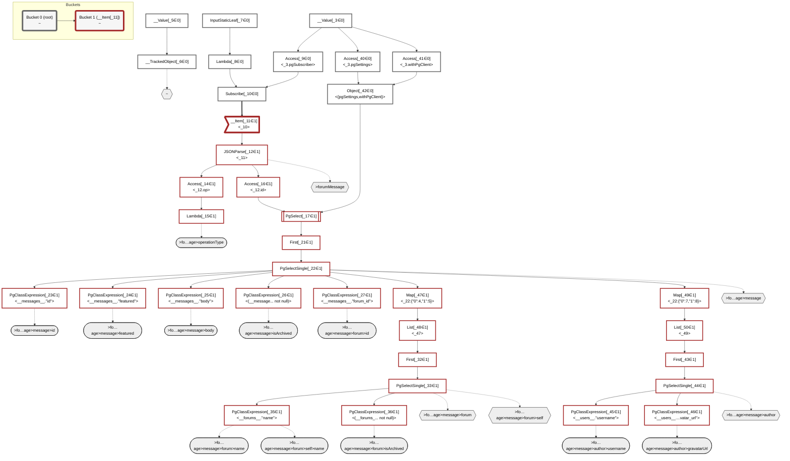

```mermaid
graph TD
    classDef path fill:#eee,stroke:#000,color:#000
    classDef plan fill:#fff,stroke-width:3px,color:#000
    classDef itemplan fill:#fff,stroke-width:6px,color:#000
    classDef sideeffectplan fill:#f00,stroke-width:6px,color:#000
    classDef bucket fill:#f6f6f6,color:#000,stroke-width:6px

    %% subgraph fields
    P1{{"~"}}:::path
    P2{{">forumMessage"}}:::path
    P3([">fo…age>operationType"]):::path
    %% P2 -.-> P3
    P4{{">fo…age>message"}}:::path
    P5([">fo…age>message>id"]):::path
    %% P4 -.-> P5
    P6([">fo…age>message>featured"]):::path
    %% P4 -.-> P6
    P7([">fo…age>message>body"]):::path
    %% P4 -.-> P7
    P8([">fo…age>message>isArchived"]):::path
    %% P4 -.-> P8
    P9{{">fo…age>message>forum"}}:::path
    P10([">fo…age>message>forum>id"]):::path
    %% P9 -.-> P10
    P11([">fo…age>message>forum>name"]):::path
    %% P9 -.-> P11
    P12([">fo…age>message>forum>isArchived"]):::path
    %% P9 -.-> P12
    P13{{">fo…age>message>forum>self"}}:::path
    P14([">fo…age>message>forum>self>name"]):::path
    %% P13 -.-> P14
    %% P9 -.-> P13
    %% P4 -.-> P9
    P15{{">fo…age>message>author"}}:::path
    P16([">fo…age>message>author>username"]):::path
    %% P15 -.-> P16
    P17([">fo…age>message>author>gravatarUrl"]):::path
    %% P15 -.-> P17
    %% P4 -.-> P15
    %% P2 -.-> P4
    %% P1 -.-> P2
    %% end

    %% define plans
    __Value_3["__Value[_3∈0]<br /><context>"]:::plan
    __Value_5["__Value[_5∈0]<br /><rootValue>"]:::plan
    __TrackedObject_6["__TrackedObject[_6∈0]"]:::plan
    InputStaticLeaf_7["InputStaticLeaf[_7∈0]"]:::plan
    Lambda_8["Lambda[_8∈0]"]:::plan
    Access_9["Access[_9∈0]<br /><_3.pgSubscriber>"]:::plan
    Subscribe_10["Subscribe[_10∈0]"]:::plan
    __Item_11>"__Item[_11∈1]<br /><_10>"]:::itemplan
    JSONParse_12["JSONParse[_12∈1]<br /><_11>"]:::plan
    Access_14["Access[_14∈1]<br /><_12.op>"]:::plan
    Lambda_15["Lambda[_15∈1]"]:::plan
    Access_16["Access[_16∈1]<br /><_12.id>"]:::plan
    PgSelect_17[["PgSelect[_17∈1]<br /><messages>"]]:::plan
    First_21["First[_21∈1]"]:::plan
    PgSelectSingle_22["PgSelectSingle[_22∈1]<br /><messages>"]:::plan
    PgClassExpression_23["PgClassExpression[_23∈1]<br /><__messages__.#quot;id#quot;>"]:::plan
    PgClassExpression_24["PgClassExpression[_24∈1]<br /><__messages__.#quot;featured#quot;>"]:::plan
    PgClassExpression_25["PgClassExpression[_25∈1]<br /><__messages__.#quot;body#quot;>"]:::plan
    PgClassExpression_26["PgClassExpression[_26∈1]<br /><(__message... not null)>"]:::plan
    PgClassExpression_27["PgClassExpression[_27∈1]<br /><__messages__.#quot;forum_id#quot;>"]:::plan
    First_32["First[_32∈1]"]:::plan
    PgSelectSingle_33["PgSelectSingle[_33∈1]<br /><forums>"]:::plan
    PgClassExpression_35["PgClassExpression[_35∈1]<br /><__forums__.#quot;name#quot;>"]:::plan
    PgClassExpression_36["PgClassExpression[_36∈1]<br /><(__forums_... not null)>"]:::plan
    Access_40["Access[_40∈0]<br /><_3.pgSettings>"]:::plan
    Access_41["Access[_41∈0]<br /><_3.withPgClient>"]:::plan
    Object_42["Object[_42∈0]<br /><{pgSettings,withPgClient}>"]:::plan
    First_43["First[_43∈1]"]:::plan
    PgSelectSingle_44["PgSelectSingle[_44∈1]<br /><users>"]:::plan
    PgClassExpression_45["PgClassExpression[_45∈1]<br /><__users__.#quot;username#quot;>"]:::plan
    PgClassExpression_46["PgClassExpression[_46∈1]<br /><__users__....vatar_url#quot;>"]:::plan
    Map_47["Map[_47∈1]<br /><_22:{#quot;0#quot;:4,#quot;1#quot;:5}>"]:::plan
    List_48["List[_48∈1]<br /><_47>"]:::plan
    Map_49["Map[_49∈1]<br /><_22:{#quot;0#quot;:7,#quot;1#quot;:8}>"]:::plan
    List_50["List[_50∈1]<br /><_49>"]:::plan

    %% plan dependencies
    __Value_5 --> __TrackedObject_6
    InputStaticLeaf_7 --> Lambda_8
    __Value_3 --> Access_9
    Access_9 --> Subscribe_10
    Lambda_8 --> Subscribe_10
    Subscribe_10 ==> __Item_11
    __Item_11 --> JSONParse_12
    JSONParse_12 --> Access_14
    Access_14 --> Lambda_15
    JSONParse_12 --> Access_16
    Object_42 --> PgSelect_17
    Access_16 --> PgSelect_17
    PgSelect_17 --> First_21
    First_21 --> PgSelectSingle_22
    PgSelectSingle_22 --> PgClassExpression_23
    PgSelectSingle_22 --> PgClassExpression_24
    PgSelectSingle_22 --> PgClassExpression_25
    PgSelectSingle_22 --> PgClassExpression_26
    PgSelectSingle_22 --> PgClassExpression_27
    List_48 --> First_32
    First_32 --> PgSelectSingle_33
    PgSelectSingle_33 --> PgClassExpression_35
    PgSelectSingle_33 --> PgClassExpression_36
    __Value_3 --> Access_40
    __Value_3 --> Access_41
    Access_40 --> Object_42
    Access_41 --> Object_42
    List_50 --> First_43
    First_43 --> PgSelectSingle_44
    PgSelectSingle_44 --> PgClassExpression_45
    PgSelectSingle_44 --> PgClassExpression_46
    PgSelectSingle_22 --> Map_47
    Map_47 --> List_48
    PgSelectSingle_22 --> Map_49
    Map_49 --> List_50

    %% plan-to-path relationships
    __TrackedObject_6 -.-> P1
    JSONParse_12 -.-> P2
    Lambda_15 -.-> P3
    PgSelectSingle_22 -.-> P4
    PgClassExpression_23 -.-> P5
    PgClassExpression_24 -.-> P6
    PgClassExpression_25 -.-> P7
    PgClassExpression_26 -.-> P8
    PgSelectSingle_33 -.-> P9
    PgClassExpression_27 -.-> P10
    PgClassExpression_35 -.-> P11
    PgClassExpression_36 -.-> P12
    PgSelectSingle_33 -.-> P13
    PgClassExpression_35 -.-> P14
    PgSelectSingle_44 -.-> P15
    PgClassExpression_45 -.-> P16
    PgClassExpression_46 -.-> P17

    %% allocate buckets
    classDef bucket0 stroke:#696969
    class __Value_3,__Value_5,__TrackedObject_6,InputStaticLeaf_7,Lambda_8,Access_9,Subscribe_10,Access_40,Access_41,Object_42 bucket0
    classDef bucket1 stroke:#a52a2a
    class __Item_11,JSONParse_12,Access_14,Lambda_15,Access_16,PgSelect_17,First_21,PgSelectSingle_22,PgClassExpression_23,PgClassExpression_24,PgClassExpression_25,PgClassExpression_26,PgClassExpression_27,First_32,PgSelectSingle_33,PgClassExpression_35,PgClassExpression_36,First_43,PgSelectSingle_44,PgClassExpression_45,PgClassExpression_46,Map_47,List_48,Map_49,List_50 bucket1

    subgraph Buckets
    Bucket0("Bucket 0 (root)<br />~"):::bucket
    style Bucket0 stroke:#696969
    Bucket1("Bucket 1 (__Item[_11])<br />~"):::bucket
    style Bucket1 stroke:#a52a2a
    Bucket0 --> Bucket1
    end
```
