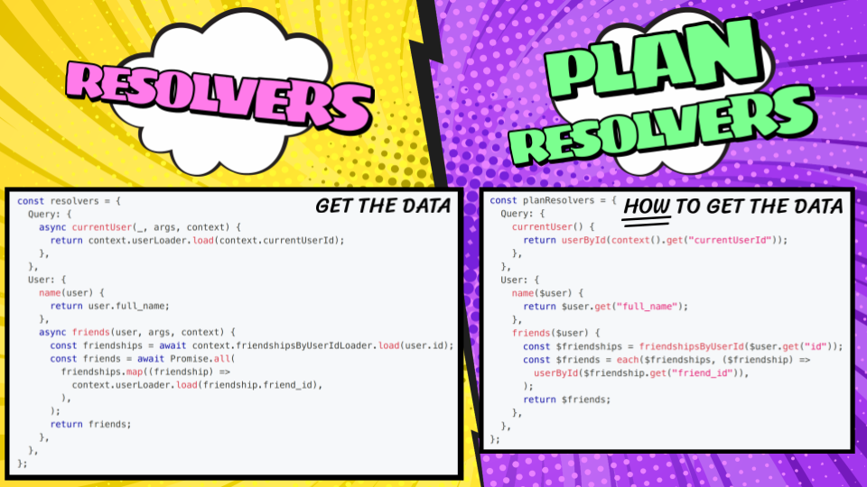

import styles from "@site/src/css/common.module.css";

<div className={styles.intro}>

PostGraphile Version 5 is a ground-up re-architecture with significant enhancements
to capability, customizability, extensibility, flexibility, maintainability,
performance, and correctness — the result of several years of design, experimentation, and real-world
production feedback — whilst staying true to PostGraphile’s key goal: **implementing the obvious so you
only write code that delivers true value**.

Try it now:

```shell
npx pgl -P pgl/amber -e -c 'postgres:///mydb'
```

</div>

{/* truncate */}

## A rewrite? Why?

With GraphQL resolvers having proven to be a performance limitation for PostGraphile Version 3, Version 4 was based around a “lookahead” system. This system grew organically, from a proof of concept built in just a couple weeks, to a production dependency used under sustained pressure by many around the world. It ended up delivering power and performance, but also complexity and limitations.

**PostGraphile isn’t meant to simply expose a database over GraphQL.** It should handle the drudgery, eliminating unnecessary work for common needs, whilst remaining sufficiently flexible that you can design the exact GraphQL schema that your frontend developers need. Broadly, it has achieved this; but over the past 7 years of PostGraphile V4 being our stable release, we’ve found that the effort required for schema customization was not as minimal as we’d like, and the main issue behind this has been the lookahead system.

Recognizing that our lookahead system had just been a first attempt at fixing a fundamental issue with GraphQL’s resolver-based execution model, we put our thinking caps on and ultimately invented Gra*fast*…

## New execution engine

Gra*fast* eschews the previous techniques of resolvers and lookahead, instead taking a radically new approach to GraphQL execution.

### Plan resolvers, steps and dataflow

When a request comes in, before any fetching or execution takes place, a plan consisting of execution steps and dataflow between them is determined from synchronous “plan resolvers” attached to each field. Plan resolvers were designed from the start to be ergonomic, with a minimal learning curve similar to that of React hooks. Here you can see how traditional resolver concepts map to plan resolvers:

<figure>



</figure>

### Batched execution and plan re-use

Once established, the plan is optimized: redundant work eliminated, related work combined, and individual steps honed to only perform necessary work. Finally, the plan is executed — with batch execution to eliminate the N+1 problem by design — and if that same operation is seen again (even with different variables/context) the plan can be reused, eliminating the per-request AST traversal costs we had with the lookahead system.

### Seamless extension and reduced database load

You can read more about this new engine and the key concepts behind it on [Grafast.org](https://grafast.org/grafast/), but for PostGraphile it enables significant improvements:

- PostGraphile can perform a lot more optimizations in JS-land, reducing SQL complexity and execution time, and more importantly moving work from the hard-to-scale database tier to the easy-to-scale JS tier.
- Due to the above, connections are now a lot more performant, almost matching simple lists for efficiency when used equivalently.
- Plan resolvers for custom fields and types means you can blend PostGraphile’s autogenerated logic with your custom extensions seamlessly, and without any of the arcane incantations or N+1 issues of the past.
- Greater control over optimization: you can instruct PostGraphile _not_ to inline SQL into parent queries in certain positions.
- Evolution is easier: should one of your types need re-architecting in the database, you can easily replace that type’s logic in the schema with your own custom code, without having to re-write dependent plan resolvers.
- Abstract types are now supported! ([see below](#native-support-for-abstract-types))

And since we had to rebuild PostGraphile on top of Gra*fast* anyway, we figured why not fix “a few” other things whilst we were at it? You can read a pretty big list of changes in our [V5 New Feature Summary](../postgraphile/5/migrating-from-v4/v5-new-feature-summary), but here’s some highlights!

## Executable schema exports

### An “eject” button

Adopting PostGraphile is no longer a semi-permanent decision; now you can export your schema as executable code and take over maintenance of it whenever you want — like an “eject” button! Thanks to Gra*fast*’s straightforward plan resolvers, the exported code is easy to comprehend and you get to keep PostGraphile’s incredible performance even whilst customizing the schema to your heart’s content!

Graphile has always had a soft spot for entrepreneurs, we aim to help you get your projects from ideation to production deployment with minimal infrastructure and complexity, and many PostGraphile and Graphile Worker users have raised multiple rounds of funding using our software to power their backends. But there’s always the concern: what happens when I outgrow PostGraphile? Now the answer is simple: eject!

### Incredibly fast startup in serverless

Executable schema exports are also the recommended way to run a PostGraphile schema on serverless environments such as AWS Lambda — no database introspection, no plugin system, no huge dependency graph; just the SDL for your schema, its plan resolvers and their runtime dependencies such as `graphql`, `grafast` and `@dataplan/pg`. No runtime dependencies on PostGraphile or the Graphile Build system!

### Aids understanding

If you want to understand what PostGraphile is doing so you can more easily customize it… export the schema and have a read!

### Improvements to come

Executable schema exports is one of the features we’re most excited about — we’d love to hear your input! Right now the output is in pretty good shape but could always be better; one of the recent release candidates massively decreased the size of the exported code without any negative impact on runtime performance, but there’s still more that can be done.

## Native support for abstract types

:::info[What is an abstract type?]

Abstract types are used in GraphQL to indicate a position that can be one of a set of different types. For example a field might state it will return a `Pet`, but at runtime that must actually be a `Cat` or a `Dog`. In GraphQL there are two abstract output types: `interface` for types that share a common interface (i.e. certain fields they must support), and `union` for types that don’t.

:::

Thanks to Gra*fast*, PostGraphile V5 was able to add support for a number of polymorphism patterns in your PostgreSQL database, including:

- “Single table” polymorphism, where a single table (`pets`) represents multiple concrete datatypes (`Cat`, `Dog`, `Fish`) via a `type` column

- “Relational” polymorphism, where a central table (`pets`) represents an interface and stores the shared attributes, and a per-type table (`cats`) is one-to-one joined and provides the additional columns for that type

- “Union” polymorphism, where independent tables indicate that they either share the same common interface type, or that they all belong to the same union.

We’d like to extend a special thank you to [Netflix](https://netflix.com) for working with us on developing the polymorphism patterns seen in PostGraphile V5, their real-world needs and help iterating ensured that the solutions we were adding solved real problems. Their identification and diagnosis of issues in early prototypes ultimately lead to significant improvements to Gra*fast* itself.

Abstract type support in PostGraphile gives you more flexibility in modelling complex systems in ways that feel ergonomic to frontend consumers whilst retaining significant flexibility of implementation on the backend.

## Ruru: the new PostGraphiQL

“PostGraphiQL” was V4’s integrated version of GraphiQL, making it easy for users to get started writing GraphQL queries. In V5 we’ve broken this out into its own standalone package — Ruru — and given it a lot of extra capabilities including the ability to visualize the Gra*fast* query plan! We hope you’ll find it Reliable, Up-to-date, Relevant and Useful!

## Standardized plugins and shareable configuration

### Your schema should serve frontend needs

Customizability and extensibility are at the heart of PostGraphile — your GraphQL schema should not be a simple reflection of your database schema, but something that truly serves frontend needs. In PostGraphile almost every element of your schema is handled via a plugin: from database introspection, through to adding relations, and even pagination arguments!

### Unified plugin/preset system

In V4 we had two separate plugin systems: one for the GraphQL schema, and one introduced after release to handle the wider concerns of request handling, CLI and so on. These two plugin systems caused a lot of user confusion, not least because there was different usage instructions depending on if you were using PostGraphile through its CLI server, through the “library mode” (middleware), or in “schema only” mode (for SSR/backend tasks).

In V5 we’ve introduced a “plugin and preset” system called `graphile-config` that takes everything we learned about plugins across all our various projects and combines it into a single system. Now a single configuration object, a “preset”, can be shared across all of your usages of PostGraphile: CLI, library and schema-only and more…

### New debug tooling

These configuration files can be read by command-line utilities such as the new `graphile` command which can be used to help debug, whether this be `graphile config print` to see your fully resolved configuration with all the plugins and options, or `graphile behavior debug` to determine why certain database elements are (or are not) exposed in your GraphQL schema. (We’ve also integrated `graphile-config` into some of our other projects such as our job queue Graphile Worker and our GraphQL document rules enforcer gqlcheck.)

### Sharing a core preset across instances

This is particularly useful if you run multiple PostGraphile instances: you can create a shared preset with the common configuration, and then “extend” it with custom per-instance configuration options/plugin addition or removal.

### Overhauled types

Plugins are also much easier to write, with a declarative shape that aids discoverability and the ability for each plugin to augment the types it impacts, improving type safety and making plugins easier to write, safer to maintain, and more resilient as your project evolves.

## And so much more…

The [V5 new features page](../postgraphile/5/migrating-from-v4/v5-new-feature-summary) covers many more of the enhancements we’ve added over the past 5 years, including: upgrading `@omit` to the behavior system, a Relay preset, massively improved types, no more `RETURNING *`, write-only columns, JOINs, DB connection can now be on-demand, the ability to override the Postgres client on a per-request basis, [Node.js](https://nodejs.org/) webserver framework integrations overhaul, improved database index behaviors, reflect multiple Postgres DBs, database-schema-based multi-tenancy via “unqualified” tables/functions, Postgres client adaptor system, plugin ordering is now less important, easier inflection overrides, deleting a field deletes the plan (unlike V4’s mess!), and more…

We’ve spent 5 years building it, so it might take you a little while to work your way through… Suffice to say, there’s barely a single feature in PostGraphile that the V5 work hasn’t enhanced or improved in some way!

## Designed for the long term

V5 is designed to scale much further with you, and to let you “eject” if and when it can’t keep up any more. There’s a lot more capability for customization, optimization and enhancement, and space to iterate to cover more user needs. The preset system lets us change defaults and experience for new users whilst supporting existing users without requiring breaking changes. Database efficiency is massively improved, with work offloaded from the database to the easier to scale JS layer; but more importantly the Gra*fast* planning system allows us to iterate with alternative optimization strategies without needing _any_ changes to user-written or autogenerated plan resolver code.

**PostGraphile V5 is designed to help you move fast early on, with minimal infrastructure and lightning fast iteration time; grow with you as you find product-market fit, scaling and shaping your API to serve the needs of your growing business; and step out of the way when it no longer serves your needs, without penalty or painful rewrites**.

## Migrating from V4 to V5

### V4 preset and migration walk-through

We’ve prepared a “V4 Preset” that smooths the process of migration from V4 to V5 by restoring older behaviors and fields, and a [migration guide](../postgraphile/5/migrating-from-v4/) that walks you through the necessary changes.

### Minimal effort for database-first users

If your PostGraphile V4 setup doesn’t use any custom plugins then migration should be very straightforward; there are a couple of minor breaking changes relating to field nullability (correctness fixes) but this will not break the majority of apps and you can even undo those if you wish. We’ve already ported a number of the community plugins to be compatible with V5, but some are still pending.

### Plugin migration codemods underway

For users with custom plugins, effort may be larger. Thanks to a collaboration with [Steelhead](https://gosteelhead.com/) we are working on codemods to ease migration and hope to open-source them soon. If you’d like to help support this effort, please reach out.

### Already in production

V5 is already used in production by many people, for some it has been that way for over a year! The extended alpha, beta, and RC phases have given us the time to hone our APIs and give great confidence in the software we’re making available today.

We hope you enjoy PostGraphile V5, and we’re excited to see what you build with it!

## Sponsors make PostGraphile possible

PostGraphile is crowd-funded open-source software, relying on sponsorship from individuals and companies to keep advancing.

If your employer benefits from PostGraphile, Gra*fast*, or the wider Graphile suite, please encourage them to fund our work. Our software saves companies substantial time and money by reducing development effort and running costs. Sponsorship is an investment in your product’s future, ensuring the foundations of your software stack remain secure and reliable for years to come.

Find out more about sponsorship at [graphile.org/sponsor](graphile.org/sponsor)

<figure>


</figure>
