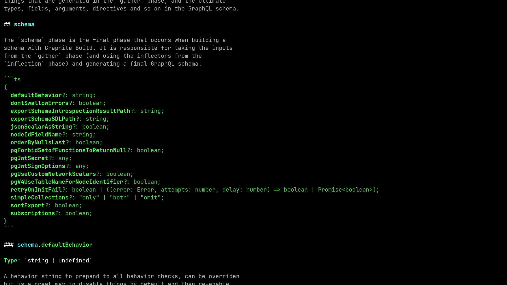
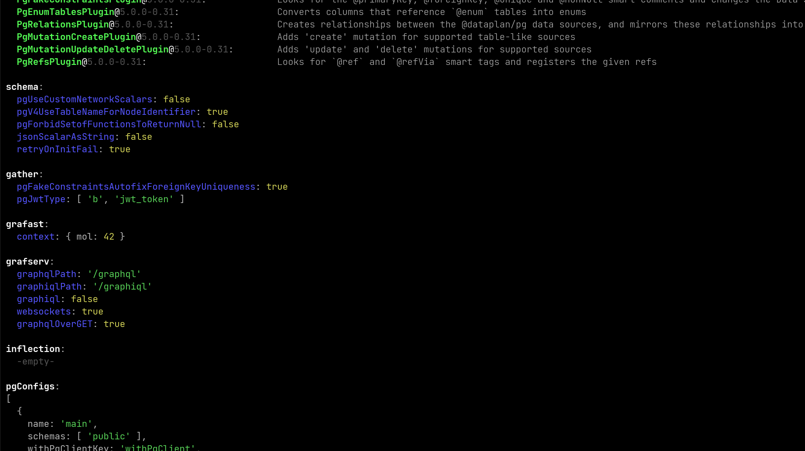

import GraphileCLI from "@theme/GraphileCLI";

# Configuration

No matter whether you're using PostGraphile CLI, library mode or schema only,
PostGraphile (and other elements of the stack including Graphile Build,
Gra*fast* and Grafserv) are configured via a [`graphile-config`
"preset."](https://star.graphile.org/graphile-config/preset)

A preset is a simple JS object that contains a combination of: other presets,
plugins, and options for the various scopes. Your configuration, your preset,
will almost certainly need to extend an existing preset or presets; which
preset(s) to extend depends on what you're looking for from PostGraphile.

The PostGraphile base presets are named after crystals; the first base preset
available is `postgraphile/presets/amber`, so you'll almost definitely want
that.

:::caution

Please don't name your own presets after crystals, or we may end up having
confusion!

:::

**If you're coming from PostGraphile V4** you may then want to add your own
V4-themed preset with the `makeV4Preset()` factory - see the [V4 migration
docs](./migrating-from-v4/) for more information.

If your schema is meant to be consumed by Relay, you may add the
`postgraphile/presets/relay` preset which enables behaviors and plugins
optimized for Relay consumption.

## Creating your configuration file

Though you can build a preset anywhere in your source code and pass it to the
relevant APIs, we recommend that you put your preset into a
`graphile.config.mjs` (or `.ts` or `.mts` or `.js` etc) file, so that it can
easily be picked up by the PostGraphile CLI and any other utilities (e.g. the
`graphile` command). You may write your preset in either JS or TS, and you may
expose it as either CommonJS (`module.exports = ...;`) or ESM (`export default
...;`). In our examples, we'll typically use `.mjs` since it's modern but
without the overhead of requiring TypeScript.

Here's an example preset that just extends the "Amber" preset:

```js title="graphile.config.mjs"
import { PostGraphileAmberPreset } from "postgraphile/presets/amber";

/** @type {GraphileConfig.Preset} */
const preset = {
  extends: [PostGraphileAmberPreset],
};

export default preset;
```

You could also have created this in TypeScript, in which case you might add a
couple of `import` statements to the top in order to ensure that the relevant
TypeScript types exist.

```ts title="graphile.config.ts"
import "graphile-config";
import "postgraphile";
import { PostGraphileAmberPreset } from "postgraphile/presets/amber";

const preset: GraphileConfig.Preset = {
  extends: [PostGraphileAmberPreset],
};

export default preset;
```

Similarly you can create your config as a `.js`, `.cjs`, `.mts` or `.cts` file;
the PostGraphile CLI will pick up all of these automatically assuming that you
have TypeScript installed locally.

## General structure

A preset is a plain JavaScript object, and every key in the preset is optional.
`{}` is a valid (but not very useful!) preset. The key `default` is forbidden
at the top level of a preset, this allows us to detect common issues with
ESM/CommonJS interoperability.

The value for the `extends` key, if specified, must be an array of other presets
your preset wishes to inherit from.

The value for the `plugins` key, if specified, must be an array of
[`graphile-config` plugins](https://star.graphile.org/graphile-config/plugin)
that your preset wishes to make use of. Plugins must always have unique names,
and will be automatically de-duplicated by the system if the same plugin is
referenced in multiple presets.

The preset also accepts keys for each supported scope. `graphile-config` has no
native scopes, but different Graphile projects can register their own scopes.
For example: `graphile-build` registers the `inflection`, `gather` and `schema`
scopes; `graphile-build-pg` registers the `pgServices` scope; Gra*fast*
registers the `grafast` scope; Grafserv registers the `grafserv` scope; and
`ruru` registers the `ruru` scope.

We highly recommend using TypeScript for dealing with your preset so that you
get auto-completion for the options available in each scope; you can also use
the `graphile config options` command detailed below. It may be necessary to
add `import "postgraphile"` at the top of the configuration file so that
TypeScript imports all the available scopes.

:::note

The schema build process in PostGraphile is:

- Synchronously build the inflectors via the `inflection` phase - inflectors are
  used throughout the phases
- Asynchronously build the registry by performing database introspection in the
  `gather` phase
- Synchronously determine the behaviors of each of the entities in the registry during the `behavior` phase
- Synchronously build the GraphQL schema during the `schema` phase

:::

### Simple example

```ts title="graphile.config.ts"
import "postgraphile"; // To import the TypeScript types
import { PostGraphileAmberPreset } from "postgraphile/presets/amber";
import { makePgService } from "postgraphile/adaptors/pg";

const preset: GraphileConfig.Preset = {
  extends: [PostGraphileAmberPreset],
  grafserv: { port: 5678 },
  pgServices: [makePgService({ connectionString: "postgres:///my_db" })],
};
```

### Larger example

```ts title="graphile.config.ts"
// Only needed for TypeScript types support
import "postgraphile";

// The standard base preset to use, includes the main PostGraphile features
import { PostGraphileAmberPreset } from "postgraphile/presets/amber";

// More presets you might want to mix in
import { makeV4Preset } from "postgraphile/presets/v4";
import { PgRelayPreset } from "postgraphile/presets/relay";

// Use the 'pg' module to connect to the database
import { makePgService } from "postgraphile/adaptors/pg";

// In case we want to customize the Ruru we render:
import { defaultHTMLParts } from "postgraphile/grafserv/ruru/server";

// A plugin for the system to use for persisted operations support
import PersistedPlugin from "@grafserv/persisted";

const preset: GraphileConfig.Preset = {
  extends: [
    PostGraphileAmberPreset,
    /* Add more presets here, e.g.: */
    makeV4Preset({
      simpleCollections: "both",
      jwtPgTypeIdentifier: '"b"."jwt_token"',
      dynamicJson: true,
      graphiql: true,
      graphiqlRoute: "/",
    }),
    PgRelayPreset,
  ],

  plugins: [
    /* Add plugins here, e.g.: */
    PersistedPlugin,
  ],

  inflection: {
    /* options for the inflection system */
  },
  gather: {
    /* options for the gather phase, e.g.: */
    pgStrictFunctions: true,
    installWatchFixtures: true,
  },
  schema: {
    /* options for the schema build phase, e.g.: */
    retryOnInitFail: true,
    exportSchemaSDLPath: `${process.cwd()}/latestSchema.graphql`,
    exportSchemaIntrospectionResultPath: `${process.cwd()}/latestSchema.json`,
    sortExport: true,
  },
  grafast: {
    /* options for Grafast, including setting GraphQL context, e.g.: */
    context: {
      meaningOfLife: 42,
    },
    // explain: true, // DO NOT ENABLE IN PRODUCTION!
  },
  grafserv: {
    /* options for Grafserv, e.g.: */
    port: 5678,
    graphqlPath: "/graphql",
    websockets: true,
    graphqlOverGET: true,
    persistedOperationsDirectory: `${process.cwd()}/.persisted_operations`,
    allowUnpersistedOperation: true,
  },
  ruru: {
    /* options for customizing Ruru, e.g.: */
    htmlParts: {
      metaTags: defaultHTMLParts.metaTags + "<!-- HELLO WORLD! -->",
    },
  },
  pgServices: [
    /* list of PG database configurations, e.g.: */
    makePgService({
      // Database connection string, read from an environmental variable:
      connectionString: process.env.DATABASE_URL,

      // List of database schemas to expose:
      schemas: ["app_public"],

      // Enable LISTEN/NOTIFY:
      pubsub: true,
    }),
  ],
};

export default preset;
```

### Viewing the available options

Once you have a basic configuration file, you can use the `graphile` CLI to
find out what options are available to you:

```sh
graphile config options
```

:::info

The `graphile` CLI is a development aid only, and is not needed at runtime or
in production (or in development really, it's just a handy little helper). This
utility is sponsors-only source-available software. If you're not a sponsor
there's a 30 day free trial that starts as soon as you run it for the first
time. You may sponsor at any level for access to this utility. Read the details
in the [graphile command's
README](https://www.npmjs.com/package/graphile/v/alpha).

:::

Note that the options available will be influenced by the modules that you are
using, so be sure to import any plugins and presets at the top of your config
file.

<figure>

[](./graphile-config-options-screenshot.png)

<figcaption>Screenshot of part of the coloured markdown output from executing <code>graphile config options</code> showing the options available to be set inside the config file.</figcaption>
</figure>

### Viewing the resolved configuration

You can also use the `graphile` CLI to print out your resolved configuration
(once all the presets have been applied). This can help with debugging:

```sh
graphile config print
```

<figure>

[](./graphile-config-print-screenshot.png)

<figcaption>Screenshot of part of the coloured output from executing <code>graphile config print</code> showing the options that the local configuration file is using.</figcaption>
</figure>

## Option reference

What follows are some of the more commonly used options to serve as a quick
reference, but this list can quickly become out of date (feel free to send a
PR!). You can use TypeScript or the sponsors-only `graphile config options`
command mentioned above to see what options are available to you - different
presets and plugins make different options available.

### `inflection` options

_(TypeScript type: `GraphileBuild.InflectionOptions`)_

_None at this time._

### `pgServices`

_(TypeScript type: `ReadonlyArray<GraphileConfig.PgServiceConfiguration>`)_

Details the PostgreSQL database(s) for PostGraphile to connect to; this is a
separate option because it's used in both the `gather` phase (for introspection)
and at runtime.

Generally it's best to construct this by using the `makePgService` helper from
the adaptor(s) you are using (see below), but if you want to know the
nitty-gritty: each entry in the list is an object with the following keys (only
`name` and `adaptor` are required):

- `name: string` - an arbitrary unique name for this config; please keep it
  alphanumeric!
- `adaptor: string` - the name of the module to use as the postgres adaptor;
  e.g. `@dataplan/pg/adaptors/pg` for the `pg` module
- `adaptorSettings` - options to pass to the adaptor, these are different for
  each adaptor (see [`adaptorSettings`](#adaptorsettings) below)
- `schemas: string[]` - an array of PostgreSQL schema names to use
- `pgSettings: (requestContext: Grafast.RequestContext) => Record<string, string> | null` -
  a callback function that will be called by the server to determine the
  pgSettings to use for a particular request
- `pgSettingsForIntrospection: Record<string, string> | null` - the pgSettings
  to use when introspecting the database (for example if you want to change
  roles)
- `pgSubscriber: PgSubscriber` - a `PgSubscriber` instance that allows code to
  subscribe to LISTEN/NOTIFY events in the database - useful for GraphQL
  subscriptions, and also for schema watch mode.
- `withPgClientKey: string` - the key on the `context` object to store the
  `withPgClient` method the schema uses for communicating with the database
- `pgSettingsKey: string` - the key on the `context` object to store the
  `pgSettings` configuration to use when communicating with the database
- `pgSubscriberKey: string` - the key on the `context` object to store the
  `pgSubscriber` instance to, for use during GraphQL subscriptions

```js title="Example manual configuration"
import * as pg from "pg";

const pgServices = [
  {
    name: "main",
    schemas: ["app_public"],
    pgSettingsKey: "pgSettings",
    withPgClientKey: "withPgClient",
    adaptor: "@dataplan/pg/adaptors/pg",
    adaptorSettings: {
      pool: new pg.Pool({ connectionString: process.env.DATABASE_URL }),
      // superuserConnectionString: process.env.SUPERUSER_DATABASE_URL,
    },
  },
];
```

:::warning Don't set `name` unless you need to!

Generally there's no need to set a `name` unless you have more than one pgService.
If you do, the different services may need different connection settings and will
definitely be listening with different "subscribers" (different events), so the `pgSettingsKey`
and `pgSubscriberKey` dictate which key to use for this. Currently the default is if the
name is `main` (the default name) then it uses the `pgSettings`/`pgSubscriber` key, otherwise it prefixes this
with the name of the service and an underscore, for example a pgService with
`name: "otherdb"` would use the context keys `otherdb_withPgClient`, `otherdb_pgSettings` and `otherdb_pgSubscriber`.

:::

### `makePgService`

When PostGraphile (or, strictly, `@dataplan/pg`) wishes to communicate with
PostgreSQL, it does so using an "adaptor". The adaptor must expose a common set
of functionality, but on top of that it can add adaptor-specific features, for
example you might write an adaptor to add support for using your ORM of choice,
so that in your custom fields/plan resolvers you can use that ORM to execute
queries against the database.

Your choice of adaptor is quite important if you want to write custom JS logic
in your schema, but otherwise it likely comes down to performance, convenience,
and maybe avoiding additional dependencies. By default, PostGraphile uses the
`postgraphile/adaptors/pg` adaptor which wraps [the `pg`
module](https://npmjs.com/package/pg).

Every adaptor should expose a `makePgService` helper function that takes a
common set of optional configuration parameters:

- `connectionString`
- `schemas`
- `superuserConnectionString`
- `pubsub` (create a pgSubscriber entry; should default to `true`)
- pass-through options (same as in `pgServices` above):
  - `name` (default: "main")
  - `pgSettingsKey` (default with default `name`: `pgSettings`, otherwise: `${name}_pgSettings`)
  - `withPgClientKey` (default with default `name`: `withPgClient`, otherwise: `${name}_withPgClient`)
  - `pgSubscriberKey` (default with default `name`: `pgSubscriber`, otherwise: `${name}_pgSubscriber`)
  - `pgSettings`

:::info

These common options are those that the `postgraphile` CLI might pass, which is
why every adaptor should support them.

:::

:::caution

The `name` option must be unique across all your `pgServices`; therefore if you
have more than one entry in `pgServices` you must give each additional entry an
explicit and unique name.

:::

Each adaptor may additionally accept any other options it likes (but care
should be taken to not conflict with options of other adaptors, or options that
we might want to add to core in future).

`makePgService` will return a fully resolved configuration object, suitable for
inclusion into the `pgServices` array in your `graphile.config.mjs` (or similar)
file.

```js title="Example configuration via makePgService"
import { makePgService } from "postgraphile/adaptors/pg";

/** @type {GraphileConfig.Preset} */
const preset = {
  // ...
  pgServices: [
    makePgService({
      // Database connection string:
      connectionString: process.env.DATABASE_URL,

      // List of database schemas:
      schemas: ["app_public"],

      // Enable LISTEN/NOTIFY:
      pubsub: true,

      // Optional, only needed for `--watch` mode:
      superuserConnectionString: process.env.SUPERUSER_DATABASE_URL,
    }),
  ],
};
```

#### `adaptorSettings`

Each adaptor has its own adaptor-specific settings.

##### `postgraphile/adaptors/pg`

_(Or, equivalently, `postgraphile/@dataplan/pg/adaptors/pg` or `@dataplan/pg/adaptors/pg`)_

This adaptor uses the `pg` module under the hood and uses the `pg.Pool` API
primarily, it accepts the following options:

- `pool` - pass your own pre-built `pg.Pool` instance to use, in which case all
  other (non-superuser) options will be ignored. You are responsible for
  releasing this pool!
- `superuserPool` - as `pool`, but for superuser connections (only needed to
  install the watch fixtures in watch mode)
- `connectionString` - the database connection string to use, we'll create a
  pool for you automatically (and handle releasing it) using this connection
  string
- `poolConfig` - additional configuration options (options other than
  `connectionString`) to pass through to `pg.Pool`; see the [pg.Pool
  options](https://node-postgres.com/apis/pool) which inherit the [pg.Client
  options](https://node-postgres.com/apis/client).
- `superuserConnectionString` - as `connectionString`, but for superuser
  connections (only needed to install the watch fixtures in watch mode)
- `pubsub` (default: `true`) - enable LISTEN/NOTIFY via creation of a
  `pgSubscriber`

### `gather` options

_(TypeScript type: `GraphileBuild.GatherOptions`)_

- `pgStrictFunctions: boolean` - if true, we'll treat all PostgreSQL function
  arguments that don't have defaults as being required (non-nullable)
- `pgJwtTypes: string | string[]` - an array of (or comma separated list of)
  the names (including schemas) for the types in the database to convert into a
  JWT (equivalent to giving these type the behavior `"-table +jwt"`); example:
  `pgJwtTypes: "app_public.jwt_token"`
- `installWatchFixtures: boolean` - if not false and schema is in watch mode
  then we will attempt to install the "event triggers" into the database so that
  PostGraphile can be notified when your database changes

Deprecated options:

- `pgV4UseTableNameForNodeIdentifier: boolean` - if true, uses the table name
  instead of the type name in the Node identifier (highly discouraged because it
  significantly increases the risk of NodeID conflicts)

### `schema` options

_(TypeScript type: `GraphileBuild.SchemaOptions`)_

:::tip

Plugins may add additional options, please refer to your plugins' documentation
to determine the options that they offer.

:::

- `defaultBehavior: string | undefined` - if set, applies a default
  [behavior](./behavior) to all entities; for example to prefer lists
  over connections: `+list -connection`.
- `dontSwallowErrors: boolean` - if true, errors during the schema build process
  will throw rather than the system trying to recover from them. Recommended,
  but not enabled by default as it can be a barrier to entry to new users.
- `jsonScalarAsString: boolean` - if true, JSON values will be stringified
  rather than returned as "dynamic" objects.
- `pgForbidSetofFunctionsToReturnNull: boolean` - if true, setof functions
  cannot return null, so our list and connection types can be non-nullable in
  more places.
- `pgJwtSecret`
- `pgJwtSignOptions`
- `pgOrderByNullsLast: boolean | undefined` - if true, orders such that nulls are
  always last; if false, orders such that nulls are always first; otherwise uses
  the default ordering
- `pgUseCustomNetworkScalars: boolean` - if not false, adds the `CidrAddress`,
  `MacAddress` and similar types for PostgreSQL network scalars.

### `grafast` options

_(TypeScript type: `GraphileConfig.GrafastOptions`)_

- `explain` - a list of 'explain' types that should be exposed to clients via
  `extensions.explain` (`plan` for the operation plan, `sql` for the
  SQL), or `true` to expose everything.
- `context` - an object (or function that returns an object, or promise to an
  object) to be merged into the GraphQL context, accessible from plan
  resolvers. If a function, it will receive two parameters, first is the
  request context (which may contain details such as the incoming HTTP request,
  depends on what server/etc you are using) and the second is the current
  context object that your results will be merged into (overwriting
  pre-existing keys).

### `grafserv` options

_(TypeScript type: `GraphileConfig.GrafservOptions`)_

- `port: number` - Port number to listen on (default: 5678)
- `host: string` - Host to listen on (default: '127.0.0.1'; consider setting to
  '0.0.0.0' in Docker and similar environments)
- `graphqlPath: string` - The path at which GraphQL will be available; usually
  `/graphql`
- `graphiqlPath: string` - The path at which GraphiQL will be available; usually
  `/`
- `eventStreamPath: string` - The path at which the GraphQL event stream would
  be made available; usually `/graphql/stream`
- `graphqlOverGET: boolean` - If true, we'll support GraphQL queries over the
  GET method (beware of the security implications, for example cross-site
  timing attacks)
- `graphiql: boolean`
- `graphiqlOnGraphQLGET: boolean` - If true, then we will render GraphiQL on GET
  requests to the `/graphql` endpoint
- `watch: boolean` - Set true to enable watch mode
- `maxRequestLength: number` - The length, in bytes, for the largest request
  body that the server will accept, only used if the framework of choice
  doesn't already handle input parsing

## Making HTTP data available to plan resolvers

Using the `grafast.context` callback we can extract data from the incoming HTTP
request and make it accessible from within the Gra*fast* schema via the GraphQL context.

Example:

```js title="graphile.config.js"
export default {
  grafast: {
    async context(requestContext, args) {
      const req = requestContext.node?.req;
      // You can perform asynchronous actions here if you need to; for example
      // looking up the current user in the database.

      // Return here things that your resolvers need
      return {
        // Return the current user from Passport.js or similar
        user: req.user,

        // Add a helper to get a header
        getHeader(name) {
          return req?.get(name);
        },

        // Give access to the database-owner PostgreSQL pool, for example to
        // perform privileged actions
        rootPgPool,
      };
    },
  },
};
```

:::warning

When adding details to `grafast.context`, you must careful to not add properties that
will clash with system context keys such as `withPgClient`, `pgSettings`,
`pgSubscriber` and `jwtClaims` (you can see the existing context keys by
inspecting the `contextValue` property of second argument to the `grafast.context`
callback: `args.contextValue`).

For the absolute best future compatibility, we recommend that you prefix your
context keys with your initials, company name, or similar.

:::

:::tip

It's _not_ a good idea to give direct access to the `req` or `res` objects
via `grafast.context` as it binds the GraphQL context too tightly to the HTTP
request lifecycle — this will cause you issues if you try and use the GraphQL
schema in other contexts (e.g. directly from the application, in integration
tests, or over alternative transports such as websockets for realtime).
Instead, add helpers to get/set the data you need that can be implemented in
each future situation.

:::

## `pgSettings`

Connections from PostGraphile to the PostgreSQL database may need to carry with
them custom settings to be set within the PostgreSQL transaction. These can be
used to indicate simple PostgreSQL settings such as `statement_timeout=5000`,
or can be used to indicate details of the currently active user (e.g.
`jwt.claims.user_id = 42`).

Every `pgService` can indicate its own `pgSettings` callback to dictate which
settings that specific service should use with its associated database (see
[`pgServices`](#pgservices) above), and these settings are added to the
GraphQL context using the key set in that services' `pgSettingsKey`.

Presets may also add values to `pgSettings`, for example
`postgraphile/presets/lazy-jwt` parses the `Authorization` header and adds the
claims from the JWT to `pgSettings`.

For most PostGraphile users there's only one pgService, and the default
`pgSettingsKey` is `"pgSettings"`, so rather than configuring pgSettings via
the adaptor you might opt to configure it via including a `pgSettings` key in
the object you return from the Grafast context callback mentioned in the
"Grafast options" section above. The value for this key should be a POJO (plain
old JavaScript object) with string keys and string values, and you should be
careful to copy across settings from the pgService adaptor and any
presets/plugins that may have added to it. For example:

```ts title="graphile.config.mjs"
export default {
  // ...

  grafast: {
    context(requestContext, args) {
      return {
        // highlight-start
        pgSettings: {
          // If any pgSettings were already set, mix them in
          ...args.contextValue?.pgSettings,
          // Add our own settings
          statement_timeout: "10000",
        },
        // highlight-end
      };
    },
  },
};
```

:::caution

You can use `pgSettings` to define variables that your Postgres
functions/policies depend on, or to tweak internal Postgres settings.

When adding variables for your own usage, the keys **must** contain either one
or two period (`.`) characters, and the prefix (the bit before the first
period) must not be used by any Postgres extension. We recommend using a prefix
such as `jwt.` or `myapp.`. Examples: `jwt.claims.userid`, `myapp.is_admin`

Variables without periods will be interpreted as internal Postgres settings,
such as `role`, and will be applied by Postgres.

:::

### Exposing HTTP request data to PostgreSQL

Using the `pgSettings` functionality mentioned above you can extend the data
made available within PostgreSQL through `current_setting(...)`. Remember: the
`grafast.context` entry can be a callback (even an asynchronous callback if you
need) which can extract details from the HTTP request.

When using PostGraphile in library mode, you will likely have a middleware that
handles user authentication (whether this be via sessions, cookies, or JWTs).
You can use the `requestContext` to extract details from the request that came
through your Grafserv adaptor and then expose this data to PostgreSQL; for
example in an express app you might do something like:

```ts title="graphile.config.js"
export default {
  // ...

  grafast: {
    async context(requestContext, args) {
      // Extract request details from the requestContext:
      // highlight-next-line
      const req = requestContext.expressv4?.req;

      return {
        pgSettings: {
          ...args.contextValue?.pgSettings,
          // Expose a specific header (if present) to PostgreSQL
          // highlight-next-line
          "myapp.headers.x_something": req?.getHeader("x-something"),
          // Expose the user id from the request, if present
          // highlight-next-line
          "myapp.user_id": req?.user?.id,
        },
      };
    },
  },
};
```

If you're using the PostGraphile CLI then you won't have middlewares to do the
heavy lifting for you, but you can still process incoming request headers -
this more complicated example extracts the user's ID from a JWT and sends that
and the value of a specific HTTP header to PostgreSQL:

```ts title="graphile.config.js"
import jwt from "jsonwebtoken";

const JWT_SECRET = process.env.JWT_SECRET;

export default {
  // ...

  grafast: {
    async context(requestContext, args) {
      // Extract request details from the requestContext:
      // highlight-next-line
      const req = requestContext.node?.req;
      // Or: const req = requestContext.expressv4?.req;
      // Or: const ctx = requestContext.koav2?.ctx;
      // Or: const req = requestContext.fastifyv4?.request;

      const context = {
        // Base settings for all requests:
        pgSettings: {
          ...args.contextValue?.pgSettings,
          // Expose a specific header (if present) to PostgreSQL
          // highlight-next-line
          "myapp.headers.x_something": req?.getHeader("x-something"),
        },
      };

      // Process the authorization header, if present
      const auth = req?.headers["authorization"];
      if (typeof auth === "string" && typeof JWT_SECRET === "string") {
        const parts = auth.split(" ");
        if (parts.length === 2 && parts[0].toLowerCase() === "bearer") {
          const token = parts[1];
          const claims = jwt.verify(token, JWT_SECRET, {
            algorithms: ["HS256", "HS384"],
            audience: "postgraphile",
            complete: false,
          });
          // Expose the user id from the request, if present
          // highlight-next-line
          context.pgSettings["myapp.user_id"] = claims.uid;
        }
      }

      return context;
    },
  },
};
```

:::tip

GraphQL itself is transport agnostic, as is `grafast`, so depending on how you
choose to use your PostGraphile schema you may or may not have access to an
HTTP request. Your `context` callback should be written to support all the
different ways that your schema may be used: directly, over HTTP, using
websockets, etc.

**Do not** expose the `request`, `response` or
`requestContext` objects via the GraphQL context, always use abstractions.

:::

### Accessing pgSettings data in PostgreSQL

With either of the above examples, you could write an SQL function
`get_x_something()` to get the `myapp.headers.x_something` setting:

```sql
create function get_x_something() returns text as $$
  /* highlight-next-line */
  select nullif(current_setting('myapp.headers.x_something', true), '')::text;
$$ language sql stable;
```

By default, everything in `pgSettings` is applied to the current transaction
with `set_config($key, $value, true)`; note that `set_config` only supports
string values so it is best to only feed `pgSettings` string values (we'll
[convert other values using the `String()` function](https://developer.mozilla.org/en-US/docs/Web/JavaScript/Reference/Global_Objects/String#string_coercion), which may not
have the effect you intend). All settings are automatically reset when the
transaction completes.

Here's an example of switching the PostgreSQL client into the 'visitor' role,
and applying the application setting `jwt.claims.user_id` using the `req.user`
object from an Express server:

```js title="graphile.config.js"
export default {
  grafast: {
    context(requestContext, args) {
      // Base context used for all GraphQL requests
      const context = {
        pgSettings: {
          ...args.contextValue?.pgSettings,
          // highlight-next-line
          role: "visitor",
        },
      };

      // Extract the current user from the Express request:
      // highlight-next-line
      const user = requestContext.expressv4?.req.user;

      // If there's a user, pass additional data to Postgres:
      if (user) {
        // highlight-next-line
        context.pgSettings["jwt.claims.user_id"] = String(user.id);
      }

      return context;
    },
  },
};
```

<!-- TODO: verify the above works. -->
