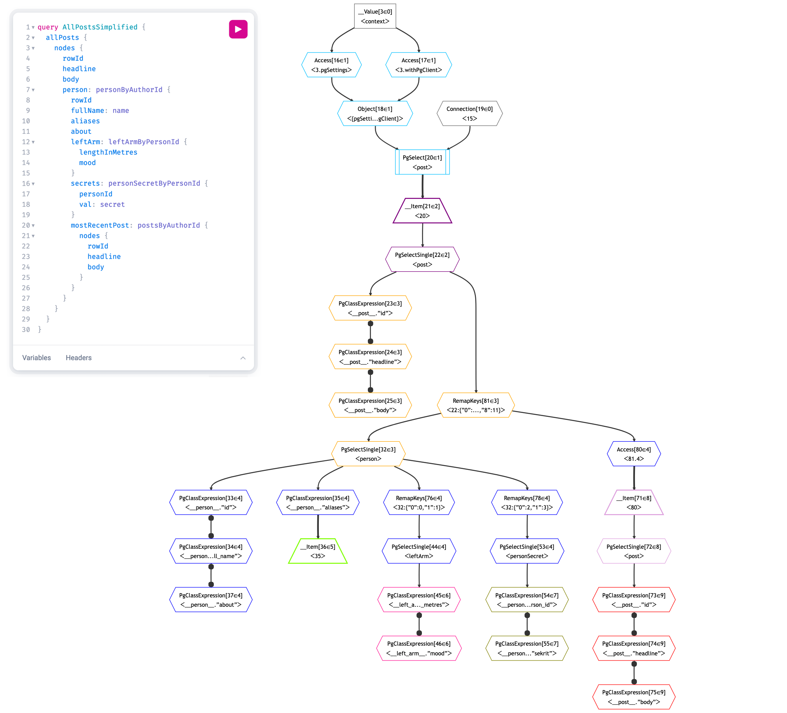

# Version 5 New Feature Summary

One of the main aims for PostGraphile V5 was to replace the cumbersome "lookahead engine"
with something much more pleasant and powerful. After many iterations, we ultimately invented
[Gra*fast*](https://grafast.org/): a new planning and execution engine for GraphQL.

Since the lookahead system underpinned everything in Version 4 of PostGraphile, replacing it
meant rebuilding everything from the ground up, so we took the opportunity to fix a huge number
of other snags and suboptimal experiences in Version 4 - also adding in many capabilities which
weren't possible, and changing some of the default behaviors.

Ultimately, Version 5 brings a number of new paradigms to PostGraphile, and along with that many
new features. The following list is a summary of those new features but is by no means complete!

# Features new to Version 5

- Lookahead replaced by advanced GraphQL query planning via new [Gra*fast* engine](https://grafast.org/grafast/)

Every GraphQL request can get an associated plan diagram to ease understanding and debugging

<figure>

<figcaption>

An autogenerated Gra*fast* plan diagram for the displayed GraphQL query. Plan diagrams detail the steps required to complete a GraphQL request and show how the data flows between them. See ["Plan Diagrams"](https://grafast.org/grafast/plan-diagrams) in the Gra*fast* documentation for more details.

</figcaption>
</figure>

Massively improved SQL query generation: smaller, simpler, easier to understand, more performant

<figure>

<figcaption>

An example of the vast improvement in the autogenerated SQL queries in Version 5 as compared to Version 4 for the same query. Generated SQL is now easier to understand and debug, and the V5 SQL query shown is twice as fast as the V4 SQL query.

</figcaption>
</figure>

- Ability to cache certain SQL queries [experimental]
- [Polymorphism support](../polymorphism.md), both in the engine and for Postgres autogeneration
- Incremental delivery support [experimental] - now possible to use `@stream` and `@defer`
  - In addition to improving page load times by delaying delivery of expensive fields, this can be used to unlock previously impossible use cases - e.g. streaming huge amounts of data (e.g. to generate CSVs from reporting or similar)
- [New "behavior" system](../behavior.md) allows more precise control over how schema is generated
  - Massively reduces the need for manually removing fields from the schema
- Significantly reduced load on PostgreSQL database

Connections are now as cheap as lists unless using connection-specific features (which are also cheaper)

- Thanks to new planning system, "hasNextPage" / "hasPreviousPage" can be achieved by just fetching an extra row
- Cursors are much cheaper

Export your schema as executable code [experimental]

Great for serverless:

- no run-time introspection
- fewer dependencies
- lower memory usage
- near-instant startup (great for serverless)

Also helps with understanding how the system/plans/etc works; and enables a path to migrate away from auto-generated should you later want to

See ["Exporting your schema"](../exporting-schema.md) for more information.

makeExtendSchemaPlugin now massively improved

No more `selectGraphQLResultFromTable`, `@requires`, `@pgQuery` or other hacks to abstract away the complicated lookahead system. Instead, use straightforward declarative code for all these concerns, integrating deeply and automatically with the Gra*fast* operation plan

Extending auto-generated types should always work, independent of plugin order

User data and Postgres leaf data (e.g. column values) can be used interchangeably and the planning system will automatically optimize Postgres data (via inlining) if it can

- Much easier to add "computed columns" in user code, which significantly increases performance by not having Postgres do this work
- Even if you query remote data sources (e.g. Stripe) in fields within a list, when you come back to postgres everything is automatically re-batched so no introduction of N+1 problem
- Unified plugins: no "server plugins" vs "schema plugins" any more
- Presets: easily share plugin lists and configuration options between servers, and still perform local customization easily
- [Consolidated configuration](../config.mdx) across CLI, library and schema-only usage; no more postgraphilerc.

Generate personalized documentation based on which plugins/presets you're using

<figure>

<figcaption>Screenshot of part of the coloured markdown output from executing <code>graphile config options</code> showing the options available to be set inside the config file.</figcaption>
</figure>

<figure>

<figcaption>Screenshot showing the initial output of the <code>graphile inflection list</code> command, including a summary of the available inflectors and their arguments.</figcaption>
</figure>

<figure>

<figcaption>Screenshot from lower down in the output of the <code>graphile inflection list</code> command, detailing each inflector, its documentation and its rough TypeScript definition.</figcaption>
</figure>

<figure>

<figcaption>Screenshot of part of the coloured output from executing <code>graphile config print</code> showing the options that the local configuration file is using.</figcaption>
</figure>

(More to come!)

- Better Relay support via `postgraphile/presets/relay`
- Massively enhanced TypeScript support
- Fully implements the latest [GraphQL-over-HTTP specification draft](https://graphql.github.io/graphql-over-http/draft/)
- Ability to perform JOINs in SQL
- No `RETURNING *` on mutations, so column-level select grants don't break mutations
- Write-only columns now supported in mutations

Use separate transactions in the same GraphQL request

Parts of mutations can now use a connection string with elevated privileges without transaction isolation causing these changes to not be reflected in the mutation payload

Massive enhancements to no-ignore-indexes

Including ability to overrule, and only preventing the expensive backwards relations whilst still allowing the cheap forwards relations.

Bespoke support for major Node.js web frameworks, fitting naturally into each of their workflows

Even makes use of things like vendor-specific websocket modules (e.g. `@fastify/websocket` or `koa-websocket`) for deeply integrated websocket support

- Theoretically easier to use with other GraphQL servers (assuming that they allow you to replace the 'execute' method)
- Multiple (postgres) databases in same GraphQL schema

New strongly typed PostgreSQL introspection library `pg-introspection`

Now generated from Postgres documentation and strongly typed (view postgres docs when hovering an introspection value in your editor!), plus much simpler so should work better with other postgres-alikes 🤞

- Optionally define your resources (tables, functions, views, etc) manually and generate the schema from them (enables generation from DDL or model objects)
- Better capabilities for allowing changes to your underlying Postgres tables without causing breaking changes to GraphQL API
- Use your choice of Postgres client
- Change your PostgreSQL connection string at runtime (assuming you have multiple identical databases - sometimes used for multitenancy)
- Optionally use alternative authorization techniques (don't need to use RLS) [experimental]
- Better support for various Postgres types
- Don't convert unknown types to `String`, instead omit them
- In graphile-build, GraphQL types are registered at "init" time, so `build.getTypeByName` no longer affected by plugin ordering concerns
- Various other plugin ordering issues eliminated or reduced
- Overhauled inflection system: more consistent, simpler to achieve common tasks
- Use `sql` directly for making SQL fragments, rather than needing `sql.fragment` (reduces code verbosity)
- GraphQL v16 support
- GraphiQL v2 support via [Ruru](https://grafast.org/ruru/) (which can now be used standalone)
- Planning information stored directly into GraphQL schema objects - removing a field now removes all its behaviors (re-introducing a field with the same name will not cause problems like it did in V4)

